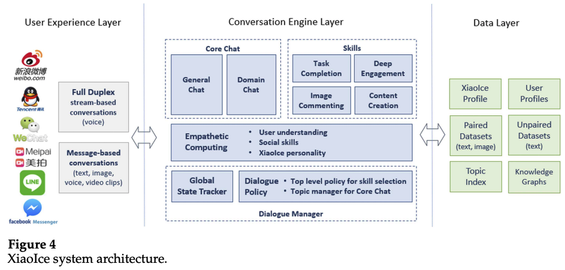
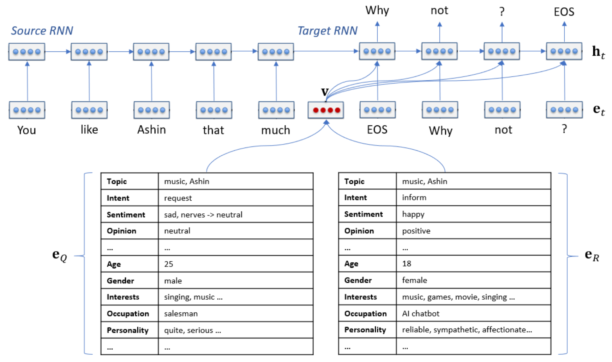
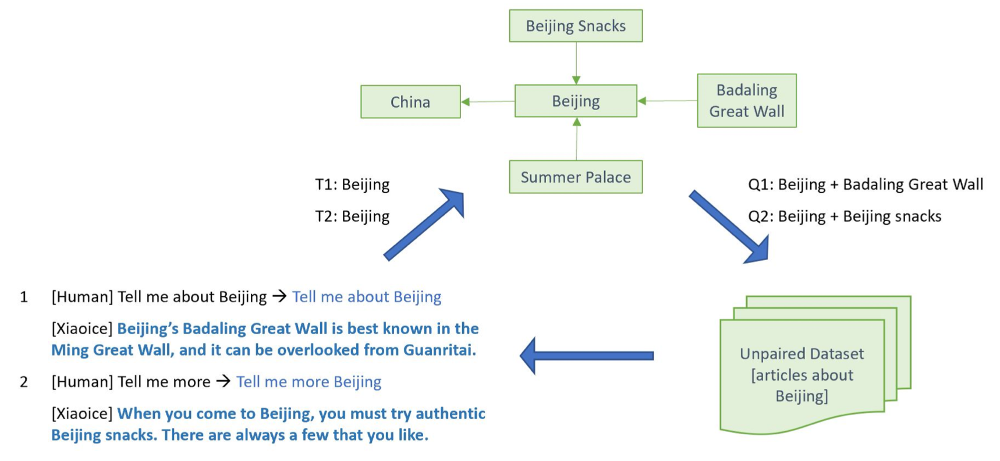

## **Microsoft의 XiaoIce 논문 리뷰** (11월 26일~🏃‍♀️)

### [📄**Paper**](https://aclanthology.org/2020.cl-1.2.pdf)  
Zhou, L., Gao, J., Li, D., and Shum, H. Y., “The design and implementation of xiaoice, an empathetic social chatbot,” _Computational Linguistics Journal (CL)_, vol. 46, no. 1, pp. 53-93, 2020.

### **📌 목차** 

1. Introduction
2. Design Principle  
    2.1 IQ + EQ + Personality  
    2.2 Social Chatbot Metric: CPS    
    2.3 Social Chat as Hierarchical Decision-Making  
3. System Architecture  
4. Implementation of Conversation Engine  
    4.1 Dialogue Manager  
    4.2 Empathetic Computing  
    4.3 Core Chat  
    4.4 Image Commenting  
    4.5 Dialogue Skills  
5. XiaoIce in the Wild
6. Related Work
7. Discussion  
    7.1 Evaluation Metrics  
    7.2 Ethics Concerns  
8. Conclusions and Future Work

---

## **1. Introduction**

XiaoIce의 전체 프레임워크를 소개하는 논문이다.  
지능 지수(Intelligent Quotient, IQ) 뿐만 아니라 감정 지 (Emotional Quotient, EQ)까지 높은 소셜 챗봇 프레임워크 제안하였다.

 

## **2. Design Principle**

## **3. System Architecture**

- User Experience Layer : 다양한 채팅 플랫폼과 연결
- Conversation Engine Layer : 대화 기술
- Data Layer : 대화 데이터를 저장한 데이터베이스 계층

## **4. Implementation of Conversation Engine**

### **1. Dialog Manager**  
- 대화 상태 파악
- 응답 시 Core Chat 기능 혹은 Dialog Skill 기능을 사용할지 선택  

### **2. Core Chat**  
- 입력에 대한 답변을 생성함으로써 기본적인 대화 능력 제공
- 오픈 도메인 대화를 커버하는 General Chat과 특정 도메인의 대화만 커버하는 Domain Chat 모드로 구성  
    🎈 General Chat과 Domain Chat은 같은 구조를 가지며 DB를 분리함으로써 구분
- 후보군을 생성하는 3개의 Candidate Generator와 후보군의 순위를 결정하는 Boosted Tree Ranker(Wu et al. 2010)로 이루어짐

⑴ Retrieval-Based Generator using Paired Data

**데이터**  
&nbsp;&nbsp;&nbsp;&nbsp;&nbsp;인터넷(social networks, public forum, bulletin board, news comment 등)에서 대화 데이터 수집  
&nbsp;&nbsp;&nbsp;&nbsp;&nbsp;XiaIce를 런칭한 후 30억개의 대화 데이터 수집

**데이터 정제**     
&nbsp;&nbsp;&nbsp;&nbsp;&nbsp;인터넷으로 수집한 데이터에 대해서 Empathetic computing module을 통해 로 변환   

: 주어진 질의    
: 답변   
: 각각 질의자와 답변자의 감정, 의도, 발화 주제 등을 포함한 정보   

&nbsp;&nbsp;&nbsp;&nbsp;&nbsp;XiaoIce의 페르소나에 적합한 공감적 답변만 남도록 정제  
&nbsp;&nbsp;&nbsp;&nbsp;&nbsp;개인정보, 이해하기 어려운 프로그래밍 코드, 적합하지 않은 내용, 오타 등 제거

**방법**  
&nbsp;&nbsp;&nbsp;&nbsp;&nbsp;Machine Learning 기반 Representation으로부터 키워드 및 의미 탐색을 통해 
400개의 응답 후보군 선택

**단점**  
&nbsp;&nbsp;&nbsp;&nbsp;&nbsp;인터넷 포럼에서 잘 다뤄지지 않은 주제는 DB에 포함되지 않기 때문에 질의에 대한 coverage가 낮음 😂  
&nbsp;&nbsp;&nbsp;&nbsp;&nbsp; → coverage를 높이기 위해 2개의 candidate generator 도입

⑵ Neural Response Generator  
Retrieval-Based Generator의 단점을 보완하기 위해 도입   
오픈 도메인 대화를 위한 GRU-RNN 기반 Seq2Seq 모델

>질의: You like Ashin  
>응답 후보: Why not?  

⑶ Retrieval-Based Generator using Unpaired Data  
Coverage를 향상시키기 위해 Non-Conversational 데이터를 사용하여 학습한 Candidate Generator  

1. 유저의 질의로부터 발화 주제 탐색  
2. 지식 그래프에서 유저의 발화 주제와 관련된 후보 주제 20개 선택  
3. 유저의 발화 주제와 후보 주제를 결합하여 대화 DB에서 응답 후보군 선택  

**3. Dialog Skills**  
- 기능 대화, 이미지 등 특정 입력에 대해 처리하는 기타 대화 기술

1. Content Creation Skill  
유저의 흥미를 충족하기 위한 기술  
오디오북 생성, 텍스트 기반 시 생성, 아이들을 위한 동화책 서비스 등

2. Deep Engagement skill  
유저의 특정 감정적 요구를 충족하기 위한 기술  
예) 유저의 발화에서 부정적인 감정이 탐색된 경우 Comporting skill이 트리거됨  

3. Task Completion skill  
날씨, 알람 등 기능 대화 처리

**4. Empathetic Computing Module**
- XiaoIce의 EQ를 담당
- 감정, 의도, 주제에 대한 의견, 배경지식, 일반적인 관심사 등 유저 및 대화의 공감적 측면을 파악

### **5. XiaoIce in the Wild**
### **6. Related Work**

### **7. Discussion**
### **8. Conclusions and Future Work**
