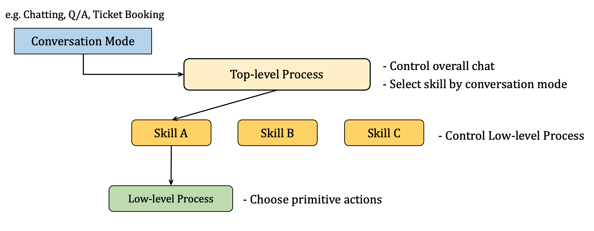

## **Microsoft의 XiaoIce 논문 리뷰** (11월 26일~🏃‍♀️)

### [📄**Paper**](https://aclanthology.org/2020.cl-1.2.pdf)  
Zhou, L., Gao, J., Li, D., and Shum, H. Y., “The design and implementation of xiaoice, an empathetic social chatbot,” _Computational Linguistics Journal (CL)_, vol. 46, no. 1, pp. 53-93, 2020.

## **📌 목차** 

1. Introduction
2. Design Principle  
    2.1 IQ + EQ + Personality  
    2.2 Social Chatbot Metric: CPS    
    2.3 Social Chat as Hierarchical Decision-Making  
3. System Architecture  
4. Implementation of Conversation Engine  
    4.1 Dialogue Manager  
    4.2 Empathetic Computing  
    4.3 Core Chat  
    4.4 Image Commenting  
    4.5 Dialogue Skills  
5. XiaoIce in the Wild
6. Related Work
7. Discussion  
    7.1 Evaluation Metrics  
    7.2 Ethics Concerns  
8. Conclusions and Future Work

---

## **1. Introduction**

**XiaoIce의 목표**  
사용자와 장기적인 감정적인 교류를 형성하는 AI 친구  

XiaoIce의 전체 프레임워크를 소개하는 논문으로,  
지능 지수(Intelligent Quotient, IQ) 뿐만 아니라 감정 지 (Emotional Quotient, EQ)까지 높은 소셜 챗봇 프레임워크 제안하였다.

 

----

## **2. Design Principle**

### **2.1 IQ+EQ+Personality**

**IQ**는 지식, 메모리 모델링, 이미지 및 자연어 이해, 추론, 생성, 예측에 관한 능력으로,  
XiaoIce는 높은 IQ를 달성하기 위해 230개의 _Dialog Skills_, 멀티턴 및 오픈 도메인 대화를 위한 *Core Chat*을 개발하였다.

**EQ**의 핵심 구성 요소는 공감능력과 사회기술이다.  
공감 능력은 사용자 감정에 공감하는 기술로, *질의 이해, 유저 프로파일링, 감정 감지, 감정 분석, 사용자의 감정에 대한 동적 트래킹 기술*을 필요로 한다.   
사회 기술은 관심사, 배경지식 등에 따라 사용자 개개인에게 적절한 응답을 제공한다.

**Personality**는 문화적 차이, 윤리적으로 민감한 질의도 고려하며, 다양한 페르소나를 디자인하였다.

### **2.2 Social Chatbot Metric: CPS**  

소셜 챗봇의 성능을 평가하기 위한 지표로 Conversation-turns Per Session (CPS)를 제안하였다.  
대화 세션당 챗봇과 사용자 사이 평균 대화 턴의 수를 의미한다. (한 대화 주제로 턴이 오래 지속되는 경우가 가장 이상적임)

본 검증 방법은 장기간 많은 사용자에 의해 추정된 expected CPS와 NAU(Number of Active Users)를 메트릭으로 사용하며,   
메트릭이 의도와 달리 잘못 측정될 가능성을 모두 제거한다.  
> 예를 들어, '잘 모르겠어'라는 애매한 대답은 CPS가 높게 측정될 수 있다.   
👎 장기적으로 보면 NAU와 CPS에 타격을 주는 답변
>
> 반대로, 많은 Task-completion skill은 CPS가 낮게 측정될 수 있다. (더 물어볼 말이 없기 때문)  
👍 AI 비서로써 필요한 기능

### **2.3 Social Chat as Hierarchical Decision-Making**

본 논문에서는 사람과 머신 간의 소셜 대화을 Hierarchical Decision-Making Process로 캐스팅하였다. 

- Top-level process: 전체 대화 관리 및 conversation mode에 따라 skill 선택  
- Low-level process: 특정 task 수행 또는 conversation segment 생성을 위한 응답 선택 

이러한 hierarchical decision making은 마르코프 결정 과정(Markov Decision Processes, MDPs) 문제로 해결할 수 있다.  

> 매 턴마다 챗봇은 (dialog) state를 탐지하며, (hierarchical dialogue) policy에 따라 action(skill 또는 응답)을 선택한다.  
응답에 따라 사용자로부터 reward(응답)를 받는다.  
>   
> (*expected CPS가 증가하도록 최적화*)

***explore*와 *exploit*의 balance를 맞추며 Action 수행**  
- explore: 알려지지 않은 user engagement를 높일 수 있는 action 탐지    
- exploit: active user를 유지하기 위해 이미 알려진 user의 관심사를 기반으로 action

 

--- 

## **3. System Architecture**

- **User Experience Layer** : 다양한 채팅 플랫폼과 연결 (+ 이미지 이해, 음성 인식, VAD 등 전처리 수행)
    - full-duplex 모드: 음성 기반 대화를 다루며, 사용자와 챗봇이 동시에 말할 수 있음
    - taking turn 모드: 메세지 기반 대화를 다루며, 턴을 가지며 대화
- **Conversation Engine Layer** : 대화 기술 (4절에서 자세히 설명)
- **Data Layer** : conversational data 및 non-conversational data를 저장한 데이터베이스 계층

 

----

## **4. Implementation of Conversation Engine**

### **4.1 Dialog Manager**  
- 대화 상태() 파악
- 응답 시 Dialogue policy()에 따라 action(, Core Chat 기능 혹은 Dialog Skill 기능)을 선택  

**Global State Tracker**  
working memory에 로 인코딩하여 저장    
각 턴에 대한 유저 질의, XiaoIce 응답, Empathetic computing module에 의해 생성된 Empathy label을 텍스트로 저장

**Dialogue Policy**   

Hierarchical Policy
- High-level policy: Core Chat 또는 skill들 중 선택  
    skill trigger 집합에 의해 구현됨  
    (Topic Manager, Domain Chat triggers 등의 _머신러닝 기반 트리거_ 및 키워드 등에 의해 유도되는 _규칙 기반 트리거_)
    

    - 입력이 텍스트인 경우 Core Chat이 활성화되며, user의 관심사가 탐지되지 않으면 General chat skill이 트리거 되고, 탐지된 경우 Domain chat skill이 트리거된다.
    - 입력이 이미지인 경우 Image Commenting skill이 트리거됨 
    - Task Completion, Deep Engagement, Content Creation은 특정 유저의 입력 또는 특정 대화 문맥에서 유도됨  
    (만약 여러 skill들이 동시에 트리거된다면 confidence score, priority, session context에 의해 하나의 skill을 선택)
- Low-level policies: 각각 conversation segment를 관리

**Topic Manager**  
대화 주제를 바꿀 것인지 아닌지 판단하는 Topic switching classifier와 새로운 대화 주제를 추천하는 topic recommendation engine으로 구성되어 있다.  

_Boosted Tree 기반 Topic switching classifier_  
다음의 feature를 기반으로 예측  
1) Core Chat이 유효하지 않은 답변을 출력했는지
2) 사용자가 비슷한 말을 반복하는지 또는 별다른 정보가 없는지  
3) 사용자의 발화가 애매한지 (OK, I see 등)

 

### **4.2 Empathetic Computing Module**
- XiaoIce의 EQ를 담당
- 감정, 의도, 주제에 대한 의견, 배경지식, 일반적인 관심사 등 유저 및 대화의 공감적 측면을 파악

### **4.3 Core Chat**  
- 입력에 대한 답변을 생성함으로써 기본적인 대화 능력 제공
- 오픈 도메인 대화를 커버하는 General Chat과 특정 도메인의 대화만 커버하는 Domain Chat 모드로 구성  
    🎈 General Chat과 Domain Chat은 같은 구조를 가지며 DB를 분리함으로써 구분
- 후보군을 생성하는 3개의 Candidate Generator와 후보군의 순위를 결정하는 Boosted Tree Ranker(Wu et al. 2010)로 이루어짐

⑴ Retrieval-Based Generator using Paired Data

**데이터**  
&nbsp;&nbsp;&nbsp;&nbsp;&nbsp;인터넷(social networks, public forum, bulletin board, news comment 등)에서 대화 데이터 수집  
&nbsp;&nbsp;&nbsp;&nbsp;&nbsp;XiaIce를 런칭한 후 30억개의 대화 데이터 수집

**데이터 정제**     
&nbsp;&nbsp;&nbsp;&nbsp;&nbsp;인터넷으로 수집한 데이터에 대해서 Empathetic computing module을 통해 로 변환   

: 주어진 질의    
: 답변   
: 각각 질의자와 답변자의 감정, 의도, 발화 주제 등을 포함한 정보   

&nbsp;&nbsp;&nbsp;&nbsp;&nbsp;XiaoIce의 페르소나에 적합한 공감적 답변만 남도록 정제  
&nbsp;&nbsp;&nbsp;&nbsp;&nbsp;개인정보, 이해하기 어려운 프로그래밍 코드, 적합하지 않은 내용, 오타 등 제거

**방법**  
&nbsp;&nbsp;&nbsp;&nbsp;&nbsp;Machine Learning 기반 Representation으로부터 키워드 및 의미 탐색을 통해 
400개의 응답 후보군 선택

**단점**  
&nbsp;&nbsp;&nbsp;&nbsp;&nbsp;인터넷 포럼에서 잘 다뤄지지 않은 주제는 DB에 포함되지 않기 때문에 질의에 대한 coverage가 낮음 😂  
&nbsp;&nbsp;&nbsp;&nbsp;&nbsp; → coverage를 높이기 위해 2개의 candidate generator 도입

⑵ Neural Response Generator  
Retrieval-Based Generator의 단점을 보완하기 위해 도입   
오픈 도메인 대화를 위한 GRU-RNN 기반 Seq2Seq 모델

>질의: You like Ashin  
>응답 후보: Why not?  

⑶ Retrieval-Based Generator using Unpaired Data  
Coverage를 향상시키기 위해 Non-Conversational 데이터를 사용하여 학습한 Candidate Generator  

1. 유저의 질의로부터 발화 주제 탐색  
2. 지식 그래프에서 유저의 발화 주제와 관련된 후보 주제 20개 선택  
3. 유저의 발화 주제와 후보 주제를 결합하여 대화 DB에서 응답 후보군 선택  

### **4.4 Image Commenting**  

### **4.5 Dialog Skills**  
- 기능 대화, 이미지 등 특정 입력에 대해 처리하는 기타 대화 기술

1. Content Creation Skill  
유저의 흥미를 충족하기 위한 기술  
오디오북 생성, 텍스트 기반 시 생성, 아이들을 위한 동화책 서비스 등

2. Deep Engagement skill  
유저의 특정 감정적 요구를 충족하기 위한 기술  
예) 유저의 발화에서 부정적인 감정이 탐색된 경우 Comporting skill이 트리거됨  

3. Task Completion skill  
날씨, 알람 등 기능 대화 처리

 

----

## **5. XiaoIce in the Wild**
## **6. Related Work**

## **7. Discussion**
## **8. Conclusions and Future Work**
