## **Microsoft의 XiaoIce 논문 리뷰** (11월 26일~12월 2일)

### [📄**Paper**](https://aclanthology.org/2020.cl-1.2.pdf)  
Zhou, L., Gao, J., Li, D., and Shum, H. Y., “The design and implementation of xiaoice, an empathetic social chatbot,” _Computational Linguistics Journal (CL)_, vol. 46, no. 1, pp. 53-93, 2020.

## **📌 목차** 

1. Introduction
2. Design Principle  
    2.1 IQ + EQ + Personality  
    2.2 Social Chatbot Metric: CPS    
    2.3 Social Chat as Hierarchical Decision-Making  
3. System Architecture  
4. Implementation of Conversation Engine  
    4.1 Dialogue Manager  
    4.2 Empathetic Computing  
    4.3 Core Chat  
    4.4 Image Commenting  
    4.5 Dialogue Skills  
5. XiaoIce in the Wild
6. Related Work
7. Discussion  
    7.1 Evaluation Metrics  
    7.2 Ethics Concerns  
8. Conclusions and Future Work

---

## **1. Introduction**

**XiaoIce의 목표**  
사용자와 장기적인 감정적인 교류를 형성하는 AI 친구  

XiaoIce의 전체 프레임워크를 소개하는 논문으로,  
지능 지수(Intelligent Quotient, IQ) 뿐만 아니라 감정 지 (Emotional Quotient, EQ)까지 높은 소셜 챗봇 프레임워크 제안하였다.

 

----

## **2. Design Principle**

### **2.1 IQ+EQ+Personality**

**IQ**는 지식, 메모리 모델링, 이미지 및 자연어 이해, 추론, 생성, 예측에 관한 능력으로,  
XiaoIce는 높은 IQ를 달성하기 위해 230개의 _Dialog Skills_, 멀티턴 및 오픈 도메인 대화를 위한 *Core Chat*을 개발하였다.

**EQ**의 핵심 구성 요소는 공감능력과 사회기술이다.  
공감 능력은 사용자 감정에 공감하는 기술로, *질의 이해, 유저 프로파일링, 감정 감지, 감정 분석, 사용자의 감정에 대한 동적 트래킹 기술*을 필요로 한다.   
사회 기술은 관심사, 배경지식 등에 따라 사용자 개개인에게 적절한 응답을 제공한다.

**Personality**는 문화적 차이, 윤리적으로 민감한 질의도 고려하며, 다양한 페르소나를 디자인하였다.

### **2.2 Social Chatbot Metric: CPS**  

소셜 챗봇의 성능을 평가하기 위한 지표로 Conversation-turns Per Session (CPS)를 제안하였다.  
대화 세션당 챗봇과 사용자 사이 평균 대화 턴의 수를 의미한다. (한 대화 주제로 턴이 오래 지속되는 경우가 가장 이상적임)

본 검증 방법은 장기간 많은 사용자에 의해 추정된 expected CPS와 NAU(Number of Active Users)를 메트릭으로 사용하며,   
메트릭이 의도와 달리 잘못 측정될 가능성을 모두 제거한다.  
> 예를 들어, '잘 모르겠어'라는 애매한 대답은 CPS가 높게 측정될 수 있다.   
👎 장기적으로 보면 NAU와 CPS에 타격을 주는 답변
>
> 반대로, 많은 Task-completion skill은 CPS가 낮게 측정될 수 있다. (더 물어볼 말이 없기 때문)  
👍 AI 비서로써 필요한 기능

### **2.3 Social Chat as Hierarchical Decision-Making**

본 논문에서는 사람과 머신 간의 소셜 대화을 Hierarchical Decision-Making Process로 캐스팅하였다.

Hierarchical Decision Making 
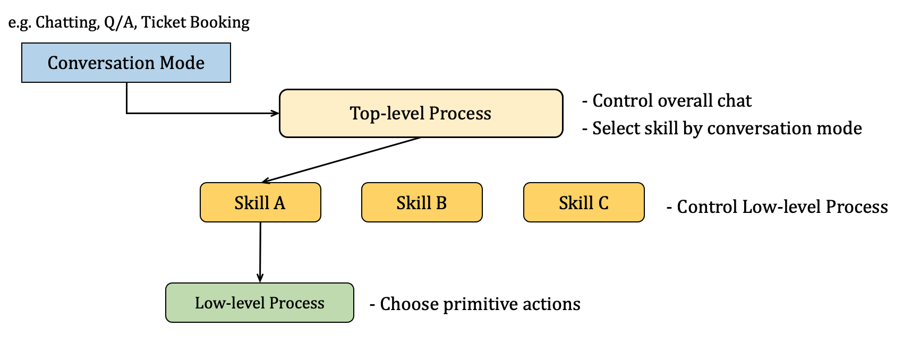

 

- Top-level process: 전체 대화 관리 및 conversation mode에 따라 skill 선택  
- Low-level process: 특정 task 수행 또는 conversation segment 생성을 위한 응답 선택 

이러한 hierarchical decision making은 마르코프 결정 과정(Markov Decision Processes, MDPs) 문제로 해결할 수 있다.  

> 매 턴마다 챗봇은 (dialogue) state를 탐지하며, (hierarchical dialogue) policy에 따라 action(skill 또는 응답)을 선택한다.  
응답에 따라 사용자로부터 reward(응답)를 받는다.  
>   
> (*expected CPS가 증가하도록 최적화*)

***explore*와 *exploit*의 balance를 맞추며 Action 수행**  
- explore: 알려지지 않은 user engagement를 높일 수 있는 action 탐지    
- exploit: active user를 유지하기 위해 이미 알려진 user의 관심사를 기반으로 action

 

--- 

## **3. System Architecture**

- **User Experience Layer** : 다양한 채팅 플랫폼과 연결 (+ 이미지 이해, 음성 인식, VAD 등 전처리 수행)
    - full-duplex 모드: 음성 기반 대화를 다루며, 사용자와 챗봇이 동시에 말할 수 있음
    - taking turn 모드: 메세지 기반 대화를 다루며, 턴을 가지며 대화
- **Conversation Engine Layer** : 대화 기술 (4절에서 자세히 설명)
- **Data Layer** : conversational data 및 non-conversational data를 저장한 데이터베이스 계층

 

----

## **4. Implementation of Conversation Engine**

### **4.1 Dialog Manager**  
- 대화 상태() 파악
- 응답 시 Dialogue policy()에 따라 action(, Core Chat 기능 혹은 Dialogue Skill 기능)을 선택  

**Global State Tracker**  
working memory에 로 인코딩하여 저장    
각 턴에 대한 유저 질의, XiaoIce 응답, Empathetic computing module에 의해 생성된 Empathy label을 텍스트로 저장

**Dialogue Policy** (~Hierarchical Policy)  

- High-level policy: Core Chat 또는 skill들 중 선택  
    skill trigger 집합에 의해 구현됨  
    (Topic Manager, Domain Chat triggers 등의 _머신러닝 기반 트리거_ 및 키워드 등에 의해 유도되는 _규칙 기반 트리거_)
    

    - 입력이 텍스트인 경우 Core Chat이 활성화되며, user의 관심사가 탐지되지 않으면 General chat skill이 트리거 되고, 탐지된 경우 Domain chat skill이 트리거된다.
    - 입력이 이미지인 경우 Image Commenting skill이 트리거됨 
    - Task Completion, Deep Engagement, Content Creation은 특정 유저의 입력 또는 특정 대화 문맥에서 유도됨  
    (만약 여러 skill들이 동시에 트리거된다면 confidence score, priority, session context에 의해 하나의 skill을 선택)
- Low-level policies: 각각 conversation segment를 관리

**Topic Manager**  
대화 주제를 바꿀 것인지 아닌지 판단하는 Topic switching classifier와 새로운 대화 주제를 추천하는 topic recommendation engine으로 구성되어 있다.  

_Boosted Tree 기반 Topic switching classifier_  
다음의 feature를 기반으로 예측  
1) Core Chat이 유효하지 않은 답변을 출력했는지
2) 사용자가 비슷한 말을 반복하는지 또는 별다른 정보가 없는지  
3) 사용자의 발화가 애매한지 (OK, I see 등)

_Boosted Tree Ranker 기반 Topic reconmmendation engine_   
Topic ranker와 Topic database로 이루어져 있으며, Topic switch가 활성화되면 를 통해 Topic database로부터 Topic candidates를 찾는다   

다음의 feature를 기반으로 후보군 예측  
1) Contextual Relevance: 대화와 연관되었는지
2) Freshness: 새로운 주제인가, 현재 이 타이밍에 유효한가 (이미 했던 지난 얘기 No)
3) Personal Interests: User profile에 따른 사용자가 관심있어 하는 주제인가
4) Popularity: 인기있는 주제인가
5) Acceptance rate: XiaoIce에서 해당 주제의 accept 비율이 높은가

--> Topic Manager를 Dialog Manager에 통합함으로써 expected CPS가 0.5 증가

 

### **4.2 Empathetic Computing Module**
- XiaoIce의 EQ를 담당
- 감정, 의도, 주제에 대한 의견, 배경지식, 일반적인 관심사 등 유저 및 대화의 공감적 측면을 파악

**Contextual Query Understanding (CQU)**  
주어진 query, 를 현재 context()를 고려하여 로 rewrite    

 
문맥에 맞도록 대명사 him이 Ashin으로 수정되었다 (in Turn 12)

 

1) Named Entity Identification: NE를 레이블링하고, working memory에 있는 경우 링크, 없으면 저장 
2) Co-reference Resolution: 모든 대명사를 NE로 변경
3) Sentence Completion: 문장이 완결되지 않은 경우, 를 통해 문장 완결

**User Understanding**  
사용자의 흥미, 감정, 의도, 의견, 사용자 페르소나 및 ë¥¼ 로 인코딩하는 컴포넌트이다.  

 
사용자의 profile을 반영한 발화 정보 (in Turn 11)

- Topic label: Topic Manager에 의해 감지된 topic
- Intent label: 화행 분석을 통해 탐지된 의도 (총 11개로 화행분류)
- Sentiment: happy, sad, angry, neural, 사용자 감정 변화(e.g. from happy->sad)로 분류
- Opinion: topic에 대한 반응 (positive, neural, negative)
- User profile: 사용자 ID가 유효한 경우, 사용자 페르소나 정보 포함

**Interpersonal Response Generation**  
를 기반으로 Response Empathy vector 를 생성하는 컴포넌트이다.  
이는 생성될 응답의 공감적 측면을 지정하며, XiaoIce의 페르소나를 구체화하는 역할을 한다.

--> Empathetic Computing module은 CPS에는 별다른 차이가 없었지만, NAU를 상승시켰다. (0.5 to 5.1 million in 3 month)

### **4.3 Core Chat**  
- 입력에 대한 답변을 생성함으로써 기본적인 대화 능력 제공
- 오픈 도메인 대화를 커버하는 General Chat과 특정 도메인의 대화만 커버하는 Domain Chat 모드로 구성  
    🎈 General Chat과 Domain Chat은 같은 구조를 가지며 DB를 분리함으로써 구분
- 후보군을 생성하는 3개의 Candidate Generator와 후보군의 순위를 결정하는 Boosted Tree Ranker(Wu et al. 2010)로 이루어짐
    > Generated response가 interpersonal & fit XiaoIce's persona

#### **Candidate Generator**

⑴ Retrieval-Based Generator using Paired Data

**데이터**  
&nbsp;&nbsp;&nbsp;&nbsp;&nbsp;인터넷(social networks, public forum, bulletin board, news comment 등)에서 사람 간 대화 데이터 수집  
&nbsp;&nbsp;&nbsp;&nbsp;&nbsp;XiaIce를 런칭한 후 30억개의 사람과 머신 간 대화 데이터 수집

**데이터 정제**     
&nbsp;&nbsp;&nbsp;&nbsp;&nbsp;인터넷으로 수집한 데이터에 대해서 Empathetic computing module을 통해 로 변환   

&nbsp;&nbsp;&nbsp;&nbsp;&nbsp;: 주어진 질의 (+current context)    
&nbsp;&nbsp;&nbsp;&nbsp;&nbsp;: 답변   
&nbsp;&nbsp;&nbsp;&nbsp;&nbsp;: 각각 질의자와 답변자의 감정, 의도, 발화 주제 등을 포함한 벡터   

&nbsp;&nbsp;&nbsp;&nbsp;&nbsp;XiaoIce의 페르소나에 적합한 공감적 답변만 남도록 정제  
&nbsp;&nbsp;&nbsp;&nbsp;&nbsp;개인정보, 이해하기 어려운 프로그래밍 코드, 적합하지 않은 내용, 오타 등 제거

**방법**  
&nbsp;&nbsp;&nbsp;&nbsp;&nbsp;Machine Learning 기반 Representation으로부터 키워드 및 의미 탐색을 통해 
400개의 응답 후보군 선택

**단점**  
&nbsp;&nbsp;&nbsp;&nbsp;&nbsp;인터넷 포럼에서 잘 다뤄지지 않은 주제는 DB에 포함되지 않기 때문에 질의에 대한 coverage가 낮음    
&nbsp;&nbsp;&nbsp;&nbsp;&nbsp; → coverage를 높이기 위해 2개의 candidate generator 도입

⑵ Neural Response Generator  
Retrieval-Based Generator의 단점을 보완하기 위해 도입   
오픈 도메인 대화를 위한 GRU-RNN 기반 Seq2Seq 모델  
견고하고(?) coverage가 높은 답변을 제공함   

>질의: You like Ashin  
>응답 후보: Why not?  

Neural Response Generator 

 

interactive representation 
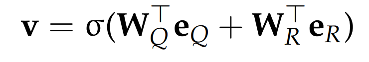

 

를 context vector로 한 Attention mechanism을 적용하였다.

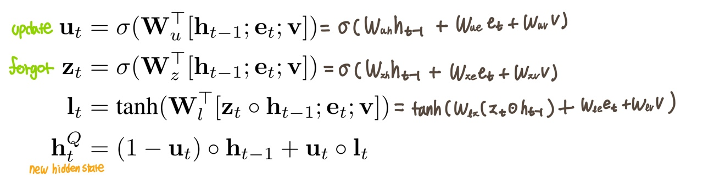 
hidden state 계산 과정

에 softmax를 적용함으로써 Next Token에 대한 확률을 계산한다.

  

previous hidden state 와 단어 임베딩 와 함께 interactive representation 을 결합함으로써 XiaoIceì˜ 페르소나에 맞는 답변이 출력됨  

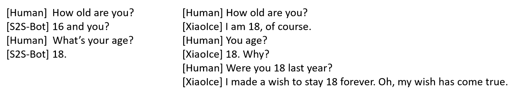 
왼쪽은 기본 S2S-Bot, 오른쪽은 interactive representation을 결합한 결과

 

⑶ Retrieval-Based Generator using Unpaired Data  
Coverage를 향상시키기 위해 Non-Conversational 데이터를 사용하여 학습한 Candidate Generator  

뉴스의 인용 문구 및 공개 강의로부터 문장을 수집하였으며, 이를 로 간주한다.   
작성자가 누군지 알기 때문에, 작성자 정보를 포함한 로 인코딩한다.

*Query expansion*: 에 다른 토픽을 추가    
본 Retrieval-based Generator의 지식 그래프(Knowledge Graph, KG)는 paired data(conversational data)와 Microsoft의 지식 그래프인 Satori를 결합함으로써 구축하였으며,   
head-relation-tail triple 로 구성됨 

1. 사용자의 질의로부터 발화 주제 탐색  
2. 지식 그래프에서 사용자의 발화 주제와 관련된 후보 주제 20개 선택  
3. 사용자의 발화 주제와 후보 주제를 결합하여 paired DB에서 응답 후보군 선택  

Retrieval-Based Generator 
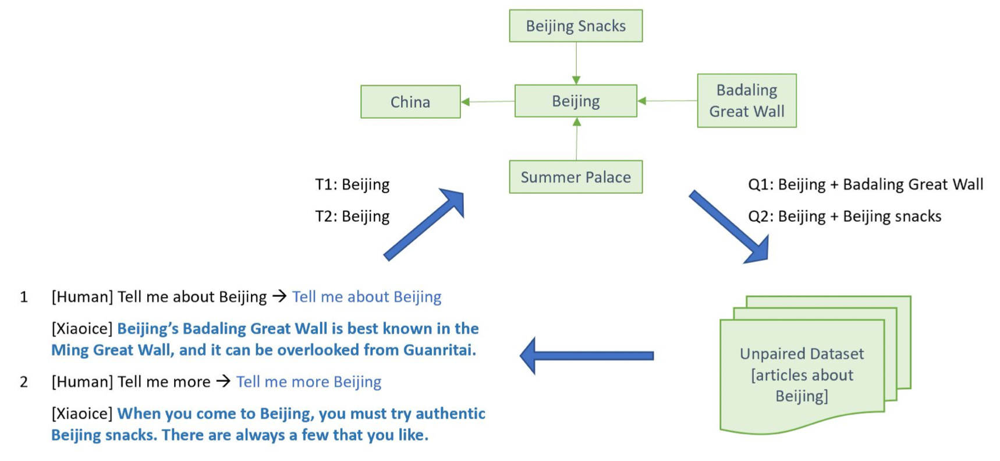

Neural Response Generator보다 길고 유용한 정보가 포함될 수 있으며, Retrieval-Based Generator using Paired Data보다 다양한 topic이 포함된 응답이 출력될 수 었어, 세 모델이 상호보완적으로 사용된다.

#### **Candidate Ranker**

Boosted Tree Ranker (Wu et al. 2010) 모델을 사용하며, ranking score가 threshold 값보다 높은 후보군 중에서 랜덤하게 응답을 선택한다. 

다음 4가지의 feature를 기반으로 ranking 
- _Local cohesion feature_ : 응답 후보군 와 질의 ì˜ 의미적 연관성   
(conversation pair로 학습된 DSSM, Deep Structured Semantic Models를 이용한 cohesion score 계산)
- _Global coherence feature_ : 응답 후보군 와 질의 및 문맥 ì˜ 의미적 연관성  
(dialogue session으로 학습된 DSSM를 이용한 coherence score 계산)
- _Empathy matching feature_ : empathetic computing module에 의해 예측된 과 응답 후보군으로부터 계산된  비교
- Retrieval matching feature : 응답 후보군이 paired database로부터 검색된 경우, 해당 query와 가 word-level 및 semantic-level에서 얼마나 매칭되는지 계산

위 네가지 feature를 기반으로 데이터셋 레이블링 진행  
공감적이지 않고 질의와 관련이 없는 응답에는 0, 좀 괜찮은 응답이면 1, 공감적이고 XiaoIce의 페르소나에 적합한 응답이면 2

#### **Editorial Response**
모델 생성 실패, 타임아웃, 부적절한 질의 등의 문제가 발생한 경우, 사전에 정해놓은 응답 출력  
예) 잘 모르겠어

#### **Evaluation**

1. 페르소나에 기반한 Neural response generator의 검증  
베이스라인 모델: vanilla seq2seq model, LSTM-MMI model(응답 생성 모델, SOTA)  
성능 지표는 언어 모델의 성능지표로 사용되는 perplexity(next token에 대한 불확실성, PPL)와 BLEU score(생성된 응답이 사람의 것과 얼마나 유사한지 나타내는 지표)를 사용하였다.
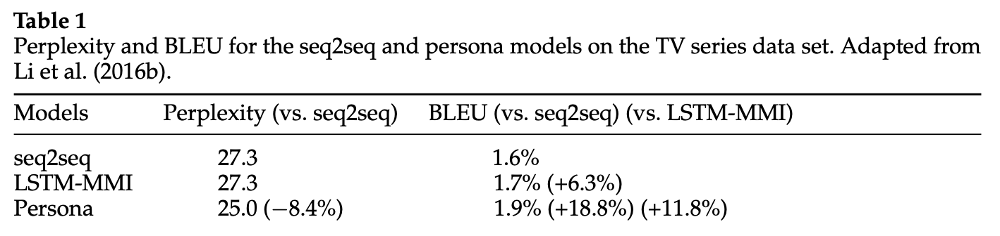
 또한, persona model은 베이스라인 모델보다 interpersonal response를 생성한다.  
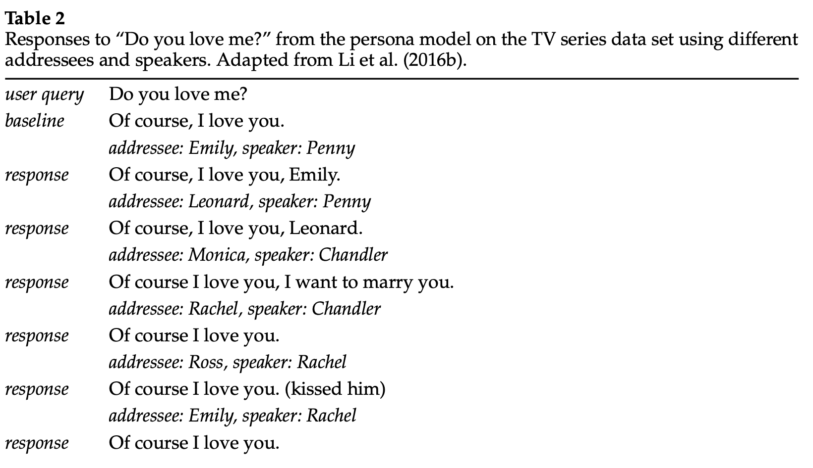

2. 생성 모델과 검색 모델을 혼용한 하이브리드 시스템의 효율성 검증  
Hybrid system :위 3가지의 Candidate generator 중 ⑴과 ⑵ 모델을 혼용한 모델  
베이스 라인: ⑴과 ⑵  
 
4,000개의 dialogue session 데이터를 검증에 사용하였으며, 각 모델에 의해 생성된 응답은 사람에 의해 0, 1, 2로 레이블링하여 검증을 진행하였다.
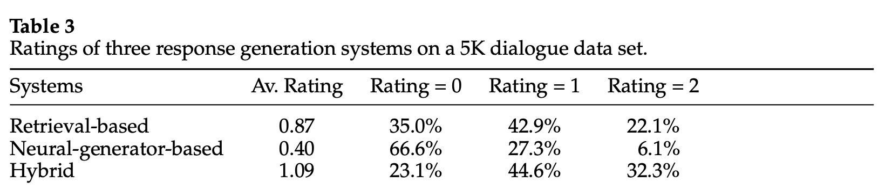
 위에서처럼,  Retrieval-based Candidate generator를 단독으로 사용하는 것보다 Neural response generator를 결합한 시스템이 더 성능이 좋다.   
세 가지 candidate generator 모델을 혼용한 Hybrid 시스템은 2주 안에 Core Chat의 expected CPS를 0.5 향상시켰으며, 응답 커버리지도 향상시켰다.

### **4.4 Image Commenting**  

입력을 이미지로 받았을 때 대화를 이어가기 위한 기술로, Core Chat과 동일한 프로세스로 이루어진다.  

traditional vision task와 다른 점 
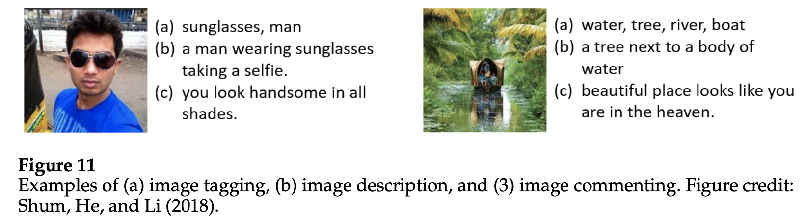

Image Commenting 기술은 사물 인식 및 사진을 묘사하면서도 공감적 코멘트를 생성한다.  

#### **Retrieval-based Approach**
Facebook, Instagram으로부터 수집한 image-comment pair dataset을 학습에 사용하였다.  
Core Chat과 마찬가지로 XiaoIce의 페르소나에 맞는 pair만 남기기 위해 Core Chat의 **데이터 정제** 및 **방법**을  적용한다. 

image-comment pair DB 및 쿼리로 주어진 이미지를 각각 visual feature vector로 인코딩한 후, 코사인 유사도를 기반으로 랭킹한다.  

Image to visual feature vector 
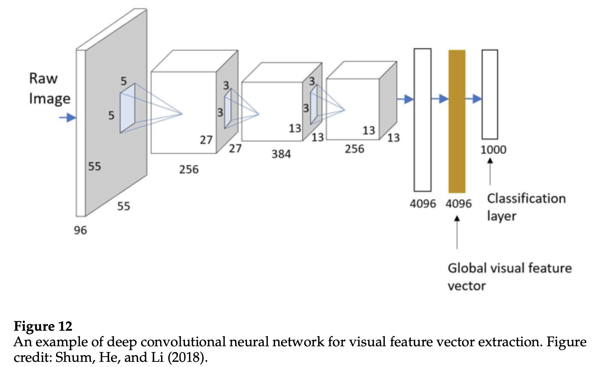

#### **Generation-based Approach**
Microsoft의 Image Captioning system의 확장 버전인 image-to-text-generator를 사용한다.  
또한, style factor 및 높은 수준의 sentiment를 제어하기 위해 추가적인 모듈을 통합하였다. 

#### **Candidate Ranker**
Core Chat과 비슷하다. boosted tree ranker를 사용하여 위에서 언급된 4가지의 feature를 기반으로 랭킹한다.   
다만, 유사도를 구해야 하는 와 가 각각 이미지와 텍스트인 점에서 조금 다른데,  
이는 *Deep Multimodal Similarity Model*에 의해 계산되었다.  

이후는 Core Chat과 동일하게 3-level로 나뉘어 후보군을 레이블링 함으로써 데이터셋을 구축하고 ranker를 학습시킨다.  

#### **Evaluation**

모든 지표에서 XiaoIce가 뛰어남 

Image Captioning system과 비교 
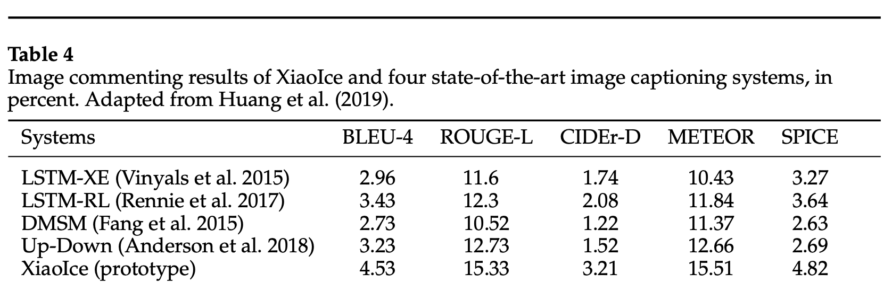

Image Commenting 예시 

--> Image Commenting 기술은 expected CPS를 2배 증가시켰다.  

  

### **4.5 Dialogue Skills**  
- 기능 대화, 이미지 등 특정 입력에 대해 처리하는 기타 대화 기술로, XiaoIce는 230개의 Dialogue skill을 가지고 있다.

>**Evaluation** : lab study 및 market study을 통해 수행  
> 
> lab study: 세션 당 평균 턴의 개수 및 user rating을 통해 검증하는 크라우드 소싱을 통한 방법  
> market study: 시장에 배포한 후, active user의 수와 skill trigger rate(유저에 의해 트리거되는 수)을 모니터링함으로써 만족도 조사

dialogue skill들을 아래 3가지의 카테고리로 나누어 소개

1. Content Creation Skill  
유저의 흥미를 충족하기 위한 기술  
오디오북 생성, 텍스트 기반 시 생성, 아이들을 위한 동화책 서비스 등
  
2. Deep Engagement skill  
유저의 특정 감정적 요구 또는 지적 욕구를 충족하기 위한 기술    
음식 인식 및 추천 기술, 빠른말 놀이 (발음하기 어려운 문장을 빠르게 말하는 놀이) 등  
예) 유저의 발화에서 부정적인 감정이 탐색된 경우 Comporting skill이 트리거됨  

3. Task Completion skill  
날씨 안내, 뉴스 추천, 디바이스 제어 등 personal assistant로서의 대화 기능 수행    

 

----

## **5. XiaoIce in the Wild**

- Neural Response Generator는 5번째 버전에 추가되었으며, 이는 응답의 커버리지 및 다양성을 향상시켰다.
- Empathetic Computing module은 6번째 버전에 추가되었는데, 이는 NAU를 500 million에서 660 million으로 향상시켰고 많은 Dialogue skill에도 불구하고 CPS 23을 유지시켰다.
- Full duplex voice mode는 대화 세션의 길이를 증가시켰다.
- XiaoIce는 14년도부터 거의 매주 새로운 dialogue를 배포했다. CPS를 감소시키는 요인이지만 장기적인 관점에서 NAU를 증가시키는데 도움이 되었다.

XiaoIce는 사람과 장기적인 교류를 목표로 삼았는데, 아래는 이를 달성했다는 결과를 보여준다.

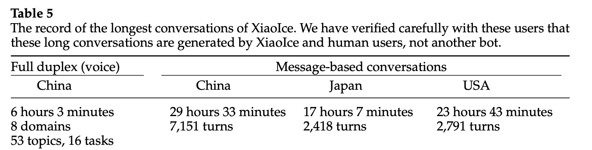

 

----

## **6. Related Work**
- Architecture

    XiaoIce는 hybrid AI engine(Rule-based + Data-driven)에 기반한 modular system이며,   
    최근에는 full data-driven, end-to-end(E2E) system이 떠오르고 있다.

    전통적인 소셜 챗봇은 사람의 대화를 모방하지만 사용자의 환경과 소통하지 않았으며,   
    이때 E2E 접근 방식은 큰 데이터 및 오픈 도메인 데이터에 학습이 용이한 RNN 기반의 간단한 아키텍처로 이어진다.

    그러나, XiaoIce는 modular 아키텍처를 통해, 유저의 환경 및 real-world knowledge에 기반한 factual response를 생성한다.

- Sounding Board Chatbot  
XiaoIce와 유사한 시스템 디자인을 가진 modular system으로, user-centric 및 content-centric으로 디자인 되었다.
    
    > User-centric: 사용자의 personaility를 수집함으로써, 사용자의 흥미에 따른 응답을 선택  
    > Content-centric: 대화를 이어가기 위해 풍부한 양의 content collection을 통해 흥미로운 정보를 제공함
    >
    > -> 

- XiaoIce 개발에 영향을 줬던 챗봇  
심심이, Panda Ichiro, Replika 등

---
## **7. Discussion**

### **Evaluation Metric**
- Retrieval-based model을 검증하기 위한 메트릭  
전통적인 retrieval metric인  
Precision at K, Mean Average Precision (MAP), normalized Discounted Cumulative Gain(nDCG)가 사용됨
- Generation-based model을 검증하기 위한 메트릭  
텍스트 생성 테스크의 성능지표인 BLEU, METEOR, ROUGE, deltaBLEU가 사용됨

> 이 메트릭들이 대화 응답을 검증하기에 적절한 지표인지는 논의가 계속되어 왔다  
>
> Liu et al.은 이러한 메트릭들이 human judgement와 상관관계가 낮음을 보여주며 적절치 않다고 주장했으며  
> Gao et al.은 BLEU는 corpus-level metric으로 사용되기 위해 디자인된 반면 Liu et al.의 상관관계 분석 연구는 sentence-level로 수행되었다고 지적했다.  
> Galley et al.은 BLEU, deltaBLEU와 같은 string-based metric의 측정 단위가 문장보다 클수록 상관관계가 커진다고 밝혔다. (무슨 의미인지 공부하기..😥)

- machine-learned metric  
최근 ADEM 등 대화 검증을 위한 machine learned metric이 제안되었고,   
해당 저자는 BLEU 및 ROUGE보다 human judgement와의 상관관계가 높다고 주장했다.

    그러나 Gao et al.의 연구에서 이러한 machine learned metric은 과적합과 gaming of the metric 등 잠재적인 문제를 야기할 수 있다고 주장했다.

결과적으로, 오픈 도메인 챗봇의 검증 지표는 아직 완성적이지 못하다.  

**오픈 도메인 챗봇의 자동 성능 지표 개발의 전제 조건**  
1. 데이터가 충분히 많아야 한다.
2. 각 질의에 대응하는 적절한 응답들이 여러개 존재해야 한다.

### **Ethics Concerns**
사용자의 개인정보를 수집하는 AI 기술을 사용함에 앞서 각별히 주의해야 하는 윤리적 문제에 대하여 언급하는 파트이다.

#### **Privacy**
XiaoIce는 사용자의 사적이면서 민감한 정보를 수집하기 때문에 이러한 정보를 사용할 때 유의해야 한다.

#### **Who is in control**
시스템은 항상 사용자에 의해 컨트롤되며, user-centric에 기반해야 한다. 

XiaoIce는 사용자 자신 또는 다른 사용자에게 해롭다고 판단되지 않는 이상 언제나 사용자에 의해 컨트롤되도록 설계되었다.  
예) 너무 오랜 시간 이용한 경우 강제로 휴식 시간을 갖게 한다.

#### **Expectation**
사용자가 비현실적인 기대감을 갖지 않도록 XiaoIce의 능력에 대한 올바른 인식이 잡혀야 한다. (잘못된 인식은 사용자를 XiaoIce에 중독시킬 수 있음)
- XiaoIce는 기계임을 명확히 인지할 것
- XiaoIce가 할 수 있는 것과 할 수 없는 것을 안내해야 한다.

#### **Machine Learning for good**  

머신러닝의 오용을 막기 위한 안전장치가 필요하다.  
본 시스템은 데이터베이스 내에 부적절한 언행 등을 삭제하여 사용하였으며,   Editorial response 또한 부적절한 언행을 담지 않도록 작성하였다.  

그럼에도 불구하고, 문맥에 따라 부적절한 언행이 될 수 있는 경우가 있다.   
예) 부적절한 질의에 대한 'Yes'

이러한 문제는 여전히 과제로 남아있다.

---
## **8. Conclusions and Future Work**

1. Towards a unified modeling framework  
본 시스템은 소셜 챗을 MDPs 문제로 해결했으며, 이는 챗봇 디자인의 가이드라인을 제공했지만 아직 unified modeling framework의 효율성을 입증하지는 못했다.  
인간의 대화에 동기를 부여하는 유저의 보상을 효과적으로 모델링 할 수 있다면 empathetic computing module과 RL에 기반한 unified framework를 함께 최적화할 수 있다.

    > 😳 잘 이해가 안간다... 유저의 보상을 효과적으로 모델링하는게 어떤식으로 모델링하는 것을 의미하는 건지 

2. Towards goal-oriented, grounded conversations  
사용자의 니즈를 충족시키는 목적 지향 인터랙션을 위해 해당 사용자의 실제 세계에서의 모든 대화를 기반으로 삼는 것은 과제로 남아있다.

3. Towards a proactive personal assistant  
상업적 가치로 이어질 수 있는 시나리오를 실현하는 주도적인 AI 비서  
4. Towards human-level intelligence  
아직 사람의 말을 완전히 이해하는 것이 아니며, 사람과 실제 세계를 이해하기 위해서는 여러 분야의 AI의 발전이 필요하다.
5. Towards an ethical social chatbot  
AI system이 사람에게 해가 되지 않기 위한 윤리적 가이드라인 설립 
