## **Facebook의 Poly-Encoder 논문 리뷰** (12월 7일~12월 9일)

### [📄**Paper**](https://openreview.net/pdf?id=SkxgnnNFvH)  
Humeau, S., Shuster, K., Lachaux, M. A., and Weston, J., “Poly-encoders: architectures and pre-training strategies for fast and accurate multi-sentence scoring,” _Proc. of the 8th International Conference on Learning Representations (ICLR 2020)_, Addis Ababa, Ethiopia, 2020.

### **📌 목차** 

1. Introduction
2. Related work  
3. Tasks
4. Methods  
    4.1 Transformers and Pre-training Strategies  
    4.2 Bi-encoder  
    4.3 Cross-encoder  
    4.4 Poly-encoder
5. Experiments  
    5.1 Bi-encoders and Cross-encoders     
    5.2 Poly-encoders  
    5.3 Domain-specific pre-training  
    5.4 Inference speed  
6. Conclusion  

---

### **1. Introduction**

기존의 pairwise comparision task를 해결하기 위한 Cross-encoder, Bi-encoder 접근방식의 성능 개선한 new Transformer architecture _Poly-encoder_ 제안  

**Poly-enocder**
- Cross-encoder의 추론 시간 개선
- Bi-encoder의 prediction quality 개선

**4가지 데이터셋에서의 Poly-encoder성능 검증**  
&nbsp;&nbsp;&nbsp;&nbsp;&nbsp;Dialogue 및 Information Retrieval (IR) 도메인에 대한 데이터셋에서 성능 검증  

 

### **2. Related work**

1. Bi-encoder  
Input과 candidate label을 같은 공간 상에 매핑한 후 유사도를 비교함으로써 scoring  
vector space model, LSI, supervised embeddings, classical siamese networks 등이 있음  
 
**next utterance prediction**에도 Memory Networks, Transformer Memory networks, LSTMs, CNNs와 같이   
input과 candidate label을 따로 인코딩하는 Bi-encoder approach가 사용되었다.   
 
input과 candidates를 각각 따로 임베딩하기 때문에, candidates를 저장하여 재사용할 수 있다는 장점이 있다.  
→ candidate를 다시 임베딩할 필요가 없기 때문에 추론 시간이 빨라짐

2. Cross-encoder  
Input과 candidate를 이어붙여(concatenation) 하나의 입력으로 사용하며, non-linear function에 의해 scoring 된다.  
Sequential Matching Network CNN-based architecture, Deep Matching Networks, Gated Self-Attention 등이 있다.    
 
가장 최신 transformer를 이용한 Cross-encoder approach는 각 layer에 self-attention을 적용한 결과를 내며,   
input과 candidate 간의 interaction을 극대화한다. (candidate 내 word는 input 내 모든 word에 attend 할 수 있음)  

> Urbanek et al. (2019)의 연구에서는 사전학습된 BERT를 통한 Cross-encoder와 Bi-encoder의 성능을 비교했으며,  
Cross-encoder의 접근 방식이 성능이 더 뛰어나지만 추론 시간 면에서는 뒤쳐졌다.

 

### **3. Tasks**

다음 두 가지 도메인에서 사용되는 데이터셋을 통해 본 연구에서 제안하는 Poly-encoder 성능을 검증하였다.  

**Sentence Selection in Dialogue**

- ConvAI2 dataset  
대화 데이터로, 각 발화자에 대한 페르소나의 정보가 함께 담겨있다.

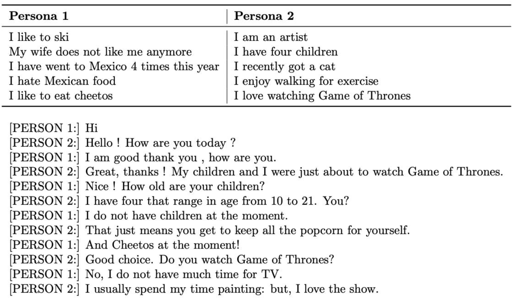

 

- DSTC7 dataset (Track 1)  
Ubuntu Chat log로부터 추출한 대화 데이터   
DSTC7 challenge에서 우승한 팀은 64.5% R@1를 달성하였다.  

- Ubuntu V2  
위와 비슷하지만 더 큰 사이즈의 corpus를 가짐    

**Article search in Information Retrieval**  
- Wiki Article Search   
약 5M의 article을 포함하며, 어떤 article 내 sentence가 주어지면 article을 찾는 task를 수행하는 데이터셋이다  
다른 1만개의 기사들 사이에서 실제 기사의 순위를 통해 검증한다.    

데이터셋 비교 
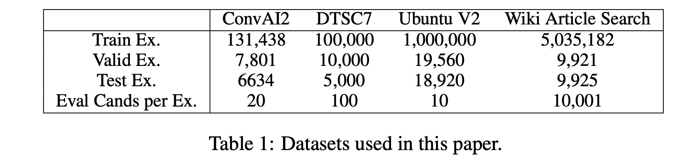

 

### **4. Methods**

#### **4.1 Transformer and pre-training strategies**  
본 논문에서 소개하는 Bi-encoder, Cross-encoder, Poly-encoder는 large pre-trained Transformer에 기반하고 있다. 

**사용한 사전 학습 모델**
- BERT-base on _Wikipedia & Toronto Books Corpus_   
Wikipedia & Toronto Books Corpus의 총 1억 5천만개의 [INPUT, LABEL] 쌍의 데이터셋을 사용하여 
<u>Masked Language Model(MLM)</u> task와 <u>Next Sentence Prediction(NSP)</u> task 학습  

- BERT-base on _Reddit_  
Reddit의 총 1억 7천만개의 [INPUT, LABEL]쌍의 데이터셋을 사용하여  
<u>Masked Language Model(MLM)</u> task와 <u>Next Utterance Prediction(NUP)</u> task 학습  
(_Reddit이 dialogue task에 더 적합_)

> **Next Sentence Prediction**  
후보군의 50%는 진짜 next sentence로 구성하고 나머지 50%는 랜덤하게 선택된 sentence로 구성하여 제공  
후보군 중에서 next sentence를 찾는 task  
>
> **Next Utterance Prediction**  
> utterance가 하나 이상의 문장으로 이루어질 수 있다는 점에서 NSP와 약간 다르다

#### **4.2 Bi-encoder**  
input context와 candidate label을 따로 인코딩하는 구조  

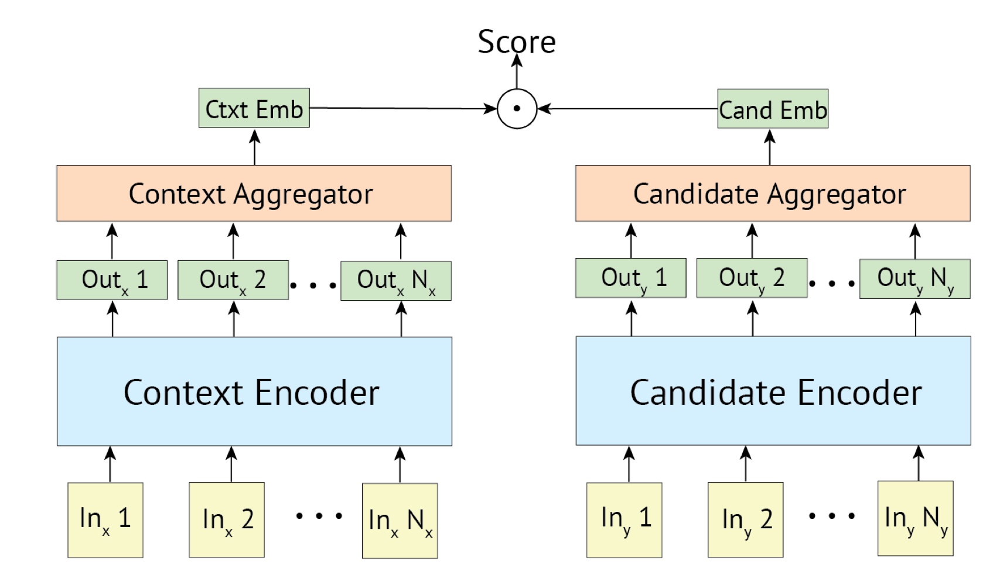

 

- Input $ctxt, cand$  
N개의 토큰으로 토큰화된 input context와 candidate label  

- Encoder $T_1, T_2$    
같은 사전학습 모델을 사용하지만, fine-tuning의 parameter upadate는 따로 진행  

- Output of Encoder $T(x)=h_1,..,h_N$   
(N, 768) (768 is *Embedding size*) 크기로 인코딩된 벡터

- Aggregator $red(\cdot)$  
N개의 벡터를 하나의 representation으로 표현하기 위함이다. 
(N, 768) → (1, 768)  

    1. 첫 번째 벡터 선택  
    2. m개 벡터들의 평균 벡터 ($m<N$)
    3. N개 벡터들의 평균 벡터

- Scoring function $s(ctxt, cand_i)$  
dot product를 통해 i번째 후보군에 대한 점수를 계산한다  

$$s(ctxt, cand_i) = y_{ctxt}\cdot y_{cand_i}$$

> **Bi-encoder 장점 🌟**  
> 모든 candidates에 대한 임베딩을 저장하여 재사용할 수 있기 때문에,  
> 추론 시간 면에서 효율적이다  
>

#### **4.3 Cross-encoder**
input context와 candidate label을 이어붙여(concatenate) 새로운 input으로 사용  

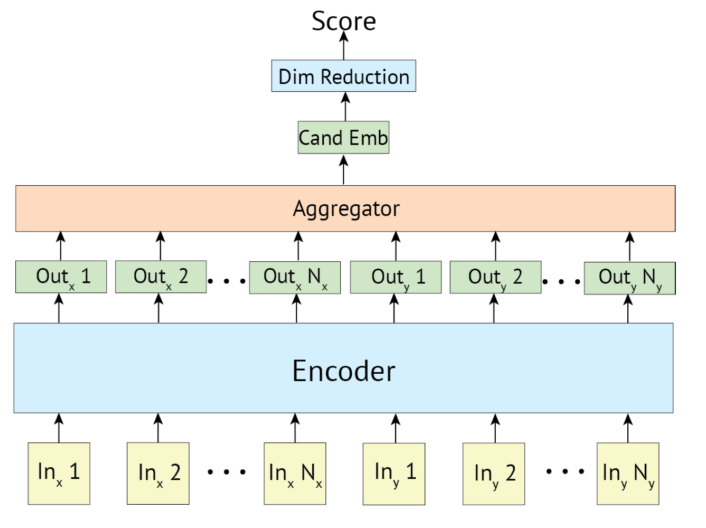

 

- Input $ctxt, cand$  
2*N개의 토큰으로 토큰화된 $[ctxt, cand]$ 

- Encoder $T$    
하나의 인코더를 사용하여 인코딩

- Output of Encoder $T(ctxt, cand)$   
768 크기로 인코딩된 2*N개의 벡터

- Aggregator $first(\cdot)$  
2*N개의 벡터를 하나의 representation $y_{ctxt,cand}$으로 표현하기 위함이다.   
첫번째 벡터를 추출한다

$$y_{ctxt,cand} = first(T(ctxt,cand))$$

- Dim Reduction (Scoring function, $s(ctxt, cand_i)$)  
선형 레이어 $W$를 거쳐 i번째 후보군에 대한 점수를 계산한다  

$$s(ctxt, cand_i) = y_{ctxt},y_{cand_i}W$$

> **Cross-encoder 장점 🌟**  
> Transformer에 기반한 사전학습 모델을 사용하였기 때문에,  
> input context와 candidate label을 이어붙인 새로운 입력에 self-attention을 적용하는 구조를 띤다.  
> <u>candidate-sensitive input representation</u>을 만들어 Bi-encoder보다 성능이 좋다  
>
> **Cross-encoder 단점 ☔**  
> Bi-encoder와 달리 candidate의 임베딩을 저장하고 재사용할 수 없디.  
> input과 candidate을 이어붙인 입력을 사용하기 때문에 메모리 사용량이 크다. → batch size를 줄임  
> 추론 시간이 느리다.

#### **4.4 Poly-encoder**
Bi-encoder의 성능을 개선하면서 Cross-encoder의 단점을 극복한 프레임워크

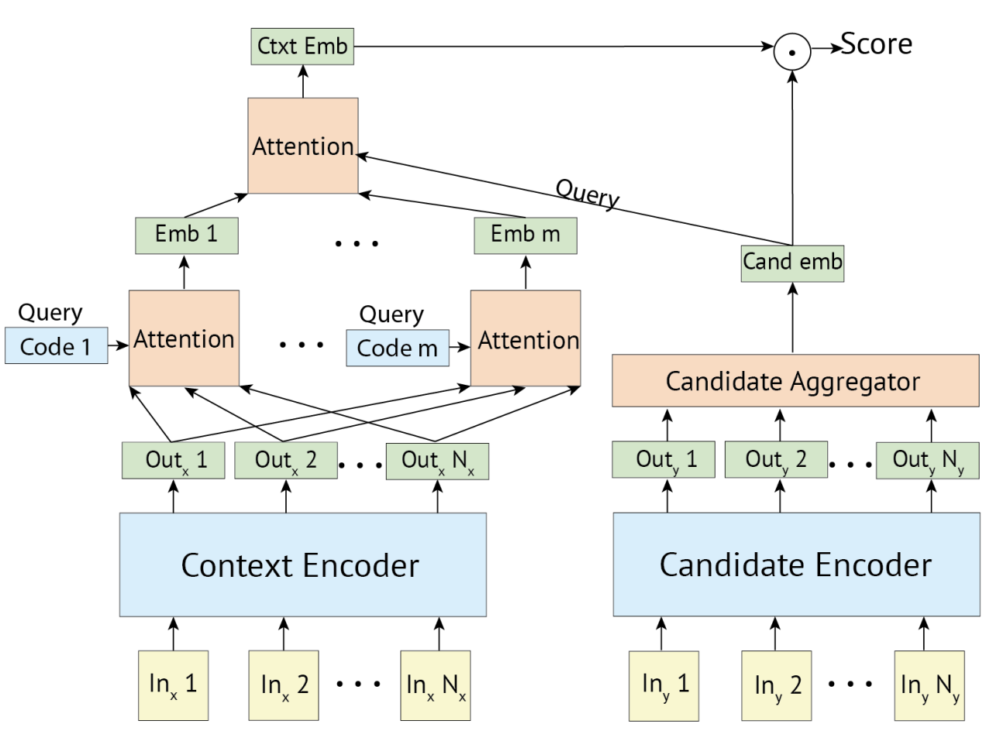

 

- Input $ctxt, cand$  
N개의 토큰으로 토큰화된 input context와 candidate label  

- Encoder $T_1, T_2$    
같은 사전학습 모델을 사용하지만, fine-tuning의 parameter upadate는 따로 진행  

- Output of Encoder $T(x)=h_1,..,h_N$   
(N, 768) (768 is *Embedding size*) 크기로 인코딩된 벡터

- Aggregator $red(\cdot)$  
N개의 벡터를 하나의 representation $y_{cand_i}$으로 표현하기 위함이다.   

$$y_{cand_i} = red(T_2(cand_i))$$

- Attention
    - m개의 Global feature 생성  
    m개의 context code $(c_1,...,c_m)$를 정의하여 global feature $y^i_{ctxt}$를 추출   
     
    구현 시, context codes $(c_1,...,c_m)$은 랜덤하게 초기화된 파라미터를 학습시켜 사용하였다.   
    [출처: facebookresearch](https://github.com/facebookresearch/ParlAI/blob/master/parlai/agents/transformer/polyencoder.py#L342)
 
    $$(w^{C_i}_1,..,w^{C_i}_N)=softmax(c_i\cdot h_1,.., c_i\cdot h_N)$$
    $$y^i_{ctxt}=\sum_{j=1}^{N}w^{C_i}_jh_j$$ 

    - Context-Candidate Attention  
    주어진 m개의 global feature vector에 $y_{cand_i}$를 attend 함으로써,  
    cross-encoder처럼 candidate과 input context 간의 더 많은 interaction을 추출하기 위함인것 같다 
 
    $$(w_1,..,w_m)=softmax(y_{cand_i}\cdot y^1_{ctxt},.., y_{cand_i}\cdot y^m_{ctxt})$$
    $$y_{ctxt}=\sum_{i=1}^{m}w_iy^i_{ctxt}$$ 

> **Poly-encoder 장점 🌟**  
> Bi-encoder처럼 input context와 candidate을 따로 인코딩함으로써 candidate 임베딩을 저장할 수 있다.  
> Cross-encoder는 input context와 candidate에 attention을 모든 계층마다 수행하는 반면,  
(인코더의 모든 계층에서 attention 수행)  
> Poly-encoder는 마지막 계층에서만 candidate과 input context 간의 attention을 수행하므로 더 빠르다

[Poly-encoder, Bi-encoder, Cross-encoder 구현👊](https://github.com/aqaqsubin/Pairwise-Comparison-Model/blob/)  
논문을 보며 구현해본 코드로 틀릴 수 있다.. 

(Poly-encoder 코드는 facebookresearch repo에서 오픈소스로 공개되어있다.)

 

### **5. Experiments**
측정 메트릭 : Recall at k(Recall@k), Mean Reciprocal Rank(MRR)

- R@k/C : 전체 C개의 후보들 중 k개를 선택했을 때, 실제 relevant 후보군 대비 선택된 relevant 후보군 비율  
- MRR : relevant한 후보군이 얼마나 상위에 ranking되어 있는지 판단  
    relevant한 후보군의 각 순위를 역수로 하여 평균을 구한 값이다

#### **5.1 Bi-encoders and Cross-encoders**

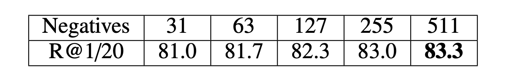 
negatives 수에 따른 성능 검증

 

negative가 증가할 수록 성능이 향상된다.   
Bi-encoder는 negative 수를 늘릴 수 있지만 Cross-encoder는 그럴수 없기 때문에  
DSTC7 and Ubuntu V2, ConvAI2 데이터셋에 대해 각각 15, 19개의 negative를 사용한다  

 
BERT-base 모델의 fine-tuning에 따른 성능 분석

→ word-embedding을 제외한 모든 layer fine-tuning  

  

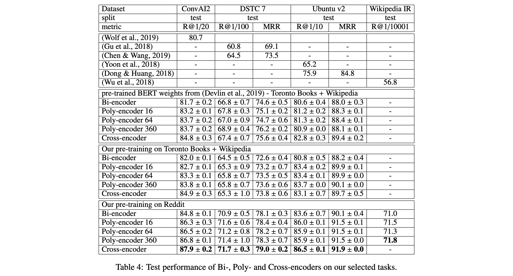 
ConvAI2, DSTC7, Ubuntu V2, Wikipedia IR 4가지 task에 대한 성능 비교

 

1. Bi-encoder와 Cross-encoder는 ConvAI2, DSTC7, Ubuntu V2에 대해 기존에 제안된 접근 방법을 능가했다  
2. Cross-encoder의 성능이 가장 뛰어나다

#### **5.2 Poly-encoders**

Poly-encoder에서는 m개의 context code를 통해 input context로부터 global feature를 추출하는데,  
위의 table 4에서는 m의 크기에 따른 성능도 분석하였다.

m이 커질수록 성능이 향상됨을 알 수 있다. 

> Li et al.(2019)의 연구에서는 ConvAI2 데이터셋에 대해 human evaluation을 수행한 결과,  
Poly-encoder가 가장 뛰어났다고 보고했다

#### **5.3 Domain-specific pre-training**

본 연구에서 제안한 3가지 사전학습 모델 중에서, Reddit 데이터로 사전학습된 모델이 SOTA 달성

Reddit이 대화 데이터에 더 가까웠고, finetuning으로 하고자 하는 stask에 가까웠다.  
> fine-tuning으로 하고자 하는 task와 비슷한 데이터셋으로 pretraining task를 수행하는 것이 성능 개선으로 이어진다.

#### **5.4 Inference speed**

 
100개 dialogue examples 평균 추론 시간 비교

 

- 1k개의 후보군을 가질 때 Bi-encoder와 Poly-encoder간의 추론 시간 차이가 적다
- Bi-encoder와 Poly-encoder에 비해 Cross-encoder의 추론 시간은 너무 길다

 

### **6. Conclusion**

candidate embedding을 미리 계산하여 저장할 수 있는 Bi-encoder의 장점을 유지한 채,
context representation에 candidate label을 attending하는 Cross-encoder의 메커니즘을 사용하였다.  

추론 시간과 정확도의 적절한 trade-off가 이루어진 Poly-encoder 모델 제안!

---

### **Appendix**  

#### **A. Training time**  

 
3가지 데이터셋에 대한 모델들의 훈련시간 비교

 

#### **B. Reduction layer in Bi-encoder**  

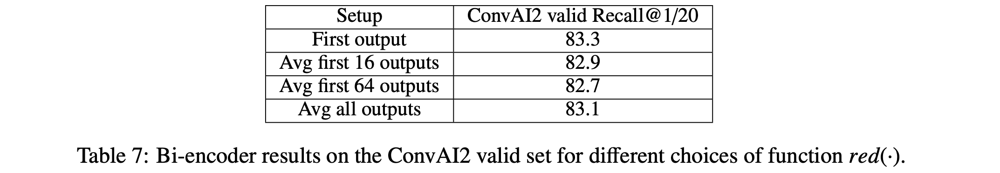 
Aggregator 3가지 방법에 대한 Bi-encoder 성능 비교

 

첫번째 벡터를 사용하는게 가장 성능이 좋다

#### **C. Alternative choices for context vectors**

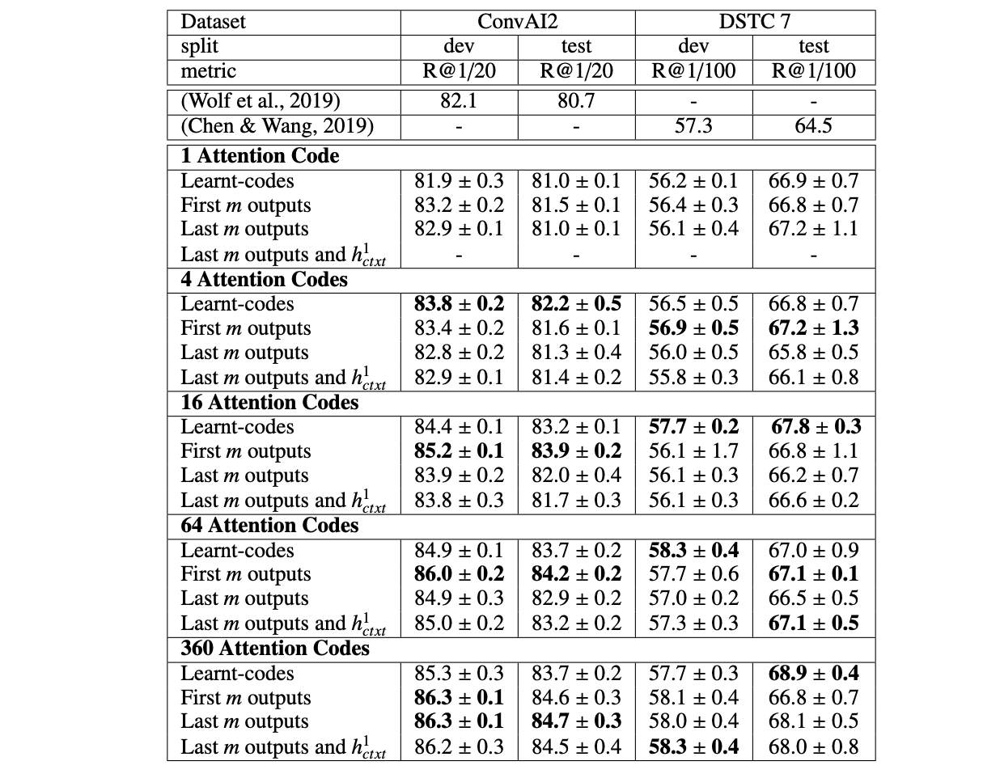 
m의 크기 및 m개의 global feature를 정의하는 방법에 대한 성능 비교

 

- Learnt-codes : context codes를 정의하여 모든 output $h^1_{ctxt},..,h^N_{ctxt}$에 attending하여 $y^i_{ctxt}$를 추출하도록 학습시킨 방법

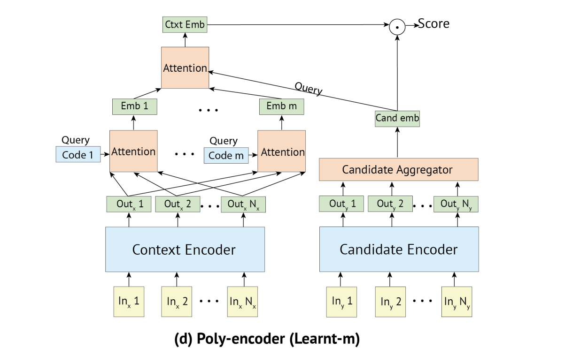

 

- First m outputs : 처음 m개의 output을 사용
- Last m outputs : 마지막 m개의 output을 사용
- Last m outputs and $h^1_{ctxt}$ : BERT의 special token [S]에 해당하는 첫번째 output $h^1_{ctxt}$와 마지막 m개의 output을 이어붙여 사용

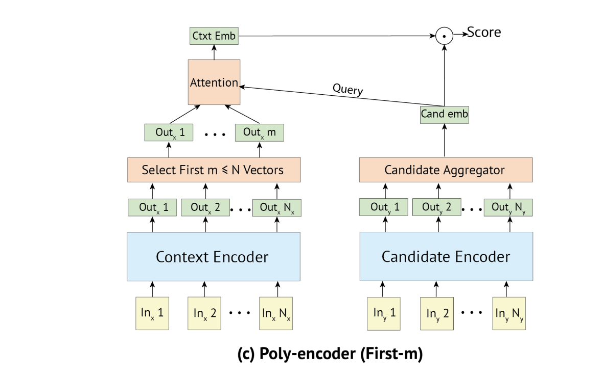

 

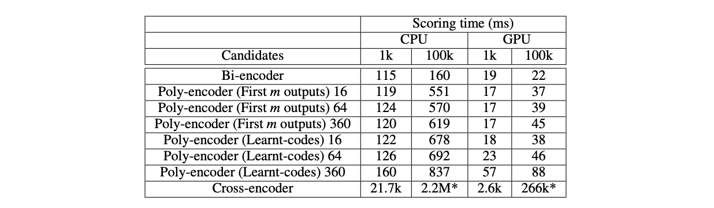

 

m의 크기가 클수록 성능이 향상됨을 알 수 있다.
m이 커진다면 learnt-m보다 first-m을 사용하는게 추론 시간 면에서 유리할 수도 있겠다!