## **'HyperCLOVA로 만드는 캐릭터 챗봇' 리뷰**

### [🍀 **DEVIEW 2021**](https://tv.naver.com/v/23650564)  
제 목 : 100억 대화 데이터 없이도 가능해요! - HyperCLOVA로 만드는 캐릭터 챗봇  
발표자: NAVER CLOVA/Conversation 강재욱, 가순원, 이민영

--- 

## **서 론**
메타버스 시대에서 인간과 소통하고 교감할 수 있는 가상 캐릭터는 핵심 콘텐츠가 될 것

하지만 기존의 가상 캐릭터는 이미 녹화된 영상에 face/motion/voice capture를 통해 구현되어 실시간 소통이 불가능하다.  

→ 챗봇이 캐릭터 페르소나를 가진다면 소통이 가능하기 때문에 대화 가능한 가상 캐릭터를 만들 수 있다. 

**캐릭터 챗봇**  
챗봇에게 캐릭터를 부여하기 위해서는 **대화체, 세계관, 성격** 이 3가지의 페르소나 설정이 가능해야 한다.

기존 다수의 챗봇은 Retriever & Reranker 프레임워크로 이루어져 있으며,   
이때 페르소나를 설정하기 위한 가장 확실한 방법은 <u>대화 DB 검수</u>이다
<div align=center>
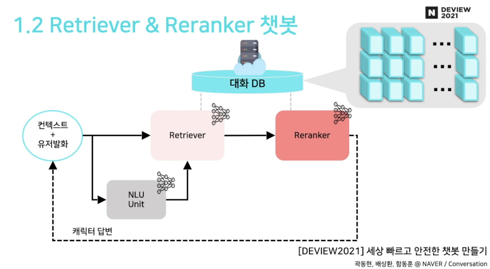
</div>
<br>

그러나, 페르소나를 가진 대량의 캐릭터 대화 DB를 구축하기는 어렵다는 한계가 있다.  
→ _HyperCLOVA로 대화 DB 생성_

<br>

## **캐릭터 대화 DB 구축 파이프라인**

### **1. 대화 DB 생성**

#### **Naive Few Shot Approach**  

HyperCLOVA에 prompt로 task에 대한 description과 몇 개의 예시를 제공함으로써   
주어진 예시를 기반으로 생성하는 방식이다  

**주어진 prompt** 👇
```
# <음식>에 관한 대화
유저 : 안뇽
캐릭터 : 안녕하세여!
유저 : 나 짐 넘 배고파
캐릭터 : 오 이럴땐 떡볶이죠!
유저 : 오 떡볶이 좋은데? 떡볶이랑 뭐 먹지
캐릭터 : 떡볶이엔 역시 순대가 찰떡이죠~
유저 : 좋아 오늘은 떡튀순으로 간다!
캐릭터 : 아 튀김은 별론데...

# <게임>에 관한 대화
```

**생성 결과**👇 
```
# <음식>에 관한 대화
유저 : 안뇽
캐릭터 : 안녕하세여!
유저 : 나 짐 넘 배고파
캐릭터 : 오 이럴땐 떡볶이죠!
유저 : 오 떡볶이 좋은데? 떡볶이랑 뭐 먹지
캐릭터 : 떡볶이엔 역시 순대가 찰떡이죠~
유저 : 좋아 오늘은 떡튀순으로 간다!
캐릭터 : 아 튀김은 별론데...

# <게임>에 관한 대화
유저 : 요즘 재밌는 게임 없나
캐릭터 : 흠.. 전 요즘 배그를 해요!
유저 : 오오 나도 그거 하는데ㅋㅋ
캐릭터 : 어 진짜요? 저도 같이해여!
유저 : 그래 나중에 하자
```

> **장 점**  
> HyperCLOVA와 같이 큰 모델에 few-shot learning을 적용했을 때,   
> 작은 모델에 비해 더 유창하다는 장점이 있다.
>
> **단 점**  
> ①	 피상적이고 단순한 대화로 마무리될 수 있음  
&nbsp;&nbsp;&nbsp;&nbsp;&nbsp;few-shot learning을 위해 주어진 대화 세션과 유사하게 진행될 수 있다.  
> ② 캐릭터 성격 불일치  
> ③ <음식>, <게임>과 같은 키워드를 통해서는 시나리오 다양화가 어려움  
&nbsp;&nbsp;&nbsp;&nbsp;&nbsp;시전학습 데이터의 bias로 인해, 확률적으로 등장 확률이 높은 대화 세션만 많이 생성되며   
&nbsp;&nbsp;&nbsp;&nbsp;&nbsp;등장 확률이 낮은 대화 세션은 이끌어내기 힘들다  

<br>

대화내용을 그래프로 구조화 한 것으로,  
유저의 발화에 공감하는 발화를 생성한 경우 왼쪽 자식 노드, 유저의 발화에 능동적인 반응을 보인 경우 오른쪽 자식 노드로 표현하였다.

아래는 간단한 대화를 그래프로 표현한 것으로, 유저의 engagement를 이끌어내지 못한 대화내용이다.  
<div align=center>
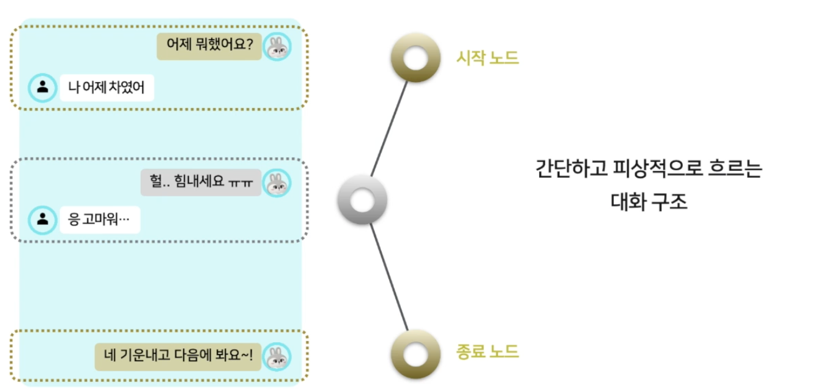
</div>
<br>

위와 달리 유저의 engagement를 끌어낸 대화내용이다.  
<div align=center>
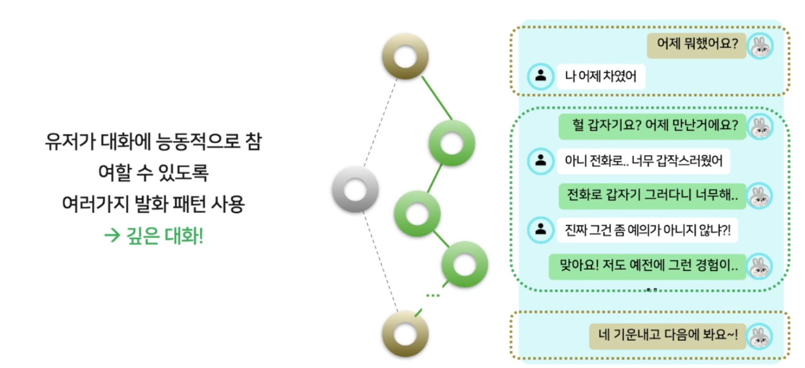
</div>
<br>

유저의 engagement를 이끌어내기 위해서는   
구체적 질문, 공감, 경험담 공유 등 여러 발화 패턴 분리해야 한다.  

💡 발화 패턴에 따라 대화 세션 생성을 어떻게 제어할 것인가?   
→ **Purpose-Action-Situation (PAS)** 대화 모델 제안  

<u>Purpose</u> : 캐릭터의 대화 목적 (ex 위로, 분노, 공감)  
<u>Action</u> : 캐릭터의 발화 패턴 제어 (ex 피드백, 경험담 공유, 상황 직시)  
<u>Situation</u> : 현 대화 세션에서 유저가 이야기하려는 대화 맥락, 상황 (ex 어제 차였어, 사기 당했어)

<br>

#### **PAS 대화 모델링을 통한 대화 DB 생성**

**Naive Approach의 한계 극복**  

① ~~피상적이고 단순한 대화~~ → 깊은 대화 구조  
&nbsp;&nbsp;&nbsp;&nbsp;&nbsp; Purpose & Action으로 다양한 발화기법을 통해 사용자의 대화 참여 유도

② ~~캐릭터 성격 불일치~~ → 캐릭터 성격 반영  
&nbsp;&nbsp;&nbsp;&nbsp;&nbsp; 캐릭터의 Purpose(대화 목적)와 그에 따른 Action(발화 기법)을 매핑함으로써 캐릭터의 성격 유지

③ ~~시나리오 다양화의 한계~~ → 다양한 시나리오  
&nbsp;&nbsp;&nbsp;&nbsp;&nbsp; 구체적인 상황을 묘사하는 Situation 리스트 확보   
&nbsp;&nbsp;&nbsp;&nbsp;&nbsp; 각 Situation에 대해 Purpose & Action을 조합하여 대화 세션을 생성함으로써 시나리오 커버리지 향상

<br>

**PAS 대화 모델링 기법을 통한 대화 DB 생성**  

1. Purpose와 Purpose에 따른 Action 리스트 정의  
사람이 직접 제작하며, Purpose에 대한 가능한 Action 리스트를 정의한다
    <div align=left>
    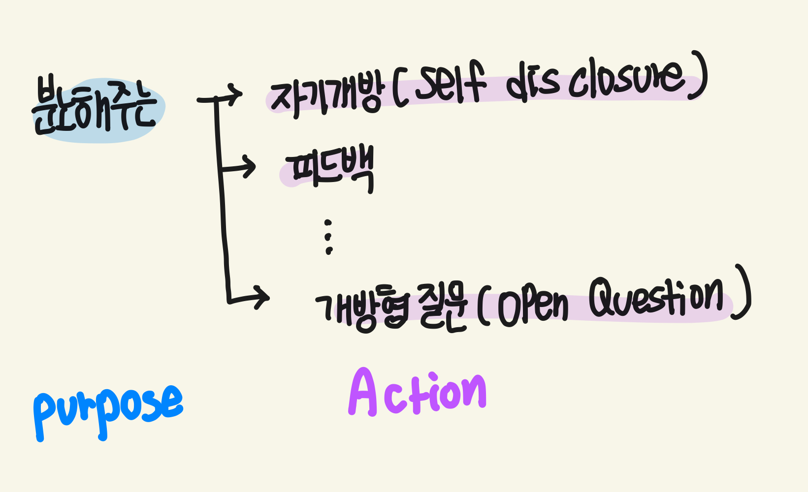
    </div>
    <br>

2. Situation 리스트 확보  
    2단계로 구성되며 각각 다양성과 구체성을 확보하는 단계  

    2.1 다양성 확보  
    purpose에 대한 situation 예시를 One-shot으로 예시 제공  
    HyperCLOVA를 통해 Situation 리스트를 확보한다  
    <div align=left>
    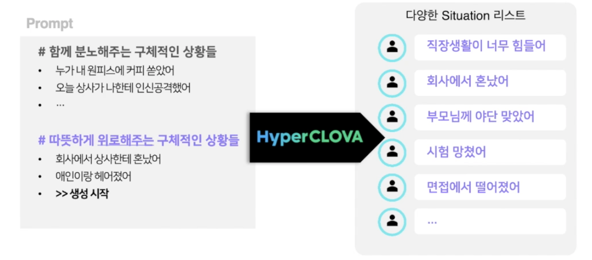
    </div>
    <br>  

    2.2 구체성 확보    
    상황을 구체적으로 묘사한 Situation 확보    
    마찬가지로 One-shot으로 예시 제공  
    <div align=left>
    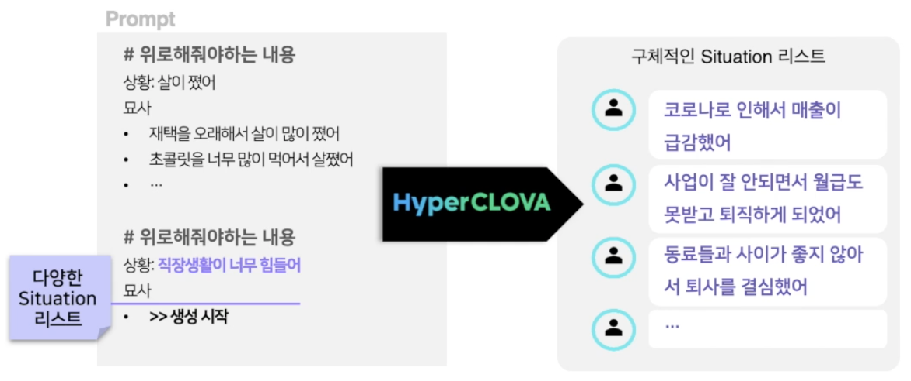
    </div>
    <br>  

3. 대화 세션 생성  
    3.1 시드 대화 DB 구축  
    Purpose, Action, Situation의 가능한 조합에 대해 대화 세션을 생성한다.  
    HyperCLOVA에 One-shot으로 사람이 직접 제작한 대화 세션 생성 예시를 함께 제공한다  
    <div align=left>
    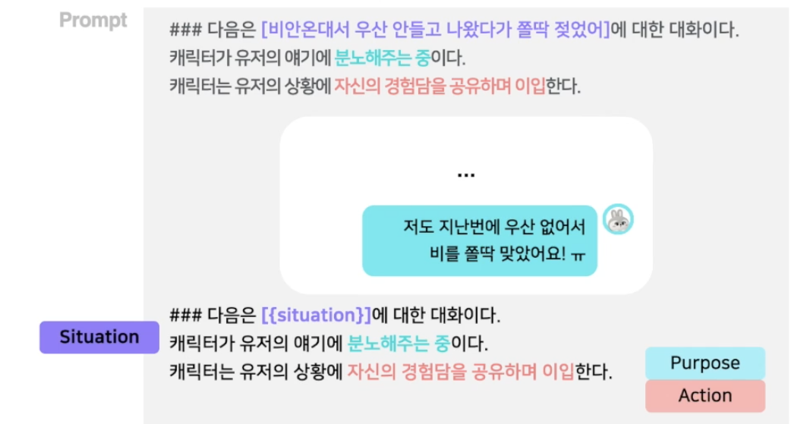
    </div>
    <br>  

    3.2 생성 대화 DB 구축 (Paraphrasing)  
    동일한 (Purpose, Action, Situation)을 가지는 데이터 Augmentation  
    적절한 paraphrasing prompt를 구성하여 HyperCLOVA를 통해 생성
    <div align=left>
    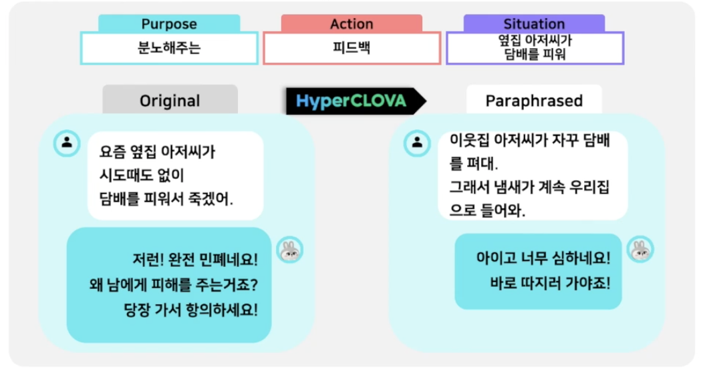
    </div>
    <br>  

### **2. PAS 대화 DB 검수**  
*지금까지는 대량의 캐릭터 대화 DB를 구축하는 내용을 설명*  

 HyperCLOVA 역시 확률 기반의 생성모델로,  
 일부에 대해서는 페르소나를 유지하는 데 실패할 수 있다.  

 → 생성된 대화 DB 내 각 대화 세션에 대하여 3가지 페르소나를 검수해야 한다

자동 검수를 위해 4가지 딥러닝 모델을 사용    
시드대화 DB의 일부를 사람에 의해 수동 검수하여 각 모델을 학습시키는 데 사용하였다.   
<div align=center>
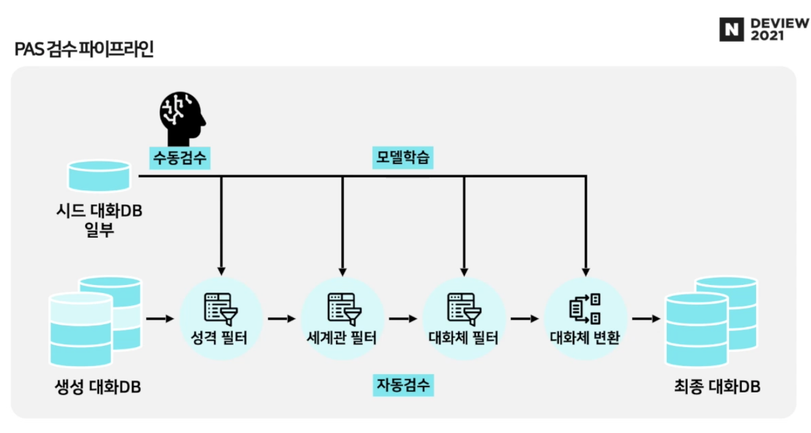
</div>
<br>  

#### **1. 성격 필터 모델**  
성격이란 <u>특정 상황(Purpose)</u>에서 보이는 <u>일관된 행동(Action)</u>이며,   
캐릭터의 성격을 Purpose와 Action을 매핑하여 나타냈다    

<div align=left>
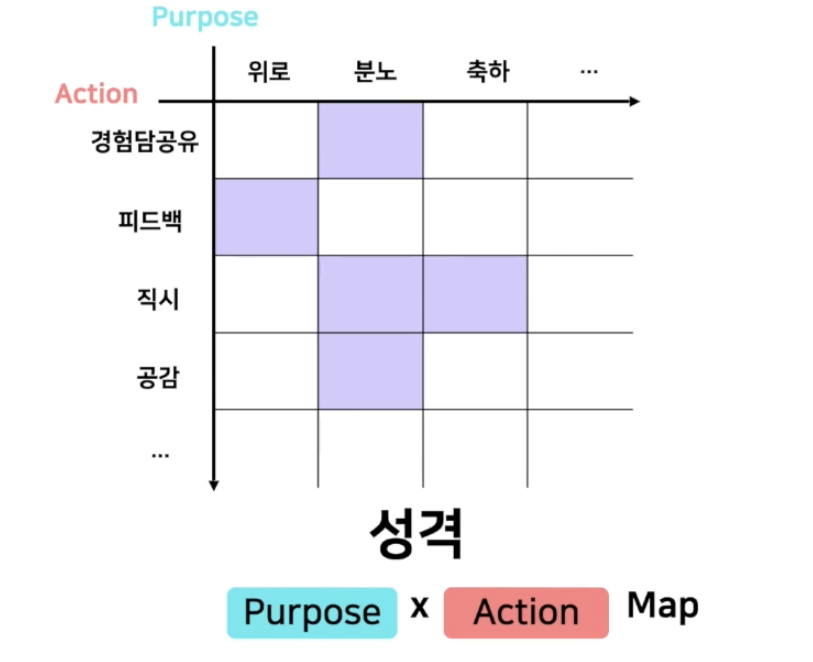
</div>
<br> 

***Purpose-Action Classifier*** 개발  
BERT를 기반으로 한 Multi-label Classifier  

Input : 대화 세션  
Output : Purpose label과 Action label

캐릭터를 생성할 때 작성했던 성격 map애 부합한지 판단하여 아닐 경우 삭제

#### **2. 세계관 필터 모델**

생성 대화 DB는 시드 대화 DB를 Paraphrasing한 것으로,  
시드 대화의 세계관과 생성 대화의 세계관이 일치하지 않는다면 다른 세계관을 가진 것으로 판단한다  

***DialogNLI Classifier*** 개발  
BERT를 기반으로 한 Binary Classifier  
시드 대화와 생성 대화 세션의 semantic이 일치하는지 판단하여, 일치하지 않는 경우 삭제


#### **3. 대화체 필터 모델**  
앞선 2개와 달리 텍스트의 syntatic 요소에만 의존한다.  

***Style Classifier*** 개발  
BERT를 기반으로 한 Binary Classifier  

캐릭터의 대화체와 부합하는 경우 right style 아닐 경우 wrong style로 판별하며,  
wrong style의 경우 대화체 변환 모델로 대화체를 수정한다.  

#### **4. 대화체 변환 모델**  

***Style Classifier*** 개발   
GPT2를 기반으로 기존 대화체에서 Target 대화체로 paraphrasing 

<br>

---

### **좋은 품질의 캐릭터 대화 DB?**
1. 깊은 대화 구조  
단조로운 대화가 아닌 유저의 engagement를 이끌어내야 한다

2. 캐릭터 성격 반영   
성격을 나타내는 Purpose-Action map에 부합해야 한다  

<div align=center>
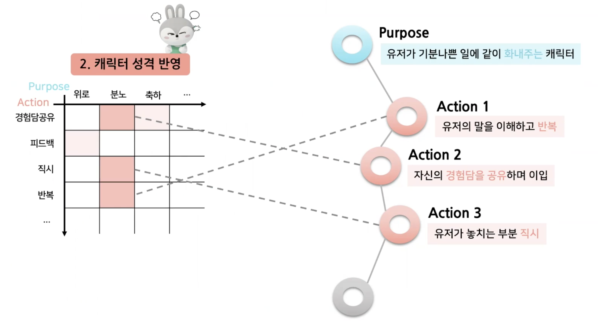
</div>
<br> 

3. 다양한 대화 시나리오 확보  
다양한 대화 Situation을 확보함으로써 다양한 상황에서도 캐릭터의 페르소나를 유지할 수 있어야 한다

<br>

### **캐릭터대화 DB 구축의 효율성 평가**  
사람의 파이프라인과 PAS 파이프라인에 따라 각각 하루동안 캐릭터 대화 DB를 구축했을 때,
사람은 8시간 근무에 48개의 대화 세션을 생성하였고,  
PAS 파이프라인은 총 7500개의 생성 대화 DB를 구축했다  

PAS 검수 과정에서 성격 필터, 세계관 필터 모델에 의해 각각 a%, b%의 대화 세션을 확보했다면   
7500ab개의 대화 세션을 생성한 것이다.

사람의 파이프라인에 비해 몇 백배는 효율적인 구축 과정이다