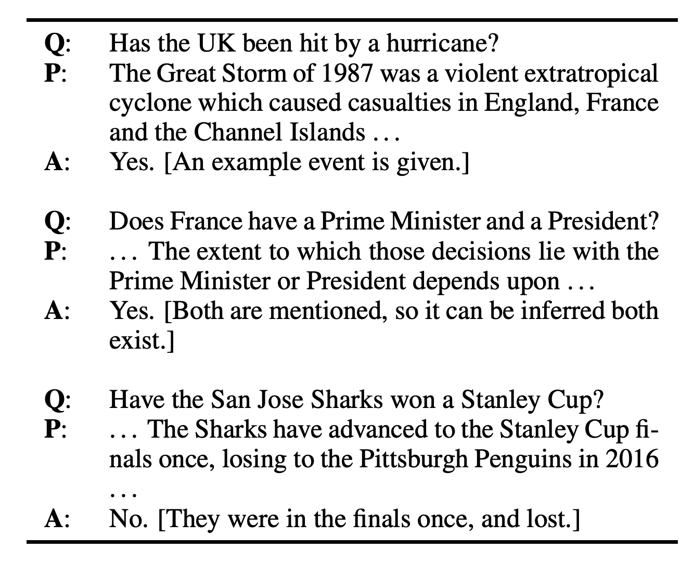
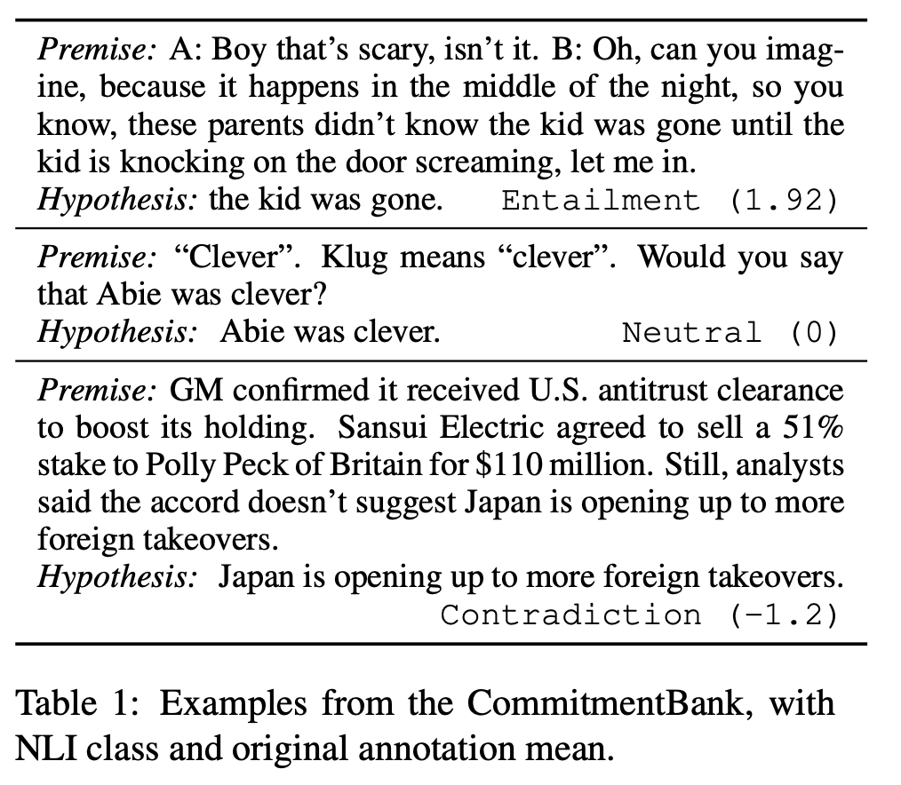
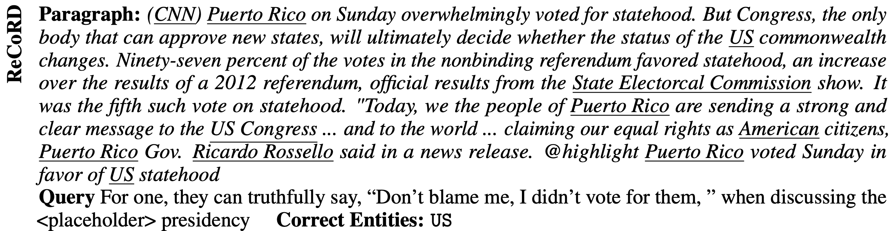
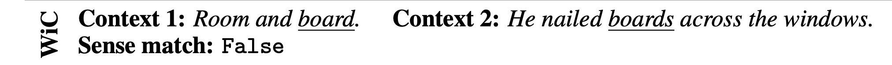
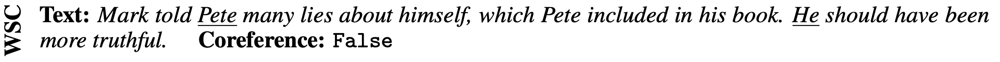

# 🗽 **SuperGLUE**

자연어 이해 시스템을 훈련시키고, 그 성능을 평가 및 비교 분석하기 위한 데이터셋으로 구성

### **1. BoolQ**

(question, passage, answer)의 triplet으로 구성되며,   
모델에 question과 passage가 주어지면, yes/no로 QA를 수행 

> **BoolQ 데이터 예시**
> 
> 
> 

> 

 

### **2. CB (CommitmentBank)**

MNLI와 비슷한 테스크를 수행하며, 각 *premise*는 embedded clause를 하나 이상 포함한다.

> **CB 데이터 예시**  
> 
> 

> 

 

### **3. COPA (Choice of Plausible Alternatives)**

premise가 주어지고, 2개의 선택지에서 premise의 원인 또는 결과를 선택하는 테스크

 

### **4. MultiRC (Multi-Sentence Reading Comprehension)**

context paragraph와 그에 대한 question, 그리고 후보 답안이 주어졌을 때 정답을 찾는 QA task

> MultiRC (Multi-Sentence Reading Comprehension, Khashabi et al., 2018) is a QA task where each example consists of a context paragraph, a question about that paragraph, and a list of possible answers. The system must predict which answers are true and which are false.
> 

 

### **5. ReCoRD (Reading Comprehension with Commonsense Reasoning Dataset)**

article과 그에 대한 question으로 구성되며, question 내 entity가 masking 되어 있다.    
후보 entity 중 masking 된 entity가 무엇을 지칭하는지 선택하는 task

> ReCoRD (Reading Comprehension with Commonsense Reasoning Dataset, Zhang et al., 2018) is a multiple-choice QA task. Each example consists of a news article and a Cloze-style question about the article in which one entity is masked out. The system must predict the masked out entity from a list of possible entities in the provided passage, where the same entity may be expressed with multiple different surface forms, which are all considered correct.
> 

 

> **ReCoRD 데이터 예시**
> 
> 

> 

 

### **6. RTE (Recognizing Textual Entailment)**

텍스트와 hypothesis가 주어졌을 때, 한 텍스트의 의미가 다른 텍스트에 포함되는 지 판단하기 위한 데이터셋 

> The RTE task is defined as recognizing, given two text fragments, whether the meaning of one text can be inferred (entailed) from the other.
> 

 

### **7. WiC (Words in Context)**
Context 내 단어 간 의미가 같은지 판단

> **WiC 데이터 예시**
> 
> 

> 

 

### **8. WSC (The Winograd Schema Challenge)**
두 단어가 같은 대상을 지칭하는지 판단

> **WSC 데이터 예시**
> 
>  

>