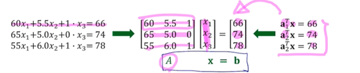

# **CHAPTER 2. 선형시스템 및 선형변환**

## **PART 1. 선형 방정식과 선형 시스템**

### **선형 방정식 (Linear Equation)**

$a_1x_1 + a_2x_2 + \cdots + a_nx_n = b$

$[a_1, a_2, \cdots a_n] \cdot [x_1, x_2, \cdots x_n]^T = [b_1, b_2, \cdots b_n]^T$

$a$: coefficients  
$b$: constant  
$x$ : unknown 

### **선형 시스템(Linear System)**

system of linear equation라고도 불리며 equation의 집합

**예제:** 주어진 weight, height, is_smoking을 regression하여 life_span을 예측하는 것

linear equation으로 접근할 수 있음  
여러 개의 linear equation을 matrix로 변환 (single matrix equation)

### **$A\mathbf{x}=\mathbf{b}$의 solution**

- 근이 1개 있는 경우
- 근이 무수히 많은 경우
- 근이 하나도 없는 경우

> 🌟 **Identity Matrix (항등행렬) $I$**
>
>: diagonal entry들이 모두 1이고, 나머지는 0인 square matrix

> 💬 **역행렬 (Inverse matrix)**: 아래 수식을 만족하는 **square matrix**  
> $A^{-1}A = AA^{-1} = I$
>
>⇒ $A$의 inverse matrix는 A의 좌측에서 곱했을 때도 우측에서 곱했을 때도 결과는 $I$가 된다
>
>**2 X 2 행렬의 역행렬 공식:**  $A^{-1} = \frac{1}{ad-bc}\left[\begin{matrix}
    a & b \\
    c & d \\
\end{matrix}\right]$

> 📌 **판별식** (determinant, $det A$)  
>**invertibility를 판단**하거나 eigenvalue를 구할 때 사용됨
>
>
>
> 2 X 2 matrix의 행렬식 ⇒ $det A = ad - bc$
>
>$det A = 0$인 경우, $A$는 **non-invertible matrix**임
>
>*Non-invertible matrix* : 해가 무수히 많거나, 하나도 없음  
*Invertible matrix* : 역행렬이 존재할 경우, 해는 1개만 존재함
>
>**Rectangular matrix**의 경우 : m by n $A$
>
>$m < n$ 인 경우 대체로 무수히 많은 해가 존재 (under-determined system)  
$m > n$ 인 경우 대체로 해가 존재하지 않음 (over-determined system)

### **Matrix Equation $A\mathbf{x}=\mathbf{b}$을 푸는 법**

1. **Invertible matrix인 경우**  
    역행렬 사용    

    $A\mathbf{x} = \mathbf{b}$  
    $A^{-1}A\mathbf{x} =A^{-1}\mathbf{b}$   
    $\mathbf{x} = A^{-1}\mathbf{b}$
    

1. **Non-invertible matrix인 경우**
    
    least squares 형태로 접근 → 최적의 해를 구한다
    
    **Under-determined system** :   
    regularization을  적용하여 어떤 변수에 부여하는 가중치가 가장 작은 값은 선택 ⇒ **risk가 작은 solution**
    
    예를 들어 solution이 $x_1 +2x_2 =  3$ 을 만족할 때,
    
    >
    > 💬 (1, 1), (5, -1) 등 만족하는 값은 무수히 많지만  
    > (5, -1)은 첫 번째 변수 $x_1$에 민감하지만 (1, 1)은 두 변수 $x_1$, $x_2$에 부여되는 가중치가 동일하기 때문에   
    > 이 경우에는 (1, 1)을 solution으로 선호하는 경향이 있다.
    