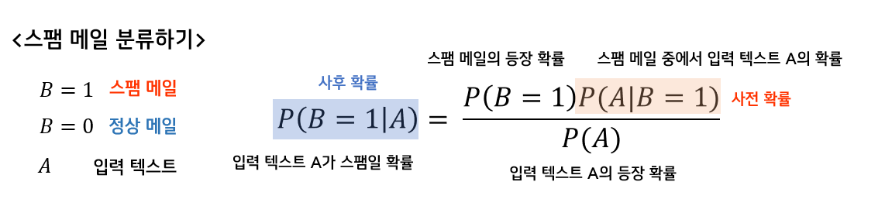
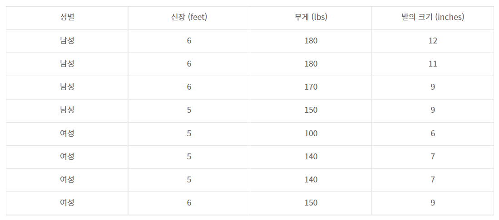

# **Bayes Classifier**

- Generative model
- 데이터가 각 그룹에 속하는 정도에 대한 확률을 학습하며 예측을 수행한다.

> 📌 **조건부 확률(conditional probability)**
>
> 어떤 사건 $A$가 일어났다고 가정한 상태에서 사건 $B$가 일어날 확률
>
> $P(B|A)=\frac{P(A\cap B)}{P(A)}$
> 
> → $P(A\cap B) = P(A)P(B|A)$
> 자연어처리에서는 $A$ 는 $B$의 확률을 계산하기 위해 주어진 >**히스토리, 문맥, 지식**
>
> 
>
> **연쇄규칙(chain rule)**
>
>3개 이상의 사건이 조건부 확률 관계를 가지는 경우
>
>$P(A_1\cap \cdots \cap A_n) = P(A_1)P(A_2|A_1)\cdots P(A_n|A_1\cap A_2\cap \cdots \cap A_{n-1})$
>
>  
>
>**베이즈 정리(Bayes theorem)**
>
>새로운 정보 $A$를 토대로, 어떤 사건이 발생했다는 주장 $B_k$의 신뢰도를 갱신하는 방법
>
>$P(B_k|A) = \frac{P(A\cap B_k)}{P(A)} = \frac{P(B_k)P(A|B_k)}{P(A)}=\frac{P(B_k)P(A|B_k)}{\Sigma_{i=1}^{n}P(B_i)P(A|B_i)}$
>
>

 

### **0. Bayes Theorem**
: 두 사건 X, Y에 대한 조건부 확률(conditional probability) 간에 성립하는 확률 관계

관측 데이터에 $A= (A_1, A_2, \cdots, A_n)$ 속성이 있을 때,   
이 데이터는 전체 $k$개의 class 중에서 어느 class에 속할 확률이 높은가?

$P(C_j|A_1,\cdots, A_n) = \frac{P(A_1,\cdots, A_n|C_j)P(C_j)}{P(A_1,\cdots, A_n)}$

$C_j$:  $j$번째 class ($j=1,\cdots, k$)

**문제** ⇒ 속성이 많아지면 $P(A_1,\cdots, A_n|C_j)P(C_j)$ 를 계산하기 어려워짐

 

### **1. Naive Bayes Classifier (NB)**

**가정** : 속성 $A_1, \cdots, A_n$ 들은 모두 독립적이다.  
따라서 아래의 식이 성립한다.

$P(A_1, \cdots, A_n|C_j) = P(A_1|C_j)P(A_2|C_j)\cdots P(A_n|C_j)$

$P(C_j) \Pi_i^n P(A_i|C_j)$ 가 최대가 되는 $C_j$를 찾아 예측 값으로 한다.

속성이 $A= (A_1, A_2, \cdots, A_n)$ 처럼 불연속적이지 않고 연속적인 값일 경우는?

 

### **2. Gaussian Naive Bayes (G-NB)**

속성들이 모두 Gaussian Distribution 즉, 정규분포를 따른다고 가정

$P(A|C)$ 를 정규분포에서의 확률밀도 계산 식으로 구함

$P(A = x| C) = \frac{1}{\sqrt{2\pi\sigma^2}}exp(-\frac{(x-\mu)^2}{2\sigma^2})$

**예제:** 신장, 무게, 발의 크기가 주어졌을 때, 성별을 예측하는 문제

$C_1$ : 남자, $C_2$ : 여자

$A_1$: 신장, $A_2$: 무게, $A_3$: 발의 크기

class $C_1$일 경우,

$A_1$ 속성에 대하여 평균 $\mu = 5.75$ , 분산 $\sigma^2 = 0.1875$

따라서 남자가 신장 5.5 feet일 확률은 

$P(A_1=5.5|C_1) = \frac{1}{\sqrt{2\pi\times 0.1875}}exp(-\frac{(5.5-5.75)^2}{2\times 0.1875})=0.7799$

 

### **Naive Bayes classifier 장점**

- 조건부 확률만 계산하기 때문에, **훈련 및 예측 속도가 빠르며 훈련 과정이 단순함**
- 희소한 고차원 데이터에 적합함
- 다중 클래스(multiple class) 예측도 가능
- Linear Model로 학습 시간이 너무 오래 걸리는 매우 **큰 데이터셋**에는 NB를 시도

### **Naive Bayes classifier 단점**

- 데이터 **속성 간 독립성**이 어느 정도 있어야 함
- 연속적인 값을 예측하는 것보다, 이산적인 클래스를 예측하는 데 성능이 더 좋음