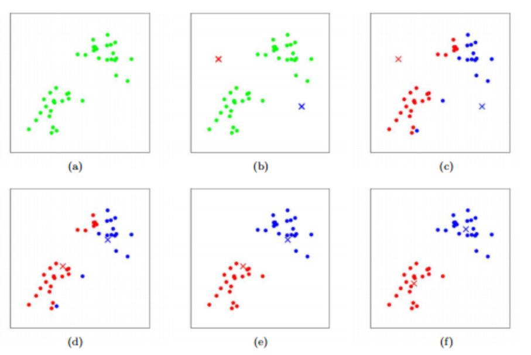

# **Clustering**

- **Partitioning method**
- Hierarchical method
- **Density-based method**
- Grid-based method
- **Model-based method**

 

## **Partitioning Method**

$n$개의 data point들이 있을 때, 사용자에 의해 정의된 $k$개의 그룹으로 군집화하는 방법

- K-means와 K-medoid가 있다.

> *Partitioning methods define clusters by grouping data points into k partitions, defined by the user at the time the process is executed.*
> 

### **1. K-means**

cluster의 centroid와의 유클리디안 거리를 최소화하는 작업을 반복함으로써 분류하는 머신러닝 비지도 학습 기법이다.

**K-means 동작 단계**

1. $k$개의 임의의 중심점(centroid) 배치 (초기 값에 따른 실패 가능성 有)
2. 각 데이터들을 가장 가까운 중심점으로 할당
3. 각 cluster의 centroid를 cluster 내 data point의 평균 값으로 업데이트
4. 더 이상 centroid가 갱신되지 않을 때까지 2-3 반복

> 💡 **K-means: Procs and Cons**
>
> - 선형 시간 내에 **빠르게 동작**함
> - 랜덤하게 설정된 **초기 값에 따라 local optima**에 빠질 수 있음
> - 적절한 클러스터 개수를 사용자가 지정해야 함
> - Outlier에 민감함
> - 데이터 밀도, 분포 형태, 크기가 다양한 경우, 실패 가능성이 커짐

 

>⚠️ **Partitioning method의 한계**
>
> Partitioning method는 data point 간의 거리에 기초하여 군집화
>
>→ 오직 **구형의 cluster** 만을 찾을 수 있고, 임의의 형태의 cluster를 찾는 데 어려움

---

## **Density-based Method**

Density-based method는 **data point 밀도** 에 따라 군집화

→  밀도가 낮은 영역을 잡음 영역으로 분리, data point가 조밀한 영역을 cluster로 여김

> 📌 **정의**
> 
> Directly density reachable
> 
> Density reachable
> 
> Density connected
> 
> Cluster

 

### **DBSCAN (Density-Based Spatial Clustering of Applicatioins with Noise)**

>💡 **DBSCAN: Procs and Cons**
>
> - 사용자가 클러스의 개수를 지정할 필요 없음
> - **다양한 shape**에 강건함
> - Outlier를 구분하기 때문에 **노이즈에 강건**함
> 
> - 데이터 분포가 다양한 밀도를 가진 경우, 실패 가능성이 커짐
> - Eps, minPts의 파라미터를 지정해야 함
> - Eps 반경 이내인지 비교 연신시간이 $n\log n$

---

## **Model-based method**

$k$번째 cluster에 속한 관측치 $x$가 다변량 정규분포인 확률 밀도 함수 $f$를 가진다고 가정한다.

⇒ 관찰된 data point는 각 cluster에 속할 확률 분포를 혼합한 혼합 분포를 가진다

**다변량 분포(Multi-variable Distribution)** : 확률 변수가 하나 이상인 분포

data point $x$가 주어지면, 각 cluster에 속할 사후 확률 (또는 Likelihood)을 계산하여 
가장 높은 확률(또는 Likelihood)의 cluster로 할당한다. (**MAP와 MLE**)

~ EM과 GMM이 있다.

> 📢 **MLE와 MAP**
>
>동전의 앞면 $H$가 나올 확률이 $\theta$일 때, 앞면이 나올 확률은 어떻게 구할까
>
> **1) Maximum Likelihood Estimation(MLE)**
>
> → **Likelihood를 최대로 하는 최적의 확률**
> 
> : 확률 질량 함수(또는 확률 밀도 함수)에서 **관측된 표본**에서 $\theta$를 추청하는 방법
> 
> $`P(D|\theta) = \theta^{a_H}(1-\theta)^{a_T}`$ *→ $a_H$ 과 $a_T$는 각각 앞면과 뒷면이 나온 횟수*
> 
> $`\hat{\theta} = argmax_{\theta}P(D|\theta)`$
> 
> ~ $P(D|\theta)$는 $\theta$가 주어졌을 때의 $D$의 분포로, $\theta$의 분포
> 
> ~ 최적의 $\theta$ 값인 $\hat{\theta}$는 그래프 **미분**을 통해 함수의 최댓값을 찾아 구함
> 
>  
>
>**2) Maximum a Posteriori Estimation(MAP)**
>
>→ **Posterior를 최대로 하는 최적의 확률**
>
>: **베이즈 정리** 를 활용하여 Posterior를 계산
>
>$`P(\theta|D) = \frac{P(D|\theta)P(\theta)}{P(D)}`$
>
>$`\hat{\theta} = argmax_{\theta}P(\theta|D)`$
>
>~ $P(\theta|D)$는 데이터 $D$가 주어졌을 때의 $\theta$의 분포로, 데이터 분포를 나타낸다
>
> 
>
>**3) MLE vs MAP**  
>데이터가 많다면 비슷하지만, 데이터가 적다면 사전 지식을 활용한 MAP가 더 유용하다

 

### EM (Expectation Maximization)

### GMM (Gaussian Mixture Modeling)

 

> 📌 **K-means vs DBSCAN**
