# **Decision Tree**

가지치기(branching)를 통해 데이터를 속성에 따라 분류하는 방식으로, 
마지막 리프 노드엔 class label이 있다. 

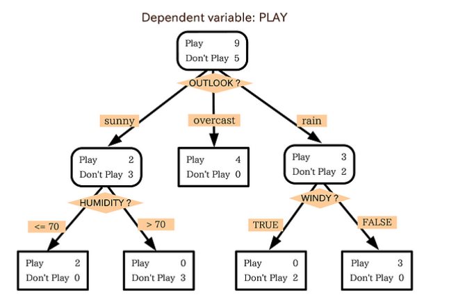

최상단 노드가 Root Node, 마지막 노드가 Leaf Node

>💡 depth가 너무 낮으면 underfitting,  
> depth가 너무 크면 overfitting의 문제가 발생할 수 있다.
>
>⇒ Best split을 찾아야 한다.

 

**Q. Decision Tree 알고리즘에서 최적의 분할은 무엇을 의미하나?**   
**A. Node impurity가 낮게 분할된 형태**

 

## ****불순도(Impurity)****

해당 범주 안에 서로 다른 데이터가 얼마나 섞여 있는지

→ 불순도가 감소하면 순도(homogeneity)가 증가한다.

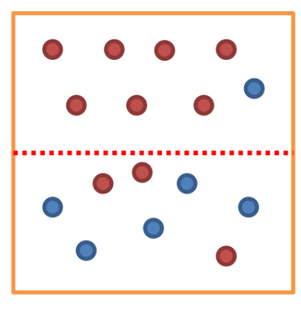

**그림 1**) 상단 그림은 불순도가 낮지만 하단은 불순도가 높음

 

## **Impurity를 수치화한 지표**

### 1. **엔트로피(Entropy)**

불순도(Impurity)를 수치화하여 나타낸 척도

- 0에서 1 사이 값을 가진다.
- 엔트로피가 높다. ⇒ 불순도가 높다.

$Entropy(A) = - \Sigma_{k=1}^m p_k \log_2 (p_k)$

$p_k$ : A 영역 안에 속하는 레코드 가운데 $k$ 범주에 속하는 레코드의 비율

전체 영역을 분할하였을 때 Entropy는 다음과 같다.  
    $Entropy(C) = \Sigma_{i=1}^d R_i (-\Sigma_{k=1}^m p_k \log_2(p_k))$

$R_i$: $i$ 영역에 속하는 레코드 비율  
~ 분할 후 $i$ 영역에 속하는 레코드 개수 / 전체 레코드 개수

 

**예제: 그림 1**

전체를 C 영역, 상단을 A 영역, 하단을 B 영역이라 했을 때 Entropy는 다음과 같다.

전체 레코드는 16개이다.

$Entropy(C) = \frac{10}{16}\log_2 (\frac{10}{16}) - \frac{6}{16}\log_2(\frac{6}{16})  \approx 0.95$

$Entropy(C) = 0.5 \times Entropy(A) + 0.5 \times Entropy(B)$

$= 0.5 \times (-\frac{7}{8}\log_2(\frac{7}{8})-\frac{1}{8}\log_2(\frac{1}{8})) + 0.5 \times (-\frac{3}{8}\log_2(\frac{3}{8})-\frac{5}{8}\log_2(\frac{5}{8}))$

$\approx 0.75$

분할 후 Entropy가 감소했기 때문에 모델은 데이터를 A와 B 영역으로 분할한다.

즉, 모델은 **순도가 증가하는 방향으로 학습**한다.

 

### **2. GINI Index**

Entropy와 같이 불순도를 측정하는 지표로, 데이터의 **통계적 분산 정도**를 정량화해서 표현한 값이다.

- Binary Split 방식이다.
- **값이 작을수록** 순도가 높다는 것이다.

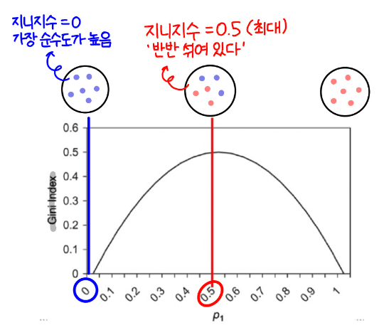

$GINI(C) = 1 - \Sigma_{i=1}^d p^2_i$

$p_i:$ C 영역에 속한 전체 레코드 중 i 영역에 속한 레코드 비율

 

**예제: 그림 2**

전체 영역 S를 A 기준으로 분할했을 때
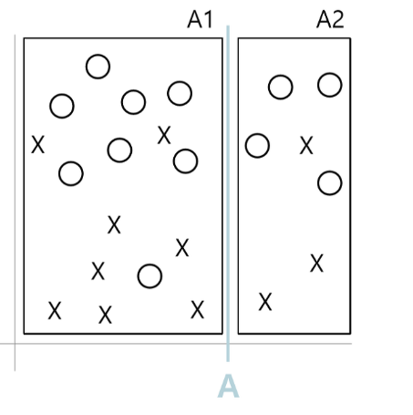

$GINI(A_1) = 1 - (\frac{8}{16})^2- (\frac{8}{16})^2 = 0.5$

$GINI(A_2) = 1 - (\frac{4}{7})^2- (\frac{3}{7})^2 = 0.49$

$GINI(S)_A = (\frac{16}{23}) \times 0.5 + (\frac{7}{23}) \times 0.49 = 0.497$

전체 영역 S를 B 기준으로 분할했을 때

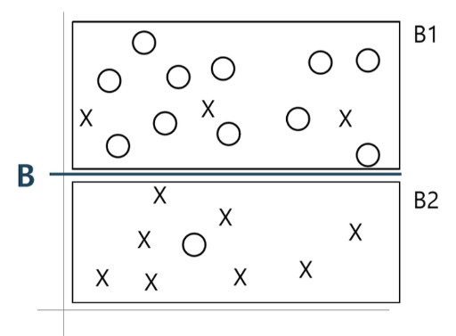

$GINI(B_1) = 1 - (\frac{11}{14})^2- (\frac{3}{14})^2 = 0.34$

$GINI(B_2) = 1 - (\frac{1}{9})^2- (\frac{8}{9})^2 = 0.2$

$GINI(S)_B = (\frac{14}{23}) \times 0.34 + (\frac{9}{23}) \times 0.2 = 0.28$

따라서  불순도가 더 낮은 B로 분할하는 것이 좋다.

 

GINI Index는 CART 알고리즘을 사용한다.

> 📌 **CART (Classification And Regression Trees) Algorithm**
>
>- **가장 널리 사용되는 Decision Tree Algorithm.**
>- 이진 분리를 사용한다.
>- 분류와 회귀 모두 사용할 수 있다.
>- 목표 변수 $y$가 범주형인 경우, GINI Index 사용
>- 목표 변수 $y$가 연속형이라 여러 기준으로 나누는 다분법일 때는 다음과 같다.
>
>   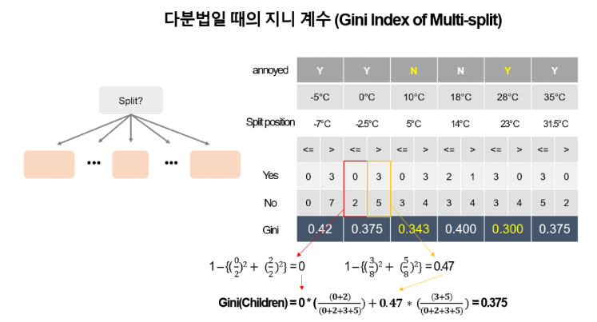
>
>   모든 노드의 gini index를 계산 
>   → 가장 낮은 값을 갖는 split position 선택   
>       단순 무식한 방법 & 비효율적
    
 

### 3. 정보 이익(Information Gain)

Information gain이란, 분할 전 Entropy와 분할 후 Entropy의 차이를 가리킨다.

- **값이 클수록** 순도가 높다는 것을 의미한다.
- 모든 속성에 대해 분할 후, Information gain을 계산하고, 값이 가장 큰 속성부터 분할의 기준으로 삼는다.

전체 영역 S에 대하여, S의 Entropy에서 각 구역의 Entropy를 빼는 형태

⇒ 상위 노드의 엔트로피에서 하위 노드의 엔트로피를 뺀 값이다.

$IG(S)= Entropy(S) - \Sigma_{i=1}^d \frac{n_i}{n} Entropy(i)$

 

📌 **예제: 그림 3**

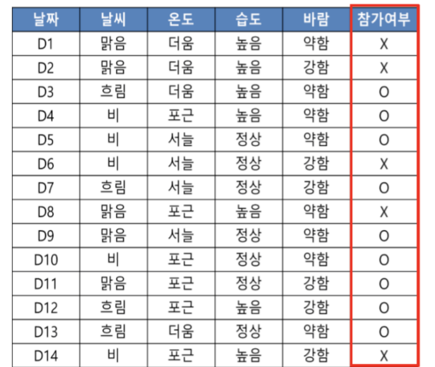

1) **분할 전 Entropy 계산**

    $Entropy(참가여부) = - \frac{9}{14}\log_2 (\frac{9}{14})- \frac{5}{14}\log_2 (\frac{5}{14}) = 0.940$

2) **각 속성에 대한 Information gain 계산**

    $Entropy(참가여부 | 날씨) = \frac{5}{14} (-\frac{2}{5}\log_2(\frac{2}{5})-\frac{3}{5}\log_2(\frac{3}{5})) + \frac{4}{14} (-\frac{4}{4}\log_2(\frac{4}{4}))+ \frac{5}{14} (-\frac{3}{5}\log_2(\frac{3}{5})-\frac{2}{5}\log_2(\frac{2}{5}))=0.694$

    $Entropy(참가여부 | 온도) = \frac{2}{14} (-\frac{2}{4}\log_2(\frac{2}{4})-\frac{2}{4}\log_2(\frac{2}{4})) + \frac{6}{14} (-\frac{4}{6}\log_2(\frac{4}{6})-\frac{2}{6}\log_2(\frac{2}{6}))+ \frac{4}{14} (-\frac{3}{4}\log_2(\frac{3}{4})-\frac{1}{4}\log_2(\frac{1}{4}))=0911$

    $Entropy(참가여부 | 습도) = \frac{7}{14} (-\frac{3}{7}\log_2(\frac{3}{7})-\frac{4}{7}\log_2(\frac{4}{7})) +\frac{7}{14} (-\frac{6}{7}\log_2(\frac{6}{7})-\frac{1}{7}\log_2(\frac{1}{7}))=0.789$

    $Entropy(참가여부 | 바람) = \frac{6}{14} (-\frac{3}{6}\log_2(\frac{3}{6})-\frac{3}{6}\log_2(\frac{3}{6})) +\frac{8}{14} (-\frac{6}{8}\log_2(\frac{6}{8})-\frac{2}{8}\log_2(\frac{2}{8}))=0.892$

3) **Information gain이 최대가 되는 분기 조건 찾기**

    $IG(참가여부, 날씨) = E(참가여부) - E(참가여부|날씨) = 0.94 - 0.694 = 0.246$

    $IG(참가여부, 온도) = E(참가여부) - E(참가여부|온도) = 0.94 - 0.911 = 0.029$

    $IG(참가여부, 습도) = E(참가여부) - E(참가여부|습도) = 0.94 - 0.789 = 0.151$

    $IG(참가여부, 바람)= E(참가여부) - E(참가여부|바람) = 0.94 - 0.892 = 0.048$

 ⇒ 가장 큰 ‘날씨’를 기준으로 분류

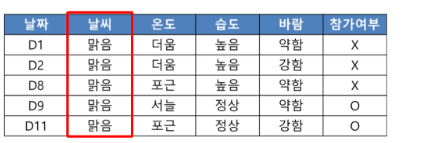

날씨가 ‘맑음’인 레코드

4) **다시 분할 전 Entropy 계산 및 나머지 속성에 대한 Information gain 비교 (반복)**

 

Information gain은 ID3 알고리즘을 사용한다.

>📌 **ID3 (interative Dichotomiser 3) Algorithm**
>
>- 불순도 알고리즘으로, Entropy를 사용한다.
>- 독립 변수가 모두 **범주형**일 때만 가능하다는 단점이 있다.

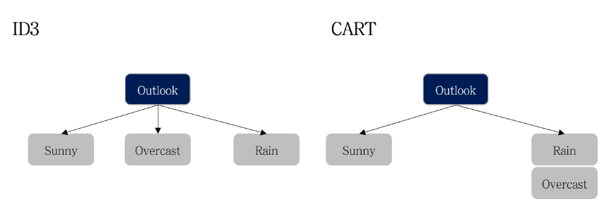

만약 아래와 같은 두 지표가 있을 때,

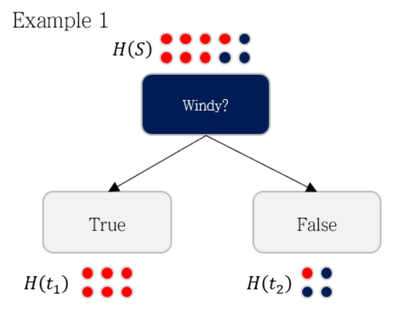

$Entropy(S) = -\frac{7}{10}\log_2 (\frac{7}{10})- \frac{3}{10}\log_2 (\frac{3}{10}) = 0.8813$

$Entropy(S | windy) = \frac{6}{10} (-\frac{6}{6}\log_2(\frac{6}{6})-0) + \frac{4}{10} (-\frac{1}{4}\log_2(\frac{1}{4})-\frac{3}{4}\log_2(\frac{3}{4}))$ 

$Entropy(S, windy) = 0.8813 - (\frac{6}{10} \times 0+\frac{4}{10} \times 0.8113) =0.5568$

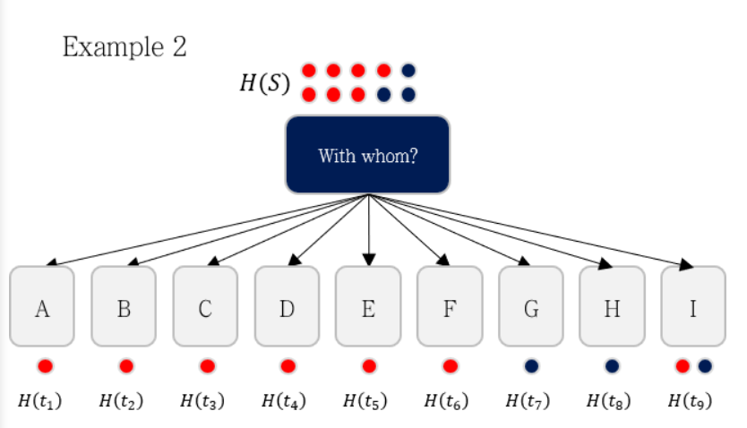

$Entropy(S | with whom) = \frac{1}{10} (-\frac{1}{1}\log_2(\frac{1}{1})-0) + \cdots + \frac{2}{10} (-\frac{1}{2}\log_2(\frac{1}{2})-\frac{1}{2}\log_2(\frac{1}{2}))=0.2$

$Entropy(S, with whom) = 0.8813 - (\frac{1}{10} \times 0+ \cdots + \frac{2}{10} \times 1) =0.6813$

Windy보다 With whom을 기준으로 분기하는 것이 더 IG가 높다.

→ 모델은 Wth whom을 선택한다.

- 데이터를 너무 잘게 분해하는 방향으로 갈 수 있다  
    with whom이라는 속성은 데이터를 9개로 분해한다.      
    → Information gain ratio 등장
    
 

### **4. 이득률 (Information Gain Ratio)**

Information gain을 Intrinsic value로 나눈 값으로, IV에 개수를 넣어 그 개수에 따라 패널티를 부여한다,

- **값이 작을수록** 순도가 높다는 것을 의미한다.

특정 지표로 분기했을 때 생성되는 가지의 수를 $N$이라 하고 
$i$번째 가지에 해당하는 확률을 $\frac{n_i}{n}$

$IV(A) = -\Sigma_{i=1}^N\frac{n_i}{n}\log_2(\frac{n_i}{n})$

$IGR(A) = \frac{IG(A)}{IV(A)}$

Information gain과 같이 데이터가 너무 잘게 분해되는 것을 방지하기 위해 Intrinsic value로 나누어 사용

 

***위의 예제 사용***

Windy 지표를 사용했을 때, 

$IGR = IG/IV$

 $= \frac{0.5568}{-(\frac{6}{10}\log_2(\frac{6}{10})+\frac{4}{10}\log_2(\frac{4}{10}))}$

$= \frac{0.5568}{0.9701} = 0.5739$

With whom 지표 사용했을 때,

$IGR = \frac{0.6813}{3.1219} = 0.2182$

IGR를 사용하면 With whom 지표보다 windy 지표를 선택하게 된다.

>📌 **C4.5 Algorithm**
>
>- 불순도 알고리즘으로, Entropy를 사용한다.
>- ID3 알고리즘과 유사하나, C4.5는 연속형 변수도 가능하다.  
>   (ID3 Algorithm의 확장)
>    
>- CART는 이진 분리를 하지만 C4.5는 **가지의 수를 다양화**할 수 있다
>    
>    연속형에서는 CART와 유사하나, 범주형에서는 다르다.
>    → C4.5는 속성이 갖는 범주 값의 수만큼 분리를 수행한다.
>    
>    예를 들어, 꽃의 색깔이 범주에 해당할 때,   
>    CART는 딱 2개로만 분리를 하는데 반해, C4.5는 모든 꽃 색깔의 수만큼 가지를 친다.
>    
>    → branching하는 방법도 CART와 차이점이 있다.
    