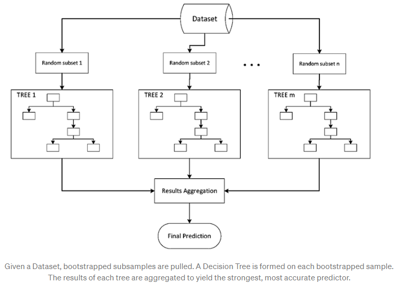
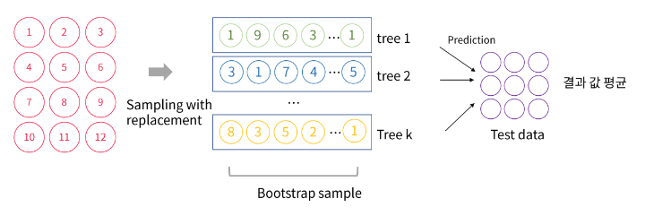
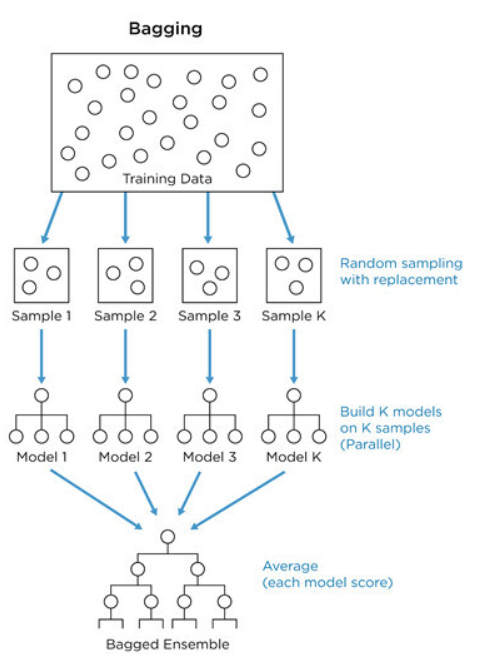
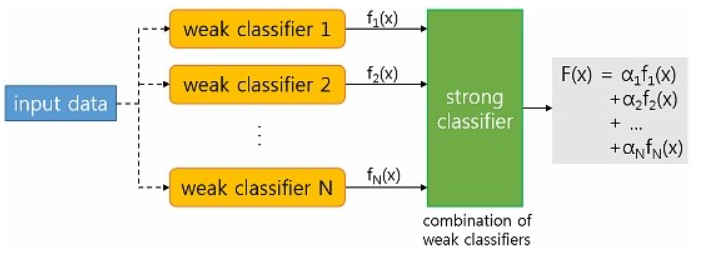
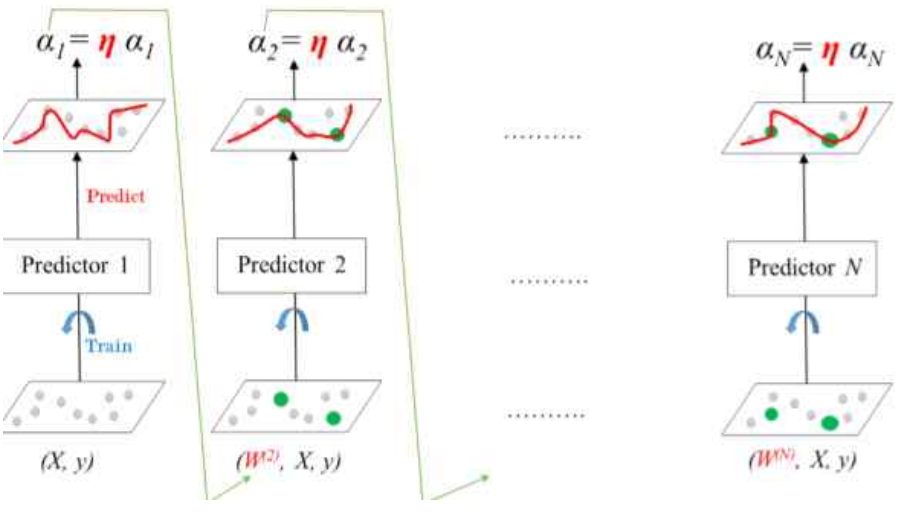
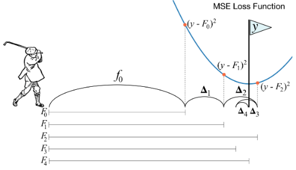
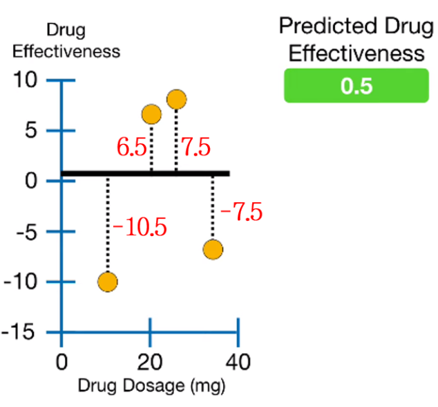
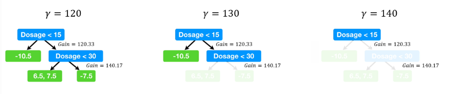

# **Ensemble Method**

주어진 데이터셋으로부터 일부 feature만 뽑거나 record sampling을 통해 

여러 개의 데이터셋을 만들고, 이를 여러 개의 classifier로 각각 학습한 후 

최종 예측 값을 voting을 통해 선택하여 사용하는 방법이다.

예측 값이 틀릴 확률은 다수의 classifier가 모두 틀릴 확률로, 틀릴 확률이 낮아진다.

 

### **Bagging**

record sampling 시 중복이 허용되는 Bootstrapping (Bootstrap sampling)을 사용

n개의 데이터를 반복적으로 k번 추출, 각 boostrap sample은  classifier에 전해짐

 

⇒ 분포가 고르지 않은 데이터들에도 강건함

⇒ 각 샘플에서 나타난 결과를 일종의 중간 값으로 맞추어 주기 때문에 
     Overfitting을 피할 수 있음

- **Random Forest** : Ensemble Bagging 기법에서 각 classifier가 Decision Tree인 경우이다.
    
    학습하기 간단하고 노이즈에 강건하다는 장점이 있다.
    
    Decision Tree를 사용하기 때문에 Random forest는 discriminative model.
    
    
    

 

### **Boosting**

예측 성능이 낮은 weak classifier를 조합하여 strong classifier를 만드는 방법

앞선 결과를 보고 업데이트하는 학습 모형의 형태이다. → **Sequential하게 학습함**

- **AdaBoost**: weak classifier들이 상호 보완하도록 순차적으로 학습
    
    weak classifier들을 한번에 하나씩 순차적으로 학습시킬 때,
    
    먼저 학습된 classifier가 잘못 분류한 결과에 대해 가중치를 부여하여 다음 classifier의 학습 시 사용 
    → 이전 classifier의 단점을 보완하도록 학습
    
    
    
- **Gradient Boost (GBM)**: AdaBoost와 비슷하나, 가중치를 부여하는 방식이 다름
    
    이전 classifier의 residual $y-\hat{y}$를 학습하는 형태
    
    > Chasing the direction vector in a GBM is chasing the (negative) **gradient of a loss function via gradient descent.**
    > 
    
    
    
    ⇒ residual로 학습하면 메모리 덜 쓸 수 있고, ML 계열의 모델 중 성능이 좋다.  
    또한 얕은 깊이의 tree를 사용하면 예측이 빠르고 성능도 좋은 편이다.  
    
    **Problems**
    - 느린 수행시간
    - Overfitting 이슈가 있음
    

- **XGBoost:** GBM의 단점을 보완한 Boosting 모델
    - **XGBoost의 목적 함수**
        
        $obj(\theta) = \Sigma_{i}^n l(y_i, \hat{y}_i)+ \Sigma_{k=1}^K \Omega (f_k)$      
        $K$: tree의 개수  
        
        $f_k$: $k$번째 tree 모델 ($f_k \in \mathcal{F}$)
        
        $l(y, \hat{y})$: 모델이 예측한 $\hat{y}$와 실제 $y$ 값에 대한 training loss
        
        ⇒ residual을 목적 함수에 추가하여 학습함
        
        $\Omega$ : 과적합을 방지하기 위한 모델의 정규화 함수
        
        > $\Sigma_{i=1}^n l(y_i, \hat{y}_i)$ *항은 Training loss,*
        > 
        > $*\Sigma_{k=1}^K \Omega (f_k)*$ 항은 트리들의 complexity를 의미한다.
        > 
        
        이때 additive 훈련 방법을 사용  
        매 단계마다 전 단계에서 예측하지 못했던 부분을 예측하도록 additive 하게 만들어감
        
        $\hat{y}_i^{(0)} = 0$  
        $\hat{y}_i^{(1)} = f_1(x_i) = \hat{y}_i^{(0)} + f_1(x_i)$  
        $\hat{y}_i^{(2)} = f_1(x_i) + f_2(x_i) = \hat{y}_i^{(1)} + f_2(x_i)$   
        $\cdots$  
        $\hat{y}_i^{(t)} = \Sigma_{k=1}^t f_k(x_i) = \hat{y}_i^{(t-1)} + f_t(x_i)$  
        
        따라서 목적 함수는 아래와 같이 정의할 수 있다.
        
        $obj^{(t)} = \Sigma_{i=1}^n l(y_i, \hat{y}_i^{(t)}) + \Sigma_{k=1}^t \Omega (f_k)$  
        $= \Sigma_{i=1}^n l(y_i, \hat{y}_i^{(t-1)} + f_t(x_i)) + \Omega (f_t) + constant$ 
        
        이 식은 복잡함  
        *Taylor expansion*을 사용하면 다음과 같이 목적 함수를 근사할 수 있다.
        
        $obj^{(t)} = \Sigma_{i=1}^n [l(y_i, \hat{y}_i^{(t-1)}) + g_if_t(x_i) + \frac{1}{2}h_if_t^2(x_i)] + \Omega (f_t) + constant$
        
        $g$와 $h$는 각각 $l$의 $\hat{y}_i^{(t-1)}$에 대한 1차, 2차 편미분 값
        
        $g_i = \partial_{\hat{y}_i^{(t-1)}} l(y_i, \hat{y}_i^{(t-1)})$  
        $h_i = \partial^2_{\hat{y}_i^{(t-1)}} l(y_i, \hat{y}_i^{(t-1)})$  
        $obj^{(t)} = \Sigma_{i=1}^n [g_if_t(x_i) + \frac{1}{2}h_if_t^2(x_i)] + \Omega (f_t)$  
        
    
    [XGBOOST 동작 원리](https://hongl.tistory.com/166)
    
    **장점**  
    - **Classification 및 Regression** 모두 사용 가능함
        
        XGBoost의 각 tree는 CART(Classification And Regression Tree) 기법을 사용함
        
    - **병렬 처리** 사용 → GBM 대비 수행 시간 빨라짐
        
        
        >❓ **Boosting 모델인데 병렬 처리를 어떻게 수행할까?**
        >
        >→ 각 tree가 순차적으로 학습되는 Boosting 알고리즘을 따르며, 병렬 처리는 **하나의 tree 안에서** 사용됨
        >
        >따라서 단순 GBM 대비 수행 시간이 빨라지는 것 뿐이지, 다른 ML 알고리즘에 비하면 빠르진 않음
        >
        >    > Xgboost doesn't run multiple trees in parallel like you noted, you need predictions after each tree to update gradients. 
            > Rather it **does the parallelization WITHIN a single tree** by using openMP to create branches independently.
            > 
    
    - **Regularization, Early Stopping** 기능을 통해 overfitting 방지  
        
        목적 함수에 $\Omega$를 두어 학습 ⇒ 과적합을 방지함
        
    - **Tree Pruning(가지치기)** 제공
        - **예제 - Decision Tree 만들기**
            
            
            
            leaf 노드로 시작 → 0.5
            
            1️⃣**Pseudo residual 계산** 
            
            $Pseudo\,\,residual  = Observed\,\,value - Predicted\,\,value$
            
            [-10.5, 6.5, 7.5, -7.5]의 Pseudo residual을 얻었으며, 
            
            2️⃣이 residual들을 통해 **Similarity를 계산**한다.
            
            $Similarity = \frac{sum\,\, of\,\, residuals^2}{the\,\,number\,\,of\, \,residuals + \lambda}$
            
            3️⃣ Gain에 따라 **분기**한다.
            
            Gain은 부모 노드와 자식 노드 간의 similarity 차이를 가리키며
            
            **Gain이 가장 큰 지점**에서 분기가 이루어진다.
            
            ![Gain이 가장 큰 분기점은 [-10.5], [6.5, 7.5, -7.5]로 나누었을 때다 ](../img/Machine-Learning/pruning_2.png)
            
            Gain이 가장 큰 분기점은 [-10.5], [6.5, 7.5, -7.5]로 나누었을 때다 
            
            4️⃣ 분기를 반복하며 decision tree를 완성한다.
            
        
        **Pruning**
        
        각 분기 지점에서 $Gain−γ$를 계산하여, 이 값이 음수일 때는 가지치기를 수행한다.
        
        
        
        ⇒ 더 이상 이득이 없는 분기들을 가지치기 해서 분할 수를 줄일 수 있다.
        
    - 자체적으로 결측치 처리  
    - 매 iteration마다 교차 검증 수행