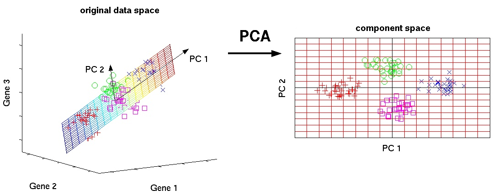

# **Machine Learning**

### **Supervised Learning (지도 학습)**

지도학습은 독립 변수 $x$와 $x$에 따라 labeling된 종속 변수 y가 주어졌을 때, 

이들 사이 관계를 예측하는 learner를 학습하는 문제

## **Regression과 Classification**

- Regression과 Classification 문제는 모두 독립 변수 $x$와 종속 변수 $y$ 간의 관계를 나타내는 예측 모델 $f$를 학습하는 문제이다.
- regression은 예측 결과로 연속적인 값을 갖고, classification은 예측 결과로 불연속적인 class를 갖는다.

## **Machine Learning 모델 유형 구분**

### 1. **Discriminative model (지도 학습)**

$X$가 주어졌을 때 $Y$가 나타날 확률 $p(Y|X)$을 **직접 추정** 하며, Decision Boundary를 학습한다. 

한 data point는 decision boundary에 따라 한 그룹에 assign된다.

대표적인 예시로 linear regression과 logistic regression, SVM이 있다.

- **Linear regression**
- **Logistic regression**
    
    [Regression 정리](./220826-Regression.md)
    
- **KNN (K-Nearest Neighbor)**

    
    
    - **1-NN**: 주어진 data point에서 가장 가까운 point의 class 할당
    - **k-NN**: 가까운 순으로 sorting한 후 k개를 뽑아 voting을 통해 
    가장 많이 나온 class로 할당
        
        ⇒ k가 적절히 큰 값일 때 트렌드를 잘 반영할 수 있다
        
    - **Weighted-NN**: 단순 voting이 아닌 거리에 따른 가중치를 고려하는 방식
    전부 취합할 수도 있음

- **SVM (Support Vector Machine)**
    
    [Support Vector Machine](./220826-Support-Vector-Machine.md)
    

- **Decision Tree**
    
    [Decision Tree](./220826-Decision-Tree.md)
    

- **Random Forest**
    
    [Ensemble Method](./220826-Ensemble-Method.md)
    

### 2. **Generative model (지도 학습 및 비지도 학습)**

사전 확률(Prior probability), 사후 확률(Posterior probability), 베이즈 확률을 통해 분포 확률로 추정하는 것이다. 

**데이터의 분포 확률**을 학습하며, classification 수행 시 후처리를 통해 class를 assign한다.

한 data point에 대해서 각 그룹에 대해 속할 확률들을 예측한다.

대표적인 예시로 GDA (Gaussian Discriminant Analysis)와 Naive Bayes가 있다.

label이 있어도 되고 없어도 구축할 수 있다. (지도 학습 및 비지도 학습에 사용 가능)

- **Naive Bayes**
    
    [Bayes Classifier](./220826-Bayes-Classifier.md)
    
    
     

## **지도 학습의 평가 지표**

### **분류(Classification) 평가지표**

1. **정확도 (Accuracy)**
    
    모델의 예측이 정답 레이블과 얼마나 동일한지 퍼센트로 나타낸 지표이다.

    >✏️ **불균형 데이터(Imbalanced Data)** 에서는 모델의 성능이 실제로 좋지 못하더라도   
    정확도가 높게 나올 수 있기 때문에 정확도를 사용하지 않는다.
    >
    >100개의 데이터 (90개의 label이 0, 10개 label이 1)
    모델의 예측이 모두 0일 때, 정확도는 90%로 나타난다.
    
    
2. **오차행렬(Confusion matrix)**
    
    Confusion matrix는 이진 분류에서 *어떤 유형의 오류*가 발생하고 있는지를 함께 나타내는 지표이다.
    
    - TP, TN, FP, FN
        
        TP : 실제값 Positive = 예측값 Positive 
        
        TN: 실제값 Negative = 예측값 Negative
        
        FP: 실제값 Negative  ≠ 예측값 Positive
        
        FN: 실제값 Positive ≠ 예측값 Negative
        
    
        $Acc  = \frac{TP+ TN}{(TP+TN + FP+ FN)}$
    
        

    
        FP를 *Type 1 Error*, FN을 *Type 2 Error*라 함 → 보통 가장 크리티컬한 에러는 Type 2 Error
    
        ex) 암에 걸린 환자한테 음성으로 판정한 경우
    
3. **정밀도 (Precision) & 재현율 (Recall)**
    
    Precision은 Positive라고 예측한 것 중에서 실제 Positive의 비율
    
    $Precision = \frac{TP}{TP + FP}$
    
    Recall은 실제 Positive인 데이터 중에서 모델이 예측 성공한 비율
    
    $Recall = \frac{TP}{FN+TP}$ 
    
    Precision과 Recall은 trade-off 관계를 가지며, 두 값이 모두 적절히 높은 경우가 가장 좋음
    
4. **F1-Score**
    
    Precision과 Recall 어느 하나에 치우치지 않게 하기 위해 
    이 둘의 조화 평균을 F1-Score 평가 지표로 사용함
    
    $F1 = \frac{2}{\frac{1}{recall} + \frac{1}{precision}} = 2 * \frac{precision * recall}{precision + recall}$
    
5. **ROC-AUC**
    
    ROC-Curve : Threshold에 민감하지 않은 안정적인 모델인지 평가하기 위한 지표
    
    FPR (False Positive Rate) : 실제 Negative인데 Positive로 잘못 예측한 비율
    
    TPR (True Positive Rate) : 실제 Positive인데 Positive로 예측한 비율
    

    
    
    빨간색 : 실제 Positive에 대한 예측 분포  
    파란색 : 실제 Negative에 대한 예측 분포
    
    - ***커브의 의미***
        
        ROC-Curve를 이루는 각 점은 threshold에 따른 TPR과 FPR 비율이다

        
        

        
    - **커브에 따른 성능**

          
        
        
        
        분류 모델의 성능이 최악인 경우    
        
        
                                                                  
    
    **AUC (Area Under Curve)**   
    : ROC 커브 아래의 면적으로, ROC-Curve를 수치화하여 평가하는 평가지표
    
    AUC의 값이 1에 가까울수록 효율적인 모델이다.
    
    
    

 

### **회귀(Regression)를 위한 평가지표**

1. **MAE (Mean Absolute Error)**
    
    예측 값 $\acute{y}_i$과 정답 $y_i$ 사이의 절댓값 차이
    
    - 이상치에 강건하다.
    - 모든 error에 동일한 가중치를 부여한다.
    
        
        
        > 💭 데이터에 약간의 이상치가 있으며 그 이상치에 영향을 적게 받으면서 (무시하면서)   
        모델을 만들고자 한다면 MAE를 쓰는 것이 적절하다.
        
     
        
2. **SSE (Sum of Squared Error)**
    
    예측 값 $\acute{y}_i$과 정답  $y_i$  차의 제곱의 합
    
    $SSE = \Sigma_{i=1}^{N}(y_i - \acute{y}_i)^2$
    
    
    > ✏️ **SSE보다 MSE를 주로 사용하는 이유  
    :** 데이터가 증가할수록 SSE는 기하급수적으로 커지게 된다.   
    이때 데이터의 양이 많아서 값이 커지는 것인지, 오차가 커서 값이 커지는 것인지 
    구분할 수 없기 때문에 MSE를 많이 사용한다.
    
     
    
3. **MSE (Mean Squared Error)**
    
    예측 값 $\acute{y}_i$과 정답 $y_i$  차의 제곱의 평균
    
    - 제곱을 했기 때문에 **이상치에 민감하다.**
    - error가 크면 더 큰 가중치를 부여하고, 작으면 작은 가중치를 부여한다.
    
        
    
    
        > 💭 데이터의 이상치를 고려하여 모델 일반화를 하고자 한다면
    MSE를 쓰는 것이 좋다.
    
     
    
4. **RMSE (Root Mean Squared Error)**
    - MSE에 루트를 씌운 값으로,  MSE보다 이상치에 덜 민감하다. (MAE보단 민감)
    - MSE와 마찬가지로 error의 크기에 따라 가중치를 다르게 부여한다.
    
        

    
     

5. **RMSLE (Root Mean Squared Logarithmic Error)**
    
    RMSE에서 예측 값, 정답 값에 각각 로그를 씌워 계산한다. 

    

 

---

### **Unsupervised Learning (비지도 학습)**

종속 변수가 주어지지 않고 각 data point의 속성들을 보고,

 유사한 것들끼리 그룹화 시키며 학습하는 방식

[Clustering](./220826-Clustering.md)

> ❓ **비지도 학습 모델의 성능 평가는 어떻게 이루어질까?**

 

---

## **차원 축소 (Dimension Reduction)**

### **차원의 저주 (The Curse of Dimensionality)**

데이터의 차원, 즉 Feature의 개수가 늘어나면서 알고리즘의 실행이 아주 까다로워지는 일.

### **차원 축소**

차원 축소는 **피처 선택(Feature Selection)** 과 **피처 추출(Feature Extraction)** 로 나눌 수 있다.

- 피처 선택은 특정 변수에 종속성이 강한 불필요한 변수는 제거하고 데이터의 특징을 잘 표현하는 주요 변수만 선택하는 것을 말한다.
    - **Lasso**

- 피처 추출은 기존 피처를 함축적으로 잘 설명할 수 있도록 저차원으로 매핑하는 것을 말한다.

    - 대표적인 피처 추출 알고리즘으로 **PCA, SVD, TSNE, LDA** 등이 있다.

- **PCA (Principal Component Analysis, 주성분 분석)**
    
    데이터의 분산을 최대한 보존하면서 고차원의 표본들을 저차원으로 변환하는 기법
    
    
    
    $n$개의 표본을 가지며 각 표본마다 $m$개의 변수를 가지는 행렬 $A$가 있을 때,
    
    ***분산 (variance)*** 은 $A$의 각 행을 따라 평균에서 떨어진 거리의 제곱의 합으로, 
    
    행렬 $AA^T$의 대각 성분이다.
    
    ***공분산 (covariance)*** 은 행렬 $AA^T$의 대각 성분을 제외한 성분이다. 
    
    $AA^T$에 통계학적으로 정확한 척도를 부여하기 위해 $n-1$로 나누어 표본 공분산 행렬을 구한다.
    
    **Sample Covariance Matrix**   $S = \frac{AA^T}{n-1}$
    
    - 공분산 행렬 $S$는 대칭인 양의 정부호 행렬(또는 준정부호 행렬)
    - $S$의 고유 벡터(eigen vector)는 $A$의 특이 벡터(singular vector)
        
        $A$의 left singular vector $\mathbf{u}$는 $AA^T$의 고유 벡터
        
        $AA^T = U\Sigma\Sigma^TU^T$
        
    
    📌 이때, $k$개의 특이 벡터가 다른 어떤 $k$개의 벡터들보다 데이터를 잘 설명하기 때문에, $k$차원의 부분 공간의 기저로 $u_1, \cdots, u_k$를 선택해야 한다.
    
     
    
    > ✏️ **기저 (Basis)**
    > vector space 내 임의의 원소를 표현하기 위해 필요한 최소한의 > vector 집합
    > ⇒ *vector space의 축 역할을 하는 벡터(?)*
    
     

- **SVD (Singular Value Decomposition, 특잇값 분해)**
    
    특잇값 분해는 임의의 m by n 행렬 $A$을 $U\Sigma V^T$로 분해하는 행렬 분해 기법 중 하나.
    
     
    $A = U\Sigma V^T = \sigma_1u_1v^T_{1} + \cdots +  \sigma_ru_rv^t_r$
    
    ($*r$은 행렬 $A$의 rank*)
    
    이때 행렬 $A$에 가장 가까운 rank가 $k$인 행렬을 $A_k$이다.
    
    $A_k = U\Sigma V^T = \sigma_1u_1v^T_{1} + \cdots +  \sigma_ku_kv^t_k$
    
    > 특잇값 $\sigma$에 대해 $\sigma_1 \geq \sigma_2 \geq \cdots \geq \sigma_r \geq 0$이 성립함
    > 
    
    즉, 데이터의 크기가 크다면, rank-k에 의한 근사를 통해 차원을 축소할 수 있다.
    
- **TSNE**
- **LDA (Latent Dirichlet Allocation, 잠재 디리클레 할당)**

 

---

### **Reinforcement Learning (RL, 강화 학습)**

 

---

### **Self-Supervised Learning (자기지도 학습)**

레이블링 되지 않은 데이터셋으로부터 적절한 representation을 얻고자 하는 학습 방식, representation learning의 일종이다.

과거에는 비지도 학습으로 분류됐지만, 최근에는 self-supervised learning으로 구분되어있다. 

> 📢 label $y$ 없이 **input $x$ 내에서** **target으로 쓰일 만 한 것을 정해서** 
> ⇒ 스스로 task를 정해 supervision 방식으로  모델을 학습하기 때문

**pretext task :** self-supervised learning의 task 

pretext task를 학습한 모델은 downstream task에 transfer하여 사용할 수 있다. 

self-supervised learning의 목적은 downstream task를 잘 푸는 것이기 때문에, 

기존의 unsupervised learning과 다르게 **downsream task의 성능으로 모델을 평가** 한다.