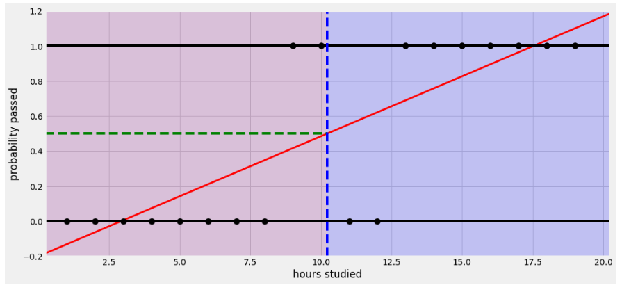
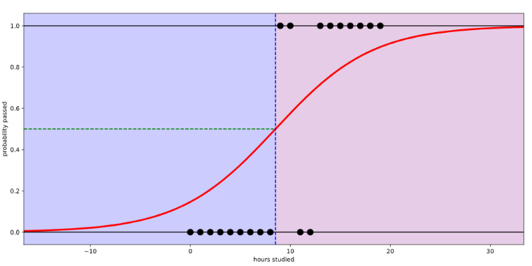

# **Regression 정리**

## 1. **Linear regression**

- **Simple linear regression**
    
    1개의 독립 변수와 종속 변수 간의 관계 함수
    
    $y = \beta_0 + \beta_1x + \epsilon$ 
    
- **Multi linear regression**
    
    여러 개의 독립 변수와 종속 변수 간의 관계 함수
    
    $y = \beta_0 + \beta_1x + \beta_2x+ \epsilon$ 
    
- **Polynomial Regression:**
    
    독립 변수들이 1차항으로 구성된 것이 아닌 n차항으로 구성
    
    독립 변수와 종속 변수 사이의 관계가 비선형적인 경우, 
    linear regression를 연장시키는 가장 일반적인 방법
    
    $y = \beta_0 + \beta_1x + \beta_2x^2+ \epsilon$ 
    
     

## 2. **Logistic regression**

독립 변수 $x$에 따른 종속 변수 $y$가 2가지 categorical한 값을 가질 때, 

이를 선형으로 분석하면 SSE(Sum of Squared Error)가 커져 logit 함수(=$ln(\frac{p(X)}{1-p(X)})$)로 변형해야 한다. 

$logit = ln(\frac{p(X)}{1-p(X)}) = \beta_0 + \beta_1X_1 + \cdots + \beta_kX_k + \epsilon$

선형으로 분석했을 때,

확률이 0에서 1 사이 값을 가지게 됨

모델 학습이 끝나면 decision boudary를 찾아 0 또는 1로 그룹을 구분할 수 있다.

 

## 3. **Lasso Regression** 

## 4. **Ridge Regression**

## 5. **ElasticNet Regression**

## **Lasso vs Ridge**