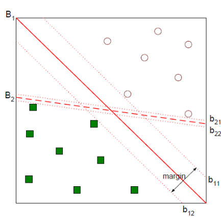
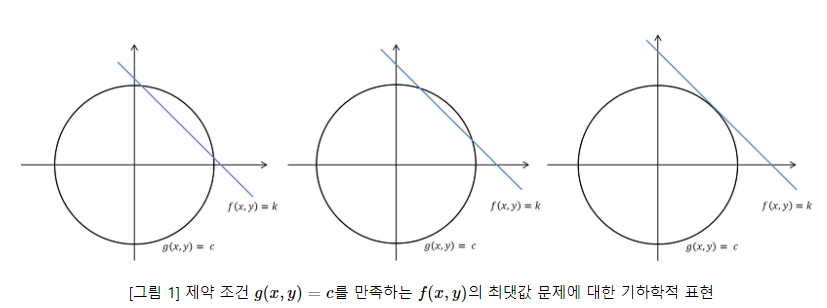
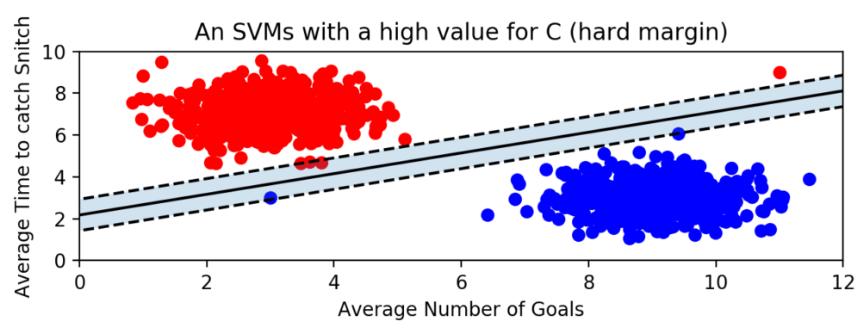
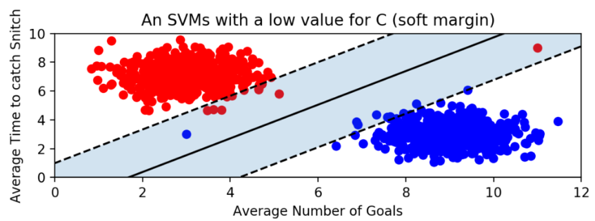
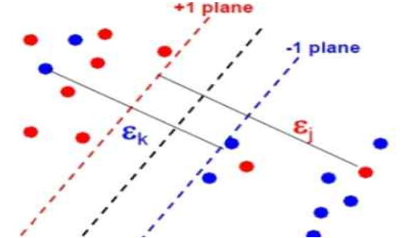
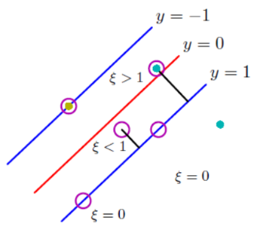
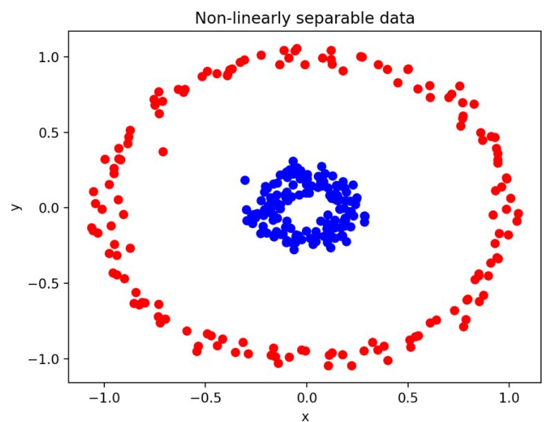

# **Support Vector Machine**

**Decision Boundary:** 분류를 위한 기준 hyperplane

### Q. 어떤 Decision Boundary가 좋은 것인가?  
### A. margin을 최대화하는 Decision Boundary

 

**Support Vector**: 모든 데이터들이 boundary에 수선의 발을 내렸을 때,

boundary와 가장 가까운 거리를 가진 벡터

**Margin**:   
~ boundary와 support vector 간의 거리  
~ boundary에 가장 가까운 point 간의 거리

### **⇒ margin은 어떻게 유도할까**

우리가 구하고자 하는 boundary를 $y = \mathbf{w}^T\mathbf{x} + b$ 라 하자

이때, 벡터 $\mathbf{w}$는 boundary와 수직이 된다.

**가중치 벡터 $\mathbf{w}$와 직교하면서 margin이 최대가 되는 선형을 찾아야 한**

단 다음은 $y_i(\mathbf{w}^Tx_i + b) \geq 1$를 만족해야 한다.

plus-plane과 minus-plane 간의 관계는 다음과 같이 정의할 수 있다.

$x^-$를 $\mathbf{w}$ 방향으로 $\lambda$ 로 scaling하여 $\lambda\mathbf{w}$ 이동

$x^+ = x^- + \lambda\mathbf{w}$

$\mathbf{w}^Tx^+ + b = 1$

$\mathbf{w}^T(x^-+\lambda\mathbf{w}) + b = 1$

$\mathbf{w}^Tx^-+\lambda\mathbf{w}^T\mathbf{w} + b = 1$

$\lambda\mathbf{w}^T\mathbf{w} = 2$

$\lambda = \frac{2}{\mathbf{w}^T\mathbf{w}}$

 

$margin =\Vert x^+ - x^-\Vert_2$  
$= \Vert x^- + \lambda\mathbf{w}-x^- \Vert_2$  
$= \Vert \lambda\mathbf{w} \Vert_2$  
$= \lambda \sqrt{\mathbf{w}^T\mathbf{w}}$ 
$= \frac{2}{\mathbf{w}^T\mathbf{w}} \sqrt{\mathbf{w}^T\mathbf{w}}$ 
$= \frac{2}{\sqrt{\mathbf{w}^T\mathbf{w}}}$  
$= \frac{2}{\Vert \mathbf{w}\Vert_2}$ 

 

### **⇒ margin의 optimization**

margin($=\frac{2}{\Vert \mathbf{w}\Vert_2}$)을 최대화하는 문제는 다음과 같이 변형할 수 있으며 

$max(\frac{2}{\Vert \mathbf{w}\Vert_2})$  → $min(\frac{1}{2}\Vert \mathbf{w}\Vert^2_2)$

이는 **라그랑주 승수법**을 통해 풀 수 있다.

$L_p(\mathbf{w}, b, \alpha_i) = \frac{1}{2}\Vert \mathbf{w} \Vert_2^2 - \Sigma_{i=1}^n \alpha_i (y_i(\mathbf{w}^T, \mathbf{x}_i + b) - 1)$

$L_p$가 최댓값을 가질  때 margin이 최대가 된다

 

$L_p$를 미지수 $\mathbf{w}$와 $b$에 대해 각각 편미분한 결과는 다음과 같다.

$\frac{\partial L(\mathbf{w}, b, \alpha_i)}{\partial \mathbf{w}} = 0$ 

→ $\mathbf{w} = \Sigma_{i=1}^n \alpha_iy_ix_i$      (1)

$\frac{\partial L(\mathbf{w}, b, \alpha_i)}{\partial b} = 0$ 

→ $\Sigma_{i=1}^n \alpha_iy_i = 0$           (2)

 

**$L_p$의 첫 번째 항**

$\frac{1}{2}\Vert \mathbf{w} \Vert_2^2 = \frac{1}{2}\mathbf{w}^T\mathbf{w}$
$= \frac{1}{2}\mathbf{w}^T \Sigma_{j=1}^n\alpha_jy_jx_j$

$= \frac{1}{2} \Sigma_{j=1}^n \alpha_jy_j(\mathbf{w}^Tx_j)$
$= \frac{1}{2} \Sigma_{j=1}^n \alpha_jy_j (\Sigma_{i=1}^n\alpha_iy_ix_i^Tx_j)$

$= \frac{1}{2} \Sigma_{i=1}^n \Sigma_{j=1}^n \alpha_i\alpha_jy_iy_jx_i^Tx_j$

**$L_p$의 두 번째 항**

$\Sigma_{i=1}^n \alpha_i (y_i(\mathbf{w}^T, \mathbf{x}_i + b) - 1)$ 

$= \Sigma_{i=1}^n \alpha_iy_i(\mathbf{w}^Tx_i + b) - \Sigma_{i=1}^n\alpha_i$

$= \Sigma_{i=1}^n \alpha_iy_i\mathbf{w}^Tx_i + b\Sigma_{i=1}^n \alpha_iy_i - \Sigma_{i=1}^n\alpha_i$

$= \Sigma_{i=1}^n \Sigma_{j=1}^n \alpha_i\alpha_jy_iy_jx_i^Tx_j  - \Sigma_{i=1}^n\alpha_i$

$L_p(\mathbf{w}, b, \alpha_i) = \frac{1}{2}\Vert \mathbf{w} \Vert_2^2 - \Sigma_{i=1}^n \alpha_i (y_i(\mathbf{w}^T, \mathbf{x}_i + b) - 1)$

$= \Sigma_{i=1}^n\alpha_i - \frac{1}{2}\Sigma_{i=1}^n \Sigma_{j=1}^n \alpha_i\alpha_jy_iy_jx_i^Tx_j$ 

 

찾고자 하는 건 margin이 최대가 된 decision boundary $\mathbf{w}^Tx+b$

$\mathbf{w}$와 $b$를 찾으면 해를 구할 수 있다

 식 (1)을 통해 $\mathbf{w} = \Sigma_{i=1}^n\alpha_iy_ix_i$

즉 $\alpha$ 값만 알아내면 $\mathbf{w}$를 구할 수 있다

새로운 데이터가 들어왔을 때는  $y_i(\mathbf{w}^Tx_i+b−1)$에 넣어서

 0보다 크면 1, 0보다 작으면 -1 범주로 예측하면 된다.

 

---

### 🌟 **라그랑주 승수법 ([블로그 링크](https://untitledtblog.tistory.com/96))**  

제약 조건 $g$를 만족하는 $f$의 최솟값 또는 > 최댓값은 $f$와 $g$가 접하는 지점에 존재할 수도 있다.

제약 조건 $g(x,y)=c$를 만족하는 $f(x,y)$의 최댓값을 구하는 문제

$f(x,y)$의 최댓값을 $k$라고 하면, 
$k$는 $xy$평면에서 직선의 $y$축 절편을 나타낸다. 

즉, 제약 조건 $g(x,y)=c$와 $f(x,y)$가 접할 때 $f(x,y)$는 최대가 된다   
(↔제 3사분면에서 접하는 경우는 최소)

라그랑주 승수법에서는 두 함수가 접하는 지점을 찾기 위해 **기울기 벡터 (gradient vector)** 를 이용

$\nabla f=(\frac{\partial f}{\partial x}, \frac{\partial f}{\partial y})$

$g$ 어떤 지점에서의 접선 벡터와 기울기 벡터 $\nabla f$는 수직을 이룬다.  
따라서, 두 함수의 기울기 벡터가 서로 상수배인 관계를 가진다.

$\nabla f = \lambda\nabla g$

즉, $L(x, y, \lambda) = f(x, y) - \lambda(g(x, y) - c)$  
→ 함수  $L$의 기울기 벡터가 영벡터가 되는 점을 찾으면   
두 함수 $f$와 $g$가 접하는 지점을 찾을 수 있다.

---

### ⇒ **SVM의 장점**

- 범주나 수치 예측 문제에 사용 가능함
- 데이터 특성이 적어도 성능이 좋게 나오는 편이며, 잡음에 강하다.
- 과적합을 피할 수 있다
- 저차원이나 고차원의 적은 데이터에서 일반화 능력이 좋다.

### ⇒ **SVM의 단점**

- 데이터셋이 많을 경우 학습 속도가 느리다
- 고차원으로 갈수록 계산이 부담이 된다
- 파라미터 조절을 잘해야 최적의 모델을 구할 수 있다.
- 커널함수의 선택이 명확하지 않다.

### ⇒ **Outlier**

데이터 포인터들을 올바르게 분리하면서도 margin을 최대화해야함

~ outlier를 얼만큼 허용할 것인지가 중요함

- **Hard margin**
    
    Outlier를 허용하지 않는다.
    
    주어진 모든 학습 데이터를 놓치지 않고 학습하며, 새로운 data point에 대해서 분류에 실패하는 overfitting 문제가 발생할 수 있다.
    
    
    
- **Soft margin**
    
    Outlier들이 margin 안에 포함되는 것을 어느 정도 허용하며,  
    underfitting 문제가 발생할 수 있다.
    
    
    
    slack variables $\xi$를 두어 노이즈 값에 패널티를 주며 학습
    
    선형적으로 분류를 할 수 없는 경우에 분류를 위해 오차를 허용해야 하는데,   
    이때 규제(constraint)를 완화하여 **오차를 허용할 때 사용하는 변수**.
    
    
    
    $\xi_i$이 1보다 크면 잘못 분류된 데이터  
    $\xi_i$이 0보다 크고 1 이하일 때 margin 안에 있는 데이터  
    $\xi_i$이 0일 때 데이터 포인트가 support vector일 경우이다
    
    
    

**slack variable이 도입된 decision rule**

$y_i(\mathbf{w}^Tx_i + b) \geq 1 - \xi_i$

### ⇒ **Non-linear SVM**

- **Kernel trick** : 데이터가 선형으로 분리되지 않는 경우, 차원을 높이거나 낮춰 문제를 해결한다.
    - Polynomial
    - RBF (Radial Basis Function) (=Gaussian Kernel)
    
    