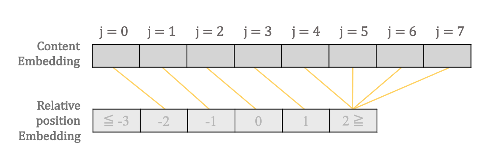
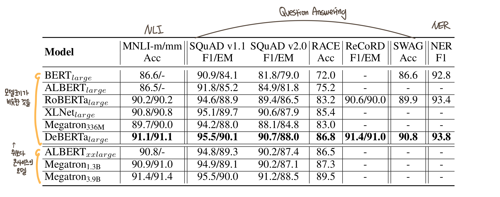

## **DeBERTa 논문 리뷰** (12월 15일~🏃‍♀️)

### [📄**Paper**](https://openreview.net/pdf?id=XPZIaotutsD)  
P. He, X. Liu, J. Gao, W. Chen, "Deberta: decoding-enhanced bert with disentangled attention," _Proc. of the 9th International Conference on Learning Representations (ICLR 2021)_, Online, 2021.

### **📌 목차** 

1. Introduction
2. Background   
    2.1 Transformer   
    2.2 Masked language model    
3. The DeBERTa architecture  
    3.1 Disentangled attention: A two-vector approach to content and position embedding   
    3.2 Enhanced mask decoder accounts for absolute word positions    
4. Scale invariant fine-tuning   
5. Experiment
    5.1 Main results on NLU tasks     
    5.2 Model analysis  
    5.3 Scale up to 1.5 billion parameters  
6. Conclusions  

---

### **1. Introduction**

트랜스포머에 기반한 Pretrained Language Model(PLM)이 많은 NLP task에서 SOTA를 달성하고 있다.  

본 논문에서는 *Disentangled Attention mechanism*과 *Enhanced Mask Decoder*를 통해 새로운 SOTA를 달성한 DeBERTa 모델을 제안하였다.      

- **✨ Disentangled Attention mechanism**  
단어 간 attention weight는 내용 뿐만 아니라 위치 정보도 상당한 영향을 끼치기 때문에   
Content와 Relative Position 정보를 2개의 벡터로 분리하여 Cross Attention 수행  

- **✨ Enhanced Mask Decoder**  
문법적 뉘앙스는 단어의 상대적 위치 정보가 아닌 절대적 위치 정보에 영향을 받는다.  
문법적 뉘앙스를 파악하기 위해 디코딩 시, absolute position embedding을 취합하여 사용한다.    

또한 본 논문에서는 perturbation에 대한 robustness를 개선하면서 안정된 성능을 보이는 *SiFT algorithm*도 함께 제안하였다.  

 
Relative position vs Absolute position

 

#### **☀️ 개선한 내용**
1. 사전학습 효율  
사전 학습 데이터가 적어도 성능 우수 

2. NLU, NLG task에서의 SOTA

 

### **2. Background**

#### **2.1 Transformer**  
기존의 Transformer는 입력 sentence가 matrix로 들어가기 때문에, 순차 정보를 포함하지 않는다.  
따라서 Positional Embedding을 통해 위치 정보를 포함시키는데, 
이러한 위치 정보는 다음 두 가지로 구분될 수 있다.  
- Absolute Position  
- Relative Position 

Shaw et al. (2018)의 연구에 따르면 Relative position 정보가 NLU/NLG task에 더 효과적이라고 밝혀졌다.

#### **2.2 Masked language model**

Transformer에 기반한 PLM은 대부분 MLM task로 사전학습을 수행한다.  
전체 시퀀스의 15%를 마스킹한 $\tilde{X}$가 주어졌을 때, 이를 복원한 $X$를 예측하도록 학습한다

$$
\max_\theta \log{p_\theta(X|\tilde{X})} = \max_\theta \sum_{i\in \mathcal{C}} \log{p_\theta (\tilde{x_i}= x_i|\tilde{X})}
$$
where $\mathcal{C}$는 masking 된 단어의 index 리스트 

### **3. The DeBERTa architecture**  

#### **3.1 Disentangled attention: A two-vector approach to content and position embedding**

 

$\{H_i\}$ : i번쩨 token에 대한 content vector   
$\{P_{i|j}\}$ : i번째 token에서 j번째 token에 대한 relative position vector 

content와 position에 대한 벡터를 분리했을 때 Cross attention score 계산은 아래와 같이 4개의 컴포넌트에 대한 덧셈으로 분리될 수 있다.

$$
A_{i,j} = \{H_i, P_{i|j}\} \times  \{H_j, P_{j|i}\}^\intercal
$$
$$
= H_iH^\intercal_j + H_iP^\intercal_{j|i} + P_{i|j}H^\intercal_j + P_{i|j}P^\intercal_{j|i}
$$

각각을 *content-to-content*, *content-to-position*, *position-to-content*, *position-to-position* 로 나타낼 수 있다

<strong>💡 Content-to-Position과 Position-to-Content의 차이는 무엇인가</strong>

1. Content-to-Position  
아래는 i번째 Position에 해당하는 content가 Query로 주어졌을 때, Attention score를 구하는 과정의 예시를 작성한 것이다.  
i가 주어졌을 때 각 j position에 대해 Relative position은 아래와 같다  

 
따라서 주어진 Query에 대한 각 Key을 매핑해보면 아래 그림처럼 나타낼 수 있다

2. Position-to-Content  
i번째 Position이 Query로 주어졌을 때, Attention score를 구하는 과정의 예시를 작성한 것이다.  
i가 주어졌을 때 각 j position에 대해 Relative position은 아래와 같다  

 
따라서 주어진 Query에 대한 각 Key을 매핑해보면 아래 그림처럼 나타낼 수 있다

🧚‍♀️ **개념 해석** 🧚‍♀️    
개념적으로 이해한 내용은 C2P는 어떤 Content가 주어졌을 때, 전체 시퀀스 내 각 Position에서 해당 Content가 어떤 의미인지 모델링하는 것이고,  

P2C는 Position이 주어졌을 때, 모든 시퀀스 내 각 Content에서 해당 Position이 어떤 의미를 지니는지 모델링한다고 이해했다.

 

>💡 본 논문에서는 상대적인 위치 정보를 사용하기 때문에, position-to-position term은 필요 없어 제외하여 계산하였다.

아래는 relative position 정보를 임베딩하여 attention을 적용한 기존 Shaw et al. (2018) 연구에서의 Attention score 계산 식으로,   
*content-to-content*, *content-to-position*로 구성되어 있다. 

본 논문에서는 relative position 정보를 매핑하기 위해 $\delta$ 함수를 사용했는데,  
$N$개의 시퀀스에 대해 모든 상대적 위치 정보를 저장하지 않고 상한선을 두어 $k$ 거리까지만 저장한다 

 

<strong>💡 어떻게 공간 복잡도(Space Complexity)가 감소했나</strong>

 

위와 같이 $\delta$ 함수를 통해 모든 relative position을 0~$2k$로 매핑했기 때문에 $Q, K$을 재사용할 수 있으며,  

N개의 token에 대한 relative position embedding을 새로 할당하지 않아도 되기 때문에 space complexity가 $O(N^2d)$에서 $O(kd)$로 감소하였다.

 

 
Attention Output 계산 과정

 

Attention score 연산이 끝나면 scaling 수행    
→ large scale의 PLM을 안정적으로 학습시킬 수 있다

<strong>💡 가 아닌 인 이유는?</strong>

<i>제 해석으로 맞지 않을 수 있습니다</i>  
이 논문에서 말하는 Relative position은 어떤 position에서 content를 참조하기 위한 상대적 거리(방향 + 거리)를 나타낸다고 생각했다  

아래는 C2P와 P2C의 Relative position을 구하는 예시이다  

- Content-to-Position 예시   
    

    where  

    i번째 position의 Query content로 주어졌을 때, j번째 position에서 content를 참조하기 위한 Relative position은 로 표현된다  

- Position-to-Content 예시   
    

    where  

    i번째 position이 Query position으로 주어졌을 때, i번째 position에서 j번째 position에 있는 content를 참조하기 위한 Relative position은 가 아닌 가 되어야 한다.  

 

아래는 Disentangled Self Attention의 연산 과정을 그림으로 그린 것이다  

 Disentangled Self Attention
  
 

Disentangled Attention을 사용한 DeBERTa의 인코더 계층은 아래와 같다

아래는 Disentangled Self Attention의 연산 과정을 그림으로 그린 것이다  

 DeBERTa Encoder Layer
  

 

 

#### **3.2 Enhanced mask decoder accounts for absolute word positions**

위의 Disentangled Attention mechanism은 absolute position을 고려하지 않는다.  

하지만 절대 위치 정보는 문법적 측면에서 필요한 요소이기 때문에, <u>EMD (Enhanced Mask Decoder)</u>에서 Absolute position embedding을 취합한다. 

**Absolute position의 영향**  
아래 store와 mall의 주변 단어를 보면 똑같이 new라는 단어가 있어, local context (relative position과 content)로는 둘을 구분하기 힘들다. 

둘이 서로 다른 객체를 가리킨다는 것은 문법적 뉘앙스를 통해 알 수 있는데,  
이러한 문법적 뉘앙스는 문장 내 단어들의 absolute position 정보에 의존한다

 absolute position에 영향을 받는 예시
  

**EMD**

- BERT의 Absolute position 사용 방법  
BERT는 입력단에 position, segment, token embedding을 더해 입력을 구성함으로써, absolute position 정보를 사용하였다.  
 
 <strong>BERT의 Input 구성</strong>
  

 
 <strong>BERT의 MLM 학습 구조도</strong>
  

 

- DeBERTa의 Absolute position 사용 방법  
입력단에 position 정보를 더한 BERT와 달리, Transformer encoder layer 직후에 Absolute position을 추가하였다.   
이전 Encoder 계층에 Absolute position embedding을 추가 입력받아 Cross Attention을 수행한다    

 
 <strong>deBERTa의 EMD</strong>
  
 

BERT는 각 계층에 self-attention을 수행했는데,  
deBERTa의 EMD는 $I$와 $H$를 입력으로 받아 $I$를 query로 $H$를 key와 value로 사용하며 cross attention을 수행한다  

EMD의 첫번째 계층은 Absolute position embedding을 $I$로 사용하고, 그 다음 계층은 이전 계층의 output을 $I$로 사용한다. $H$는 DeBERTa의 Encoder의 마지막 전 계층의 Hidden state이다. EMD의 두 계층은 인코더의 마지막 계층을 사용하며, 서로 간 파라미터를 공유한다  

$P$는 Relative position embedding으로 모든 계층에서 공유된다  

 

> **EMD Layer에서의 Attention은?**  
> 개인적으로 EMD에 대한 설명이 조금 부족했다고 생각했다.  
> 개념적으로 무엇을 위해 존재하는지 어떤 역할을 하는지 이해할 수는 있었으나, 구조도를 그리거나 구현해보려고 한다면 논문만으로는 정보가 부족하다😥  
>
>  위의 구조도는 배포한 코드를 참고하여 그린 것이다  
>  $I$를 $Q_c$로 사용했으며, $H$를 $K_c, V_c$로 사용한  Disentangled Cross Attention을 적용하였다 
>
>
 <strong>EMD에서의 Attention</strong>
  
> 
 

 
 <strong>deBERTa의 MLM 학습 구조도</strong>
  

사실 Relative position embedding ($P$)이 입력으로 전달된다기 보단, 전체 계층에서 공유하고 있기 때문에 각 계층 내에서 호출하여 사용한다고 보면 될 것 같다   

부족한 실력으로 그림을 그리니 헷갈리게 하는 부분이 있는 것 같다.. 😭 😭  

 

### **4. Scale invariant fine-tuning**

이 섹션에서는 안정적으로 finetuning 하기 위한 새로운 알고리즘 ***SiFT (Scale-invariant-Fine-Tuning)*** 를 제안한다.

#### **Virtual Adversarial Training (VAT)**  

Adversarial Training이란, 입력에 perturbation을 추가하여 데이터에 적대적 방향(adversarial direction)을 정의하여 학습하며 perturbation에 대한 robustness를 개선하는 학습이다.  

Virtual Adversarial Training는 label이 없는 데이터에 대해서도 
가상의 adversarial direction을 정의하여 학습한 것이다.  

#### **VAT in NLP**
NLP에서는 perturbation을 word embedding에 추가하는데,  이 임베딩 값은 단어 및 모델마다 그 범위가 매우 다양하다.   
문제는 모델의 크기가 커질수록 임베딩 값의 variance가 커지기 때문에 학습 불안정으로 이어질 수 있다

#### **SiFT**  
그냥 word embedding에 perturbation을 추가하는 것이 아니라, normalized word embedding에 perturbation을 추가하는 알고리즘이다  
모델의 크기가 클수록 성능 개선을 뚜렷하게 확인할 수 있다.  

### **5. Experiment**

#### **5.1 Main results on NLU tasks** 

⑴ Large Model

- 사전학습 데이터: 전체 78G, 20억 개의 데이터  

   

- 모델 구조  
Num of Layer : 24  
Hidden Size : 1024  
Attention Head : 16  

- 실험 환경    
6개의 NVIDIA DGX-2 머신 사용 (총 96개의 v100 GPU)  
Batch size: 2048   
Num of steps: 1 million  
학습에 소요된 시간: 20일  

**GLUE에서의 성능 비교**

   

SOTA 달성   
MNLI 성능이 PLM의 연구 동향을 파악하는데 있어서 주요 지표로 사용되며,  
이 역시 가장 높은 성능을 보였다

여기서 XLNet과 RoBERTa, ELECTRA는 160G 데이터로 학습을 진행했으며, DeBERTa는 이의 절반 가량의 데이터로 학습했다  
그럼에도 불구하고 DeBERTa가 가장 높은 성능을 보인다  

**그 외 QA, NLI, NER task에서의 성능 비교**

   

비슷한 크기의 모델 중에서 DeBERTa가 가장 높은 성능을 보였고, 그보다 더 큰 모델인 $\mathrm{Megatron}_{1.3B}$과 비교했을 때도 4개의 task 중 3개에서 더 우세한 성능을 보였다  
($\mathrm{Megatron}_{1.3B}$은 $\mathrm{DeBERTa}_{large}$보다 3배 더 크다)
 

⑵ Base Model

- 사전학습 데이터: *위와 동일*
- 모델 구조  
Num of Layer : 12  
Hidden Size : 768  
Attention Head : 12  

- 실험 환경  
4개의 NVIDIA DGX-2 머신 사용 (총 64개의 v100 GPU)  
Batch size: 2048   
Num of steps: 1 million  
학습에 소요된 시간: 10일 

  

***Main results on NLG task***  
Appendix에 있는 내용으로, DeBERTa를 통해 NLG task를 수행하도록 확장하였다   
Text Generation을 위한 auto-regressive model처럼 동작하게 하기 위해, 각 계층의 attention block에 Transformer의 Masked Self Attention처럼 Masking을 수행한다  

이에 MLM 및 Auto-regressive language model(ARLM) task로 사전학습한 모델을 DeBERTa-MT로 칭하였다   

성능은 next token에 대한 불확실성을 나타내는 언어 모델의 성능지표인 perplexity(PPL)를 통해 비교하였다.

  

여기서 DeBERTa-AP는 Absolute position 정보를 input 단에 추가하도록 변형된 DeBERTa이다. 

- DeBERTa-AP가 DeBERTa보다 높은 perplexity을 보이므로, EMD를 사용하는 것이 더 좋은 성능을 보이는 것을 알 수 있다  
- DeBERTa-MT가 가장 낮은 perplexity를 보였다  

 

#### **5.2 Model analysis** 
각 Contribution의 효과를 파악하기 위해 ablation study 진행  

- 사전학습 데이터: Wikipedia + BookCorpus (16G), 2억개의 데이터
- 모델 구조 : *base 모델 구조*

- 실험 환경  
1개의 NVIDIA DGX-2 머신 사용 (총 16개의 v100 GPU)  
Batch size: 256   
Num of steps: 1 million  
학습에 소요된 시간: 7일 

  

$\mathrm{RoBERT-ReImp_{base}}$는 본 실험 환경에 RoBERTa를 다시 사전학습 시킨 모델이다

- RoBERTa와 RoBERTa-ReImp의 성능이 비슷하기 때문에 본 실험환경이 합리적임
- 각 contribution을 제거했을 때 성능이 낮아지며, 이를 통해 각 contribution이 성능 개선을 이끌어 냄을 알 수 있다.

#### **5.3 Scale up to 1.5 billion parameters** 

### **6. Conclusions**

