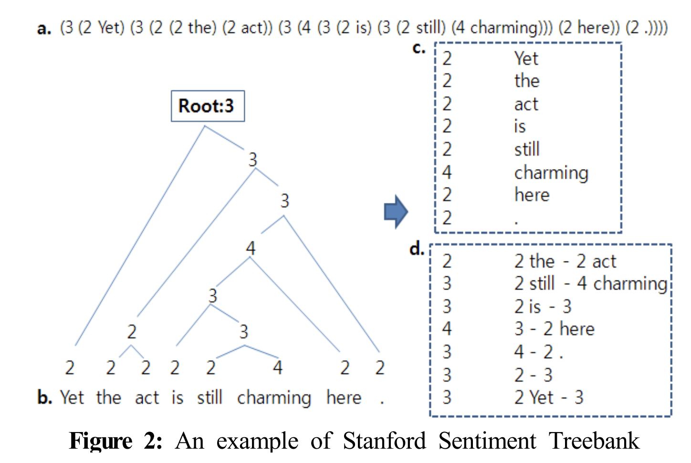

#  🗽 **GLUE : General Language Understanding Evaluation**

자연어 이해 시스템을 훈련시키고, 그 성능을 평가 및 비교 분석하기 위한 데이터셋으로 구성

### **1. CoLA (The Corpus of Linguistic Acceptability)**

주어진 문법적으로 수용 가능한지 판단하기 위한 데이터셋

> This paper investigates the ability of artificial neural networks to judge the grammatical acceptability of a sentence, with the goal
of testing their linguistic competence.
> 

 

### **2. QQP (Quora Question Pairs)**

두 개의 질문이 같은 의도를 가지는지 판단하기 위한 데이터셋

 

### **3. MNLI(Multi-Genre NLI)**

전제 문장과 hypothesis가 주어졌을 때, 둘 사이의 관계를 판단하기 위한 데이터셋으로, 

하나의 텍스트 장르의 데이터셋을 사용한 Stanford NLI Corpus와 달리 여러 장르의 텍스트 데이터셋을 사용하였다.

> a model is presented with a pair of sentences and asked to judge the relationship between their meanings by picking a label from
a small set: typically **ENTAILMENT**, **NEUTRAL**, and **CONTRADICTION**.
> 

> There are five unique prompts in total: one for written non-fiction genres (SLATE, OUP, GOVERNMENT, VERBATIM, TRAVEL; Figure 1), one for spoken genres (TELEPHONE, FACE-TO-FACE), one for each of the less formal written genres (FICTION, LETTERS), and a specialized one for 9/11, tailored to fit its potentially emotional content.
> 

 

**3.1 MNLI-m (MultiNLI Matched)**

모델 훈련 시 5개의 장르의 데이터만 사용하며 (*FICTION, GOVERNMENT, SLATE, TELEPHONE, TRAVEL*)

이 5개의 장르에 속하는 데이터로 테스트함

> All of the genres appear in the test and development sets, but only five are included in the training set. Models thus can be evaluated on both the ***matched*** test examples, which are derived from the same sources as those in the training set, and on the ***mismatched*** examples, which do not closely resemble any of those seen at training time.
> 

 

**3.2 MNLI-mm (MultiNLI Mismatched)**

위 5개의 장르에 속하지 않는 데이터로 테스트(*9/11, FACE-TO-FACE, LETTERS, OUP, VERBATIM*)

 

### **4. SST (The Stanford Sentiment Treebank)**

문장의 감정 분류를 위한 데이터셋으로,  
문장이 트리구조로 표현되어 있고 각 노드에 대해 긍정의 정도에 따라 0~4로 레이블링을 수행하였다.  

> 

> 
> S. W. Lee, “Sentiment analysis system using stanford sentiment treebank,” *Journal of the Korean Society of Marine Engineering*, vol. 39, no. 3, pp. 274~279, 2015. (in Korean)

 

### **5. STS-B (Semantic Textual Similarity Benchmark)**

주어진 두 텍스트의 의미가 유사한지 판단하기 위한 데이터셋

 

### **6. QNLI (Question NLI)**

paragraph-question pair로 구성

paragraph 내 각 문장을 context sentence라 할 때  주어진 question에 대한 답이 context sentence에 포함되었는지 판별

*주어진 question에 대한 answer는 paragraph 내에 존재한다*

> We convert the task into sentence pair classification by forming a pair between each question and each sentence in the corresponding context, and filtering out pairs with low lexical overlap between the question and the context sentence. The task is to determine whether the context sentence contains the answer to the question
> 

 

### **7. RTE (Recognizing Textual Entailment)**

텍스트와 hypothesis가 주어졌을 때, 한 텍스트의 의미가 다른 텍스트에 포함되는 지 판단하기 위한 데이터셋 

> The RTE task is defined as recognizing, given two text fragments, whether the meaning of one text can be inferred (entailed) from the other.
> 

 

### **8. MRPC (Microsoft Research Paraphrase Corpus)**

두 개의 텍스트가 주어졌을 때, 한 텍스트가 다른 문장을 패러프레이징한 것인지 아닌지 판단하기 위한 데이터셋

 

---

➕ 논문 내 실험에 포함되지 않은 테스크 

 

### **9. WNLI(Winograd NLI)**

대명사가 포함된 문장이 주어지고, 그 대명사가 가리키는 대상을 선택하기 위한 데이터셋

> The Winograd Schema Challenge (Levesque et al., 2011) is a reading comprehension task in which a system must read a sentence with a pronoun and select the referent of that pronoun from a list of choices.
> 

train-dev의 데이터 분포 차이의 문제로 인해 모델의 성능이 하락할 수 있기 때문에 BERT에서는 이를 제외함

> The GLUE webpage notes that there are issues with the construction of this dataset, 15 and every trained system that’s been submitted to GLUE has performed worse than the 65.1 baseline accuracy of predicting the majority class. We therefore exclude this set to be fair to OpenAI GPT.
>