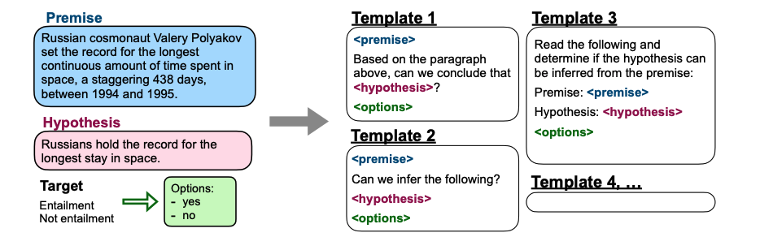

## **FLAN 논문 리뷰** (12월 22일~12월 23일)

### [**📑 Paper**](https://openreview.net/forum?id=gEZrGCozdqR)
Anonymous, _ICLR 2022 Conference Blind Submission_, 2022.

### ✨ **Contribution 정리**

#### **1. Language model의 unseen task에 대한 zero-shot 성능을 향상시킬 수 있는 *instruction tuning*을 제안**

또한 instruction tunnig이 zero-shot 성능에 어떤 영향을 미치는지   
NLI, Reading Comprehension 등 여러 task에서 실험을 수행하였다. 

<br>

---- 

### **1️⃣ Instruction Tuning이란?**  
여러 task를 포함한 데이터셋을 통해 finetuning을 수행하는 것인데,  
이 때 각 데이터셋은 instruction으로 표현된다  
<div align=center><br></div>

instruction tuning의 결과 모델을 *FLAN*이라 함  
아래 그림과 같이, Evaluation을 수행할 task(=NLI)를 제외한 다른 task(=Commonsense reasoning, Translation...)를 통해 instruction tuning을 수행한다. 
<div align=center><br></div>

본 연구에서는 NLP에서 많이 사용되는 데이터셋을 12개의 cluster로 구분하였다  
따라서 evaluation을 수행할 task의 cluster에 속하지 않는 다른 데이터셋을 통해 instruction을 수행한다.

<div align=center><br></div>

또한 instruction template을 여러개 정의해두고 기존의 데이터 형식을 instruction에 맞게 수정했다.  

Classification은 `OPTIONS`를 추가하였는데,  
yes/no를 답해야 하는 classification에서 undesired distribution으로 인해 다른 답안이 출력되는 문제를 방지하기 위함이다.   

`OPTIONS`은 모델에게 선택지를 부여하는 역할을 한다.  
(Generation task에 대해서는 필요 없음)

<div align=center><br></div>

<br>

----

### **2️⃣ 실험**

먼저, 본 논문에서는 decoder-only transformer language model를 통해 137B *BASE LM*을 구축하였다.  
이 BASE-LM은 web document, dialog data, wikipedia로 사전학습되었다  

이 실험에서는 BASE-LM, GPT-3, FLAN의 zero-shot 및 few-shot 성능을 비교한다.

> 실험 결과에 Supervised model (BERT, T5)의 성능도 포함했는데 이는 task-specific data로 학습한 성능으로, 아직 이 성능에 근접한 정도는 아니다

<br>

#### **1) NLI (Natural Language Inference)**  

Brown et al. (2020)의 연구에서는 GPT-3가 NLI task에 어려움을 겪는 이유가   
prompt의 example이 사전 학습 데이터에 나타나지 않기 때문이락고 언급했으며,   

이를 보완하기 위해 format을 좀 더 자연스럽게 수정했다. 
```
Does <premise> mean that <hypothesis>?
```

Base LM과 GPT-3의 zero-shot & few-shot 성능을 뛰어넘었다


<div align=center><br></div>

<br>

> 🤨 **이해가 가지 않는 점**   
>
> Brown et al. (2020)의 GPT-3 논문을 살펴보면, GPT-3의 few-shot에 낮은 성능을 보이는 NLI 등의 task는 bidirectional model에 좋은 성능을 보이기 때문에 단방향인 GPT로는 낮은 성능을 보일 수 있다고 언급했다. 
>    > As a result our experiments do not include any bidirectional architectures or other training objectives such as denoising. This is a noticeable difference from much of the recent literature, which has documented improved fine-tuning performance when using these approaches over standard language models. Thus our design decision comes at the cost of potentially worse performance on tasks which empirically benefit from bidirectionality.
>
> 한편, GPT-3의 few-shot learning이 주어진 scratch로부터 새롭게 학습하는 것인지, 아니면 단순히 사전 학습된 task를 구별하는 것인지 확실치 않다고 언급했다.  
>
> > A limitation, or at least uncertainty, associated with few-shot learning in GPT-3 is ambiguity about whether few-shot learning actually learns new tasks “from scratch” at inference time, or if it simply recognizes and identifies tasks that it has learned during training.
>
> 😦 zero-shot이라 당연히 사전 학습된 task를 구별한다고 생각되는 것인가..?  
> NLI task가 사전 학습 데이터에 거의 등장하지 않고 이로 인해 성능이 낮다고 여겨지는 것인가

<br>

> 🤨 **궁금한 점**   
> 
> NLI 성능을 개선하고자 prompt 형식을 바꿨는데, 이를 GPT나 Base LM에도 적용했는가?  
> 
> Openreview에도 리뷰어가 이 같은 질문을 남겼는데, FLAN의 prompt는 명령형이며 GPT는 문장 이어쓰기 형식에 가까워 두 모델의 prompt 형식이 다르다. 이로 인해 FLAN의 prompt는 다른 모델에 적합하지 않은 성능을 보인다고 한다. 
> 
> > A small but noteworthy difference between FLAN prompts and GPT-style prompts is that FLAN prompts are formulated as responding to an instruction, whereas GPT-style prompts are formatted as continuations of sentences. For instance, a FLAN prompt might be “The dog runs. Translate this sentence to French.”, whereas a GPT-style prompt might be “‘The dog runs’ translated to French is:”. For this reason, FLAN prompts do not work well for pretrained language models without finetuning, so we did not report these results in the paper. Performance was near zero for most generation tasks. 
> 


<br>

#### **2) Reading Comprehension & Closed-book QA**

passage가 주어지면 그에 따른 답을 하는 task이다. 

BoolQ를 제외한 다른 task에서 FLAN이 Base LM을 뛰어넘었고, 
모든 task에서 GPT-3를 뛰어넘었다. 


<div align=center><br></div>

<br>

#### **3) Translation**

기본적으로 GPT나 Base LM의 zero-shot 성능이 상당히 낮지만 그에 비해 few-shot 성능이 좋은 편이다.  

FLAN은 Base LM의 성능을 뛰어넘었으며, 특히나 영어를 target으로 번역할 때 높은 성능을 보인다.  
이는 FLAN의 사전 학습 데이터가 대부분 영어로 이루어졌기 때문이라 한다. 

<div align=center><br></div>

<br>

#### **4) Commonsense Reasoning & Coreference Resolution**

- Commonsense reasoning   
ex) COPA: premise가 주어지고 2개의 선택지에서 원인/결과에 해당하는 후보 답안 선택

- Coreference resolution  
ex) WSC: 주어진 두 개의 단어가 같은 대상을 지칭하는지 판단

위 두 개의 유형에 대하여, Base LM보다 FLAN이 더 낮은 성능을 보임을 알 수 있다.  
이는 downstream task가 pretraining object와 유사하기 때문이라고 한다.   

(GPT가 문장을 완성하느 task로 사전학습을 수행하며, 아래 표에서 낮은 성능을 보이는 HellaSwag, PiQA, ReCoRD 등이 문장 완성 task를 수행하여 pre-training objective와 비슷하다고 한다)

> 🤨 **이해가 가지 않는 점**   
>
> pre-training obejective로 인해 redundant instruction을 갖는다고 했는데,  
> 예를 들어 HellaSwag task를 수행하려면 해당 cluster에 속하는 data는 instruction tuning에 사용되지 않는데, 어째서 redundant instruction을 갖는가? 
> 
> 🔍 **나의 해석**  
> 이미 많은 양의 비슷한 task를 수행하는 데이터셋에 학습되었으며,   
> instruction에 따라 HellaSwag를 수행해야 하는데, pretraining objective와 유사하게 진행됨

<div align=center><br></div>

<br>

#### **5) Instruction tuning cluster 수에 따른 성능 비교**

instruction tuning에 사용되는 cluster 수에 따른 성능을 비교한 것이다.  
cluster 수가 증가함에 따라 Commonsense, NLI, Closed-book QA 성능이 향상된다.  

그래프 추세를 보면 더 향상될 여지 또한 있음을 알 수 있다.  


<div align=center><br></div>

본 ablation study는 각 cluster가 Commonsense, NLI, Closed-book QA 성능에 어떤 영향을 미치는지는 알 수 없다는 한계가 있다. 

<br>

#### **6) 모델 크기에 따른 성능 비교**

모델 크기에 따라 성능을 비교한 것이다.  
좌측은 instruction tuning에 사용된 task로 측정한 성능이며, 우측은 unseen task에 대한 성능이다.  

모델 크기가 커짐에 따라 FLAN의 성능이 향상됨을 관찰할 수 있다.  
이때 unseen task에 대해서, 일정 크기 이상의 모델을 사용해야 untuned model의 성능을 뛰어넘을 수 있다 (8B 보다는 커야한다)

<div align=center><br></div>

<br>

> untuned model은 instruction tuning을 사용하지 않은 모델로,  
좌측은 7개의 zero-shot 성능의 평균치고 우측은 13개의 zero-shot 성능의 평균치이다.  


<br>

#### **7) zero-shot 성능 vs few-shot 성능**

FLAN의 zero-shot 성능과 few-shot 성능을 비교한 것이다.  
본 실험에서는 16개의 example을 사용하였고, 전체 시퀀스 길이가 960을 넘지 않도록 했다.  

few-shot이 더 높은 성능을 보이는데,  
example을 통해 output format을 학습하기 때문에 struct-to-text, translation, closed-book QA 등 output이 복잡하거나 길 경우에 더욱 효과적이었다.  

또한 어떤 한 task에 대하여 template 간의 성능 분포 표준편차가 컸는데, few-shot으로 이 편차가 작아졌다.   
이는 prompt에 따른 민감도가 감소함을 의미한다

<div align=center><br></div>

---

### **3️⃣ 결론**

본 논문에서는 LM의 unseen task에 대한 zero-shot 성능을 향상시키는  instruction tuning을 제안하였다.  

GPT3와 Base LM과의 비교를 통해 대부분의 task에서 zero-shot 성능이 개선되었음을 알 수 있었다.  

단, 아래의 한계가 존재하였다.

- 일정 크기 이상의 PLM이어야 한다. (80억개 이상의 파라미터를 가져야함)
- 논문에서 사용한 12개의 task cluster의 분류가 주관적으로 이루어졌다.  
- 본 실험에서 수행한 instruction tuning의 각 instruction은 한 개의 문장으로 이루어진 짧은 명령문으로만 구성했다.
- 모델 검증 시, prompt 내 example이 사전 학습 데이터에 포함된 데이터일 수 있다.  
