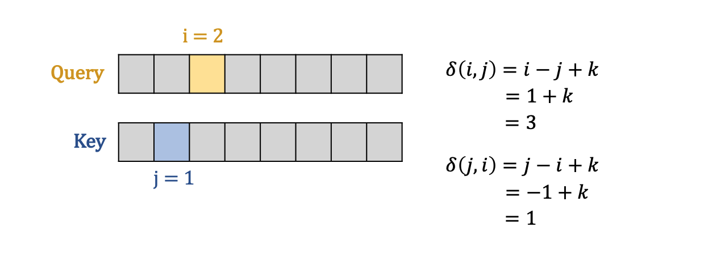
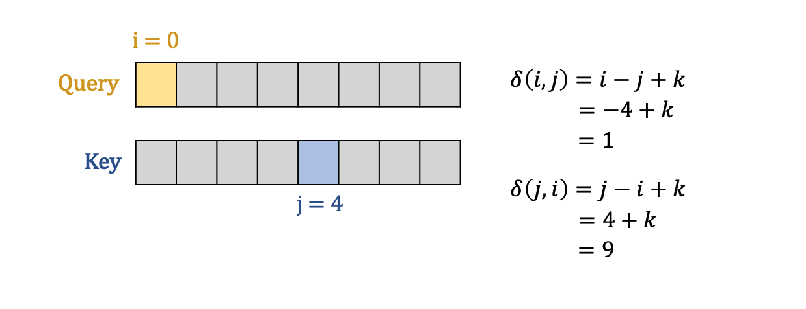
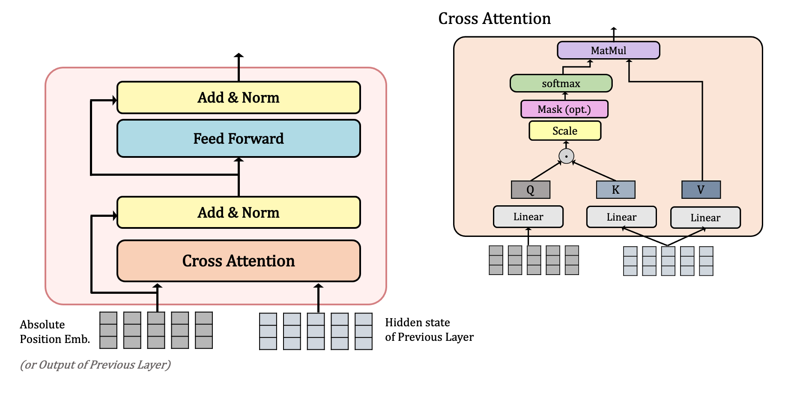

## **DeBERTa 논문 리뷰** (12월 15일~🏃‍♀️)

### [📄**Paper**](https://openreview.net/pdf?id=XPZIaotutsD)  
P. He, X. Liu, J. Gao, W. Chen, "Deberta: decoding-enhanced bert with disentangled attention," _Proc. of the 9th International Conference on Learning Representations (ICLR 2021)_, Online, 2021.

### **📌 목차** 

1. Introduction
2. Background   
    2.1 Transformer   
    2.2 Masked language model    
3. The DeBERTa architecture  
    3.1 Disentangled attention: A two-vector approach to content and position embedding   
    3.2 Enhanced mask decoder accounts for absolute word positions    
4. Scale invariant fine-tuning   
5. Experiment
    5.1 Main results on NLU tasks     
    5.2 Model analysis  
    5.3 Scale up to 1.5 billion parameters  
6. Conclusions  

---

### **1. Introduction**

트랜스포머에 기반한 Pretrained Language Model(PLM)이 많은 NLP task에서 SOTA를 달성하고 있다.  

본 논문에서는 *Disentangled Attention mechanism*과 *Enhanced Mask Decoder*를 통해 새로운 SOTA를 달성한 DeBERTa 모델을 제안하였다.      

- **✨ Disentangled Attention mechanism**  
단어 간 attention weight는 내용 뿐만 아니라 위치 정보도 상당한 영향을 끼치기 때문에   
Content와 Relative Position 정보를 2개의 벡터로 분리하여 Cross Attention 수행  

- **✨ Enhanced Mask Decoder**  
문법적 뉘앙스는 단어의 상대적 위치 정보가 아닌 절대적 위치 정보에 영향을 받는다.  
문법적 뉘앙스를 파악하기 위해 디코딩 시, absolute position embedding을 취합하여 사용한다.    

또한 본 논문에서는 perturbation에 대한 robustness를 개선하면서 안정된 성능을 보이는 *SiFT algorithm*도 함께 제안하였다.  

 
Relative position vs Absolute position

 

#### **☀️ 개선한 내용**
1. 사전학습 효율  
사전 학습 데이터가 적어도 성능 우수 

2. NLU, NLG task에서의 SOTA

 

### **2. Background**

#### **2.1 Transformer**  
기존의 Transformer는 입력 sentence가 matrix로 들어가기 때문에, 순차 정보를 포함하지 않는다.  
따라서 Positional Embedding을 통해 위치 정보를 포함시키는데, 
이러한 위치 정보는 다음 두 가지로 구분될 수 있다.  
- Absolute Position  
- Relative Position 

Shaw et al. (2018)의 연구에 따르면 Relative position 정보가 NLU/NLG task에 더 효과적이라고 밝혀졌다.

#### **2.2 Masked language model**

Transformer에 기반한 PLM은 대부분 MLM task로 사전학습을 수행한다.  
전체 시퀀스의 15%를 마스킹한 $\tilde{X}$가 주어졌을 때, 이를 복원한 $X$를 예측하도록 학습한다

$$
\max_\theta \log{p_\theta(X|\tilde{X})} = \max_\theta \sum_{i\in \mathcal{C}} \log{p_\theta (\tilde{x_i}= x_i|\tilde{X})}
$$
where $\mathcal{C}$는 masking 된 단어의 index 리스트 

### **3. The DeBERTa architecture**  

#### **3.1 Disentangled attention: A two-vector approach to content and position embedding**

 

$\{H_i\}$ : i번쩨 token에 대한 content vector   
$\{P_{i|j}\}$ : i번째 token에서 j번째 token에 대한 relative position vector 

content와 position에 대한 벡터를 분리했을 때 Cross attention score 계산은 아래와 같이 4개의 컴포넌트에 대한 덧셈으로 분리될 수 있다.

$$
A_{i,j} = \{H_i, P_{i|j}\} \times  \{H_j, P_{j|i}\}^\intercal
$$
$$
= H_iH^\intercal_j + H_iP^\intercal_{j|i} + P_{i|j}H^\intercal_j + P_{i|j}P^\intercal_{j|i}
$$

각각을 *content-to-content*, *content-to-position*, *position-to-content*, *position-to-position* 로 나타낼 수 있다

> 💡 본 논문에서는 상대적인 위치 정보를 사용하기 때문에, position-to-position term은 필요 없어 제외하여 계산하였다.

아래는 relative position 정보를 임베딩하여 attention을 적용한 기존 Shaw et al. (2018) 연구에서의 Attention score 계산 식으로,   
*content-to-content*, *content-to-position*로 구성되어 있다. 

본 논문에서는 relative position 정보를 매핑하기 위해 $\delta$ 함수를 사용했는데,  
$N$개의 시퀀스에 대해 모든 상대적 위치 정보를 저장하지 않고 상한선을 두어 $k$ 거리까지만 저장한다 

 

> 💡 **공간 복잡도(Space Complexity) 감소**    
> 
> 위와 같이 $\delta$ 함수를 통해 모든 relative position을 0~$2k$로 매핑했기 때문에 $Q, K$을 재사용할 수 있으며,  
> 
>N개의 token에 대한 relative position embedding을 새로 할당하지 않아도 되기 때문에 space complexity가 $O(N^2d)$에서 $O(kd)$로 감소하였다.
> 

 

 
Attention Output 계산 과정

 

Attention score 연산이 끝나면 scaling 수행    
→ large scale의 PLM을 안정적으로 학습시킬 수 있다

> 💡 **$\delta(i,j)$가 아닌 $\delta(j,i)$인 이유**  
>
> 해당 term은 position-to-content term이며,   
> 예시를 들면 아래와 같다  
> $k$가 2일 때 relative position을 구하는 예시이다  
> 

  
> query position i에서 key content의 relative position은 -1에 해당한다  
>
> 따라서 이를 $\delta$ 함수에 매핑하려면 $\delta(j,i)$가 되어야 한다
>
> 또 다른 예시를 들자면 $i<j$ 이고, $k$가 5인 예시이다
> 

  
>
> 마찬가지로 주어진 query position i에서 key content j의 relative position은 +4에 해당한다  
> 이를 $\delta$ 함수에 매핑하려면 $\delta(j,i)$가 되어야 한다

아래는 Disentangled Attention의 연산 과정을 그림으로 그린 것이다  

 Disentangled Attention
  

 

 

#### **3.2 Enhanced mask decoder accounts for absolute word positions**

위의 Disentangled Attention mechanism은 absolute position을 고려하지 않는다.  

하지만 절대 위치 정보는 문법적 측면에서 필요한 요소이기 때문에, <u>EMD (Enhanced Mask Decoder)</u>에서 Absolute position embedding을 취합한다. 

**Absolute position의 영향**  
아래 store와 mall의 주변 단어를 보면 똑같이 new라는 단어가 있어, local context (relative position과 content)로는 둘을 구분하기 힘들다. 

둘이 서로 다른 객체를 가리킨다는 것은 문법적 뉘앙스를 통해 알 수 있는데,  
이러한 문법적 뉘앙스는 문장 내 단어들의 absolute position 정보에 의존한다

 absolute position에 영향을 받는 예시
  

**EMD**

- BERT의 Absolute position 사용 방법  
BERT는 입력단에 position, segment, token embedding을 더해 입력을 구성함으로써, absolute position 정보를 사용하였다.  
 
 <strong>BERT의 Input 구성</strong>
  

 
 <strong>BERT의 MLM 학습 구조도</strong>
  

 

- DeBERTa의 Absolute position 사용 방법  
입력단에 position 정보를 더한 BERT와 달리, Transformer encoder layer 직후에 absolute position을 추가하였다.   
이때, EMD는 기존 BERT의 Transformer Encoder Layer에 Absolute position embedding을 추가한 것이다.  

 
 <strong>deBERTa의 MLM 학습 구조도</strong>
  
 

BERT는 각 계층에 self-attention을 수행했는데,  
deBERTa의 EMD는 $I$와 $H$를 입력으로 받아 $I$를 query로 $H$를 key와 value로 사용하며 cross attention을 수행한다  

EMD의 첫번째 계층은 Absolute position embedding을 $I$로 사용하고, 그 다음 계층부터는 이전 EMD 계층의 output을 $I$로 사용한다.

 
 <strong>deBERTa의 EMD Layer</strong>
  

### **4. Scale invariant fine-tuning**

이 섹션에서는 안정적으로 finetuning 하기 위한 새로운 알고리즘 ***SiFT (Scale-invariant-Fine-Tuning)*** 를 제안한다.

#### **Virtual Adversarial Training (VAT)**  

Adversarial Training이란, 입력에 perturbation을 추가하여 데이터에 적대적 방향(adversarial direction)을 정의하여 학습하며 perturbation에 대한 robustness를 개선하는 학습이다.  

Virtual Adversarial Training는 label이 없는 데이터에 대해서도 
가상의 adversarial direction을 정의하여 학습한 것이다.  

#### **VAT in NLP**
NLP에서는 perturbation을 word embedding에 추가하는데,  이 임베딩 값은 단어 및 모델마다 그 범위가 매우 다양하다.   
문제는 모델의 크기가 커질수록 임베딩 값의 variance가 커지기 때문에 학습 불안정으로 이어질 수 있다

#### **SiFT**  
그냥 word embedding에 perturbation을 추가하는 것이 아니라, normalized word embedding에 perturbation을 추가하는 알고리즘이다  
모델의 크기가 클수록 성능 개선을 뚜렷하게 확인할 수 있다.  

### **5. Experiment**

#### **5.1 Main resultss on NLU tasks** 

⑴ Large Model

⑵ Base Model

#### **5.2 Model analysis** 

#### **5.3 Scale up to 1.5 billion parameters** 

### **6. Conclusions**

----

### **Appendix**