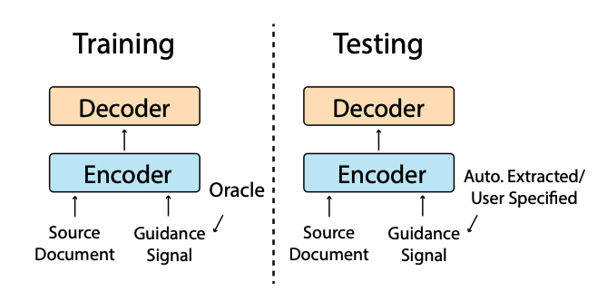
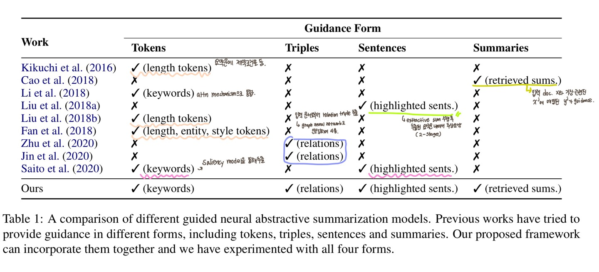
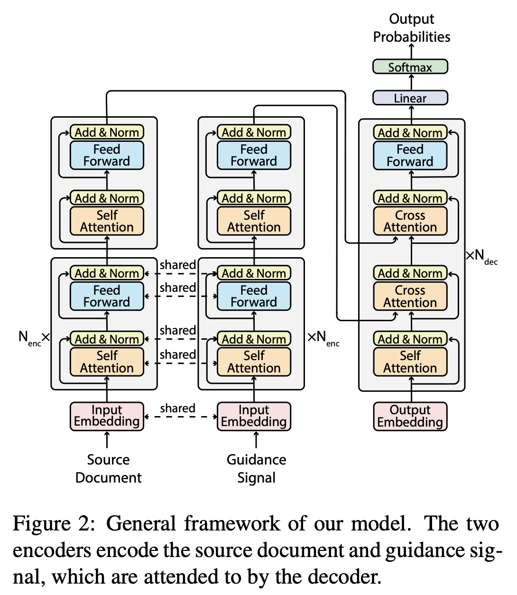

## **GSum 논문 리뷰** (12월 3일~🏃‍♀️)

### [📄**Paper**](https://aclanthology.org/2021.naacl-main.384.pdf)  
Dou, Z. Y., Liu, P., Hayashi, H., Jiang, Z., and Neubig, G, “Gsum: a general framework for guided neural abstractive summarization,” _Proc. of the 2021 Conference of the North American Chapter of the Association for Computational Linguistics: Human Language Technologies_, Online, pp. 4830-4842, 2021.

### **📌 목차** 

1. Introduction
2. Background and Related Work  
3. Methods  
    3.1 Model Architecture  
    3.2 Choices of Guidance Signals  
4. Experiments  
    4.1 Datasets     
    4.2 Baselines  
    4.3 Implementation Details  
    4.4 Main Results  
    4.5 Analysis  
5. Conclusion

---

### **1. Introduction**

추상 요약은 추출 요약보다 유연하고 유창한 요약문을 생성할 수 있지만, 다음의 단점이 따른다.  

1) Unfaithful Summaries  
사실과 다르거나, 잘못된 내용을 담고 있을 수 있음

2) Difficult to control  
source document 내에서 어느 파트를 주축으로 삼을건지 사전에 선택하는 것이 불가능함

이를 해결하기 위한 방안으로 **guided neural abstractive summarization**을 제안하였다.

❗ 추상요약에 가이드를 사용하는 프레임워크는 사전에도 존재했다.  
> Kikuchi et al. (2016)은 추상 요약문의 길이를 특정했으며,  
> Li et al. (2018)은 키워드를 가이드로 사용하여 핵심 내용을 포함하게 했다.  
> Cao et al. (2018)은 학습 데이터셋에서 관련 요약문을 검색 및 참조하는 프레임워크를 제안했다.

위의 연구에서는 하나의 가이드 (길이 제약, 키워드, 관련 요약문)만을 사용했지만,  
본 논문에서는 여러 유형의 가이드를 입력으로 사용할 수 있도록 확장한 *general and extensible guided summarization framework*를 제안하였다. 

 
GSum 프레임워크, encoder-decoder 구조를 갖는다.

 

>  **참고하기** 👀   
> Oracle summary란?  
> 많은 텍스트 요약 테스크의 성능 지표로 활용되는 ROUGE-N score가 가장 높은 요약문을 가리킨다.   
> (Hirao et al. 2017, EACL)
>
> _위 그림에 언급된 oracle은 3장에 나온다_

 

### **2. Background and Related Work**

#### **⑴ Neural Abstractive Summarization**   
추상 요약 모델의 프레임워크는 전형적으로 인코더를 통해 입력 문서로부터 representation을 생성하고,
디코더를 통해 output을 생성하는 구조를 갖는다.  

이러한 추상 요약 모델에는 몇 가지 단점이 존재하는데, 이를 극복하기 위해 아래 기술들이 제안되었다.  

- Copy mechanism: 입력 문장에 나타난 어휘에 대한 출현 확률을 높임
- Coverage mechanism: 같은 단어가 반복적으로 등장하는 반복 문제를 해결하기 위함

#### **⑵ Guidance**   

기존 추상 요약 모델  
입력 문서 $\mathbf{x}$가 주어졌을 때, 그에 매핑된 요약문 $\mathbf{y}$의 출현 확률이 최대가 되도록 파라미터 학습

$$
\begin{align}
arg\max\limits_{\theta}\sum_{\langle\mathbf{x}^i,\mathbf{y}^i\rangle\in\langle\mathcal{X},\mathcal{Y}\rangle}^{} \log{p(\mathbf{y}^i|\mathbf{x}^i;\theta)}
\end{align}
$$

Guidance $g$를 함께 입력으로 받는 모델 

$$
\begin{align}
arg\max\limits_{\theta}\sum_{\langle\mathbf{x}^i,\mathbf{y}^i,\mathbf{g}^i\rangle\in\langle\mathcal{X},\mathcal{Y},\mathcal{G}\rangle}^{} \log{p(\mathbf{y}^i|\mathbf{x}^i,\mathbf{g}^i;\theta)}
\end{align}
$$

아래는 guidance를 사용하여 추상 요약을 수행한 관련 연구를 비교한 내용이다.  

 

> 🌟 본 연구는 4가지 유형의 guidance를 입력으로 사용할 수 있도록 확장된 프레임워크를 제안
> 1. Highlighted sentences
> 2. Keywords
> 3. Relational triples
> 4. retrieved summaries 

### **3. Methods**

#### **3.1 Model Architecture** 

Transformer를 backbone으로 삼았으며, GSum의 각 인스턴스는 BERT 또는 BART를 사용하여 생성했다.

 

**Encoder**  
두 인코더는 각각 $N_{enc}+1$개의 계층을 가지며, 이 중 $N_{enc}$개의 계층에서 parameter sharing을 진행한다.

- 계산량 및 메모리 사용량 감소
- High-level representation  
    본 논문의 저자는 source document와 guidance 간의 차이는 인코더의 top layer에서 포착되어야 한다고 추측했다.

**Decoder**  
기존의 Transformer와 달리, attend를 2번 진행한다.  

self-attention 이후, guidance의 representation에 attention을 수행하면서 guidance-aware representation을 생성한다. 

$$
\begin{align}
\mathbf{y} = \mathrm{LN}(\mathbf{y} + \mathrm{SELFATTN}(\mathbf{y})) \\
\mathbf{y} = \mathrm{LN}(\mathbf{y} + \mathrm{CROSSATTN}(\mathbf{y}, \mathbf{g}))
\end{align}
$$

이는 source document의 representation을 입력으로 받기 전에 document의 어느 부분에 집중해야 하는지 가이드를 할 수 있다.  

$$
\begin{align}
\mathbf{y} = \mathrm{LN}(\mathbf{y} + \mathrm{CROSSATTN}(\mathbf{y}, \mathbf{x})) \\
\mathbf{y} = \mathrm{LN}(\mathbf{y} + \mathrm{FFN}(\mathbf{y})) 
\end{align}
$$

또한 두번째 cross attention에서 guidance를 기반으로 만들어졌던 representation에서 부족한 부분이 채워질 수 있다.  
예) coreference chain에 의해 개체명이 채워짐  

> **참고하기** 👀   
> co-reference chain
> 
> 텍스트에서 두 개 이상의 표현이 같은 사물 또는 사람을 가리킬 때 *co-refer* 하다라고 표현한다.  
> co-reference chain은 같은 연관 관계를 가진 개체끼리 묶여 있는 사슬
>
> 예) Mary bought [a car]. [The car] is green and [it] has four wheels.

#### **3.2 Choices of Guidance Signals**  

- **Test phase에서의 guidance 선택**
    1. manual definition  
    유저가 guidance를 직접 선택

    2. automatic prediction  
    automated system을 통해 $\mathbf{x}$로부터 예측한 $\mathbf{g}$를 사용  

- **Train phase에서의 guidance 선택**
    1. automatic prediction  
    위와 동일

    2. oracle extraction  
    $\mathbf{x}$와 $\mathbf{y}$를 모두 사용하여 가장 좋은 $\mathbf{g}$를 사용

automatic prediction이 학습과 테스트의 조건이 동일하다는 장점을 가지지만,  
oracle extraction을 통해 생성된 guidance가 더 유용하기 때문에 모델이 guidance signal에 더 집중하게끔 한다.

본 연구에서는 oracle extraction(in train)과 automatic prediction(in test)을 통해 $\mathbf{g}$ 추출하였다.  

**Highlighted Sentences**  

_oracle extraction_: greedy search algorithm을 사용하여 가장 높은 ROUGE score를 갖는 $\mathbf{g}$ 추출  

_automatic prediction_: BertExt 또는 MatchSum 모델을 통해 추출 요약을 수행하였으며, 추출 요약문을 $\mathbf{g}$로 사용

**Keywords**  

_oracle extraction_: 먼저 greedy search algorithm을 사용하여 가장 높은 ROUGE score를 갖는 문장들을 추출하였으며, 추출한 문장들로부터 TextRank 알고리즘을 통해 키워드를 예측하였다.  
위 키워드로부터 Target summary 내에 없는 단어는 삭제하여 $\mathbf{g}$로 사용  

_automatic prediction_: BertAbs 모델을 통해 예측한 키워드들을 $\mathbf{g}$로 사용

**Relations**  

_oracle extraction_: Stanford OpenIE를 사용하여 입력 문서로부터 relational triple들을 추출하였으며, 추출한 triple들에서 greedy하게 ROUGE score가 가장 높은 triple을 $\mathbf{g}$로 사용  

> greedy search할 때는 triple을 flatten하여 사용
> (Barack Obama, was born in, Hawaii) →	Barack Obama was born in Hawaii

_automatic prediction_: BertAbs 모델을 통해 예측한 relational triple을 $\mathbf{g}$로 사용

**Retrieved Summaries**  

_oracle extraction_: target summary $\mathbf{y}_i$로 사용와 가장 유사한 5개의 후보군 쌍 $\{\langle\mathbf{x}_1,\mathbf{y}_1\rangle, ..., \langle\mathbf{x}_5,\mathbf{y}_5\rangle\}$을 선택하며, Elastic Search를 통해 가장 유사한 pair의 summary를 $\mathbf{g}$로 사용

> 🎯 공부하기  
> [Elastic Search](https://github.com/elastic/elasticsearch)
> 

_automatic prediction_: source document $\mathbf{x}_i$와 가장 유사한 $\mathbf{x}_j$에 매핑된 $\mathbf{y}_j$를 $\mathbf{g}$로 사용

### **4. Experiments**

### **5. Conclusion**
