## **GSum 논문 리뷰** (12월 3일~12월 6일)

### [📄**Paper**](https://aclanthology.org/2021.naacl-main.384.pdf)  
Dou, Z. Y., Liu, P., Hayashi, H., Jiang, Z., and Neubig, G, “Gsum: a general framework for guided neural abstractive summarization,” _Proc. of the 2021 Conference of the North American Chapter of the Association for Computational Linguistics: Human Language Technologies_, Online, pp. 4830-4842, 2021.

### **📌 목차** 

1. Introduction
2. Background and Related Work  
3. Methods  
    3.1 Model Architecture  
    3.2 Choices of Guidance Signals  
4. Experiments  
    4.1 Datasets     
    4.2 Baselines  
    4.3 Implementation Details  
    4.4 Main Results  
    4.5 Analysis  
5. Conclusion

---

### **1. Introduction**

추상 요약은 추출 요약보다 유연하고 유창한 요약문을 생성할 수 있지만, 다음의 단점이 따른다.  

1) Unfaithful Summaries  
사실과 다르거나, 잘못된 내용을 담고 있을 수 있음

2) Difficult to control  
source document 내에서 어느 파트를 주축으로 삼을건지 사전에 선택하는 것이 불가능함

이를 해결하기 위한 방안으로 **guided neural abstractive summarization**을 제안하였다.

❗ 추상요약에 가이드를 사용하는 프레임워크는 사전에도 존재했다.  
> Kikuchi et al. (2016)은 추상 요약문의 길이를 특정했으며,  
> Li et al. (2018)은 키워드를 가이드로 사용하여 핵심 내용을 포함하게 했다.  
> Cao et al. (2018)은 학습 데이터셋에서 관련 요약문을 검색 및 참조하는 프레임워크를 제안했다.

위의 연구에서는 하나의 가이드 (길이 제약, 키워드, 관련 요약문)만을 사용했지만,  
본 논문에서는 여러 유형의 가이드를 입력으로 사용할 수 있도록 확장한 *general and extensible guided summarization framework*를 제안하였다. 

 
GSum 프레임워크, encoder-decoder 구조를 갖는다.

 

>  **참고하기** 👀   
> Oracle summary란?  
> 많은 텍스트 요약 테스크의 성능 지표로 활용되는 ROUGE-N score가 가장 높은 요약문을 가리킨다.   
> (Hirao et al. 2017, EACL)
>
> _위 그림에 언급된 oracle은 3장에 나온다_

 

### **2. Background and Related Work**

#### **⑴ Neural Abstractive Summarization**   
추상 요약 모델의 프레임워크는 전형적으로 인코더를 통해 입력 문서로부터 representation을 생성하고,
디코더를 통해 output을 생성하는 구조를 갖는다.  

이러한 추상 요약 모델에는 몇 가지 단점이 존재하는데, 이를 극복하기 위해 아래 기술들이 제안되었다.  

- Copy mechanism: 입력 문장에 나타난 어휘에 대한 출현 확률을 높임
- Coverage mechanism: 같은 단어가 반복적으로 등장하는 반복 문제를 해결하기 위함

#### **⑵ Guidance**   

기존 추상 요약 모델  
입력 문서 $\mathbf{x}$가 주어졌을 때, 그에 매핑된 요약문 $\mathbf{y}$의 출현 확률이 최대가 되도록 파라미터 학습

$$
\begin{align}
arg\max\limits_{\theta}\sum_{\langle\mathbf{x}^i,\mathbf{y}^i\rangle\in\langle\mathcal{X},\mathcal{Y}\rangle}^{} \log{p(\mathbf{y}^i|\mathbf{x}^i;\theta)}
\end{align}
$$

Guidance $g$를 함께 입력으로 받는 모델 

$$
\begin{align}
arg\max\limits_{\theta}\sum_{\langle\mathbf{x}^i,\mathbf{y}^i,\mathbf{g}^i\rangle\in\langle\mathcal{X},\mathcal{Y},\mathcal{G}\rangle}^{} \log{p(\mathbf{y}^i|\mathbf{x}^i,\mathbf{g}^i;\theta)}
\end{align}
$$

아래는 guidance를 사용하여 추상 요약을 수행한 관련 연구를 비교한 내용이다.  

 

> 🌟 본 연구는 4가지 유형의 guidance를 입력으로 사용할 수 있도록 확장된 프레임워크를 제안
> 1. Highlighted sentences
> 2. Keywords
> 3. Relational triples
> 4. retrieved summaries 

### **3. Methods**

#### **3.1 Model Architecture** 

Transformer를 backbone으로 삼았으며, GSum의 각 인스턴스는 BERT 또는 BART를 사용하여 생성했다.

 

**Encoder**  
두 인코더는 각각 $N_{enc}+1$개의 계층을 가지며, 이 중 $N_{enc}$개의 계층에서 parameter sharing을 진행한다.

- 계산량 및 메모리 사용량 감소
- High-level representation  
    본 논문의 저자는 source document와 guidance 간의 차이는 인코더의 top layer에서 포착되어야 한다고 추측했다.

**Decoder**  
기존의 Transformer와 달리, attend를 2번 진행한다.  

self-attention 이후, guidance의 representation에 attention을 수행하면서 guidance-aware representation을 생성한다. 

$$
\begin{align}
\mathbf{y} = \mathrm{LN}(\mathbf{y} + \mathrm{SELFATTN}(\mathbf{y})) \\
\mathbf{y} = \mathrm{LN}(\mathbf{y} + \mathrm{CROSSATTN}(\mathbf{y}, \mathbf{g}))
\end{align}
$$

이는 source document의 representation을 입력으로 받기 전에 document의 어느 부분에 집중해야 하는지 가이드를 할 수 있다.  

$$
\begin{align}
\mathbf{y} = \mathrm{LN}(\mathbf{y} + \mathrm{CROSSATTN}(\mathbf{y}, \mathbf{x})) \\
\mathbf{y} = \mathrm{LN}(\mathbf{y} + \mathrm{FFN}(\mathbf{y})) 
\end{align}
$$

또한 두번째 cross attention에서 guidance를 기반으로 만들어졌던 representation에서 부족한 부분이 채워질 수 있다.  
예) coreference chain에 의해 개체명이 채워짐  

> **참고하기** 👀   
> co-reference chain
> 
> 텍스트에서 두 개 이상의 표현이 같은 사물 또는 사람을 가리킬 때 *co-refer* 하다라고 표현한다.  
> co-reference chain은 같은 연관 관계를 가진 개체끼리 묶여 있는 사슬
>
> 예) Mary bought [a car]. [The car] is green and [it] has four wheels.

#### **3.2 Choices of Guidance Signals**  

- **Test phase에서의 guidance 선택**
    1. manual definition  
    유저가 guidance를 직접 선택

    2. automatic prediction  
    automated system을 통해 $\mathbf{x}$로부터 예측한 $\mathbf{g}$를 사용  

- **Train phase에서의 guidance 선택**
    1. automatic prediction  
    위와 동일

    2. oracle extraction  
    $\mathbf{x}$와 $\mathbf{y}$를 모두 사용하여 가장 좋은 $\mathbf{g}$를 사용

automatic prediction이 학습과 테스트의 조건이 동일하다는 장점을 가지지만,  
oracle extraction을 통해 생성된 guidance가 더 유용하기 때문에 모델이 guidance signal에 더 집중하게끔 한다.

본 연구에서는 oracle extraction(in train)과 automatic prediction(in test)을 통해 $\mathbf{g}$ 추출하였다.  

**Highlighted Sentences**  

_oracle extraction_: greedy search algorithm을 사용하여 가장 높은 ROUGE score를 갖는 $\mathbf{g}$ 추출  

_automatic prediction_: BertExt 또는 MatchSum 모델을 통해 추출 요약을 수행하였으며, 추출 요약문을 $\mathbf{g}$로 사용

**Keywords**  

_oracle extraction_: 먼저 greedy search algorithm을 사용하여 가장 높은 ROUGE score를 갖는 문장들을 추출하였으며, 추출한 문장들로부터 TextRank 알고리즘을 통해 키워드를 예측하였다.  
위 키워드로부터 Target summary 내에 없는 단어는 삭제하여 $\mathbf{g}$로 사용  

_automatic prediction_: BertAbs 모델을 통해 예측한 키워드들을 $\mathbf{g}$로 사용

**Relations**  

_oracle extraction_: Stanford OpenIE를 사용하여 입력 문서로부터 relational triple들을 추출하였으며, 추출한 triple들에서 greedy하게 ROUGE score가 가장 높은 triple을 $\mathbf{g}$로 사용  

> greedy search할 때는 triple을 flatten하여 사용
> (Barack Obama, was born in, Hawaii) →	Barack Obama was born in Hawaii

_automatic prediction_: BertAbs 모델을 통해 예측한 relational triple을 $\mathbf{g}$로 사용

**Retrieved Summaries**  

_oracle extraction_: target summary $\mathbf{y}_i$로 사용와 가장 유사한 5개의 후보군 쌍 $\{\langle\mathbf{x}_1,\mathbf{y}_1\rangle, ..., \langle\mathbf{x}_5,\mathbf{y}_5\rangle\}$을 선택하며, Elastic Search를 통해 가장 유사한 pair의 summary를 $\mathbf{g}$로 사용

> 🎯 공부하기  
> [Elastic Search](https://github.com/elastic/elasticsearch)
> 

_automatic prediction_: source document $\mathbf{x}_i$와 가장 유사한 $\mathbf{x}_j$에 매핑된 $\mathbf{y}_j$를 $\mathbf{g}$로 사용

### **4. Experiments**

#### **4.1 Datasets**
Reddit, XSum, CNN/DM, WikiHow, NYT, 
PubMed 총 6개의 데이터셋에서 실험을 진행하였다.  

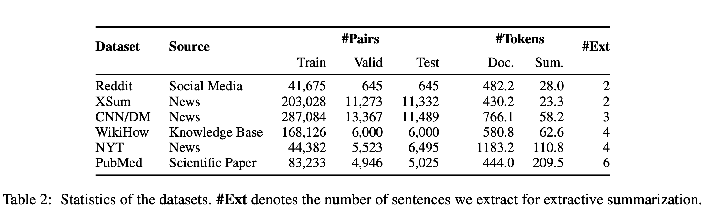 

#### **4.2 Baselines**

BertExt, BertAbs (Liu and Lapata, 2019), MatchSum, BART를 베이스 라인 모델로 삼아 실험 진행

> **BERTSUM (BertExt, BertAbs)**  
> BERT를 이용하여 Text Summarization 수행  
> 여러 개의 문장으로 이루어진 문서를 입력으로 받기 위해 Segmentation Embedding 을 수정한 구조를 띤다  
>   
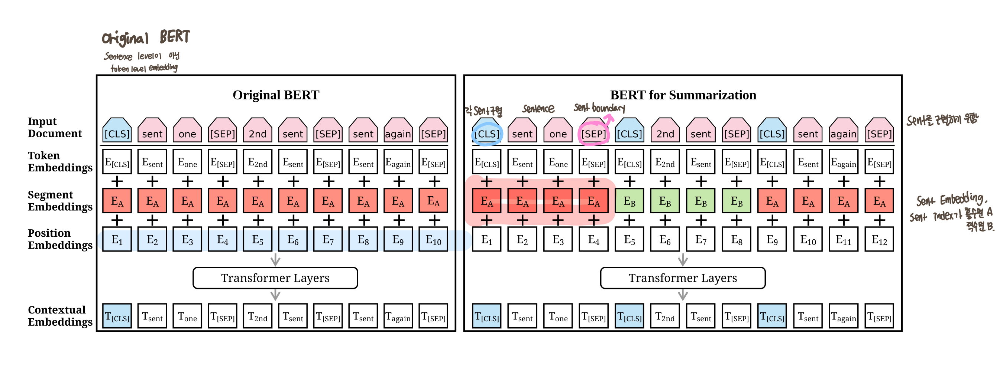  왼쪽은 BERT, 오른쪽은 BERTSUM
  
>  
> **BertExt**  
> BERTSUM과 Transformer layer를 이용하여 sentence 단위의 labeling task 학습
>  
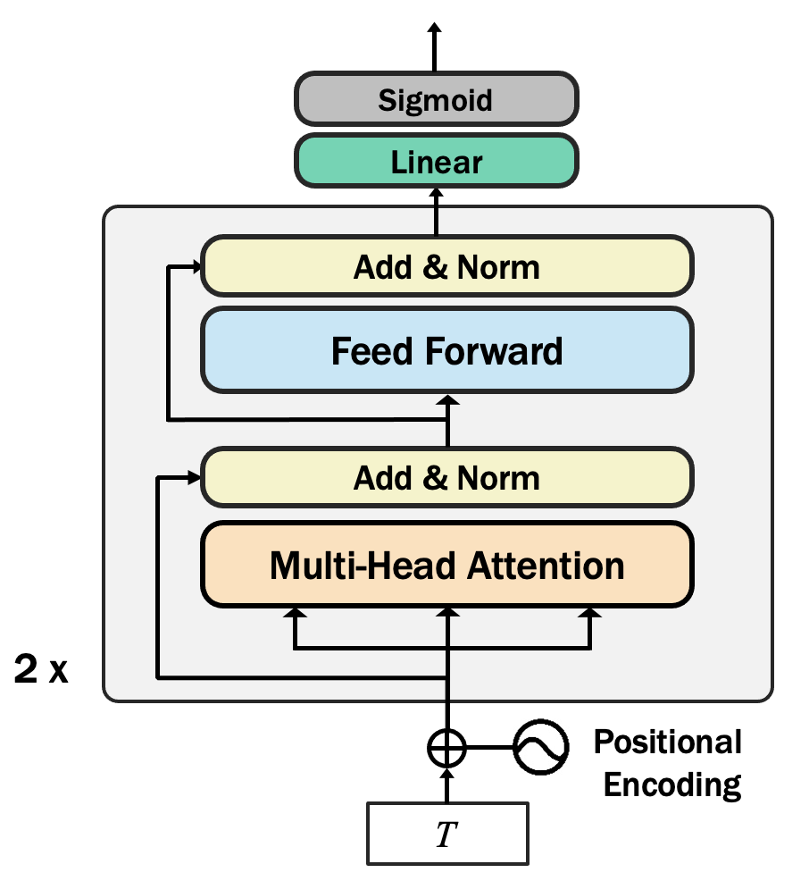 
  

> $T$는 BERTSUM의 output
>
> **BertAbs and BertExtAbs**  
> pretrained BERTSUM을 encoder, 6-layered Transformer를 decoder로 한 encoder-decoder 구조를 띰
>
> - encoder와 decoder의 mismatch를 해결하기 위해 encoder, decoder 각각의 optimizer를 사용   
> (pretrained encoder의 finetuning은 lr 작게, 천천히 학습)
> - 2-stage finetuning  (*called BERTSUMEXTABS*)  
>   Extractive summarization task, then abstractive summarization task에 finetuning
>

#### **4.3 Implementation Details**
BertAbs(BERTSUM+Transformer layer)와 BART(seq2seq Transformer architecture)를 사용하여 GSum 구현  

- BertAbs를 이용한 GSum 프레임워크 구현  
각 encoder는 13개의 layer를 가지며, top layer는 random initialization 후 각각 따로 학습한다  
(1~12번째 layer는 parameter sharing)

- BART를 이용한 GSum 프레임워크 구현  
각 encoder는 24개의 layer를 가지며, top layer는 pretrained parameter로 initialization 후 각각 따로 학습한다  
(1~23번째 layer는 parameter sharing)  
decoder의 첫 번째 cross-attention block은 랜덤하게 초기화하였고 두 번째 block은 pretrained parameter로 초기화하였다고 한다.

> 🧐 **Decoder의 초기화** 
> 
> 3.1 절에서 두 번째 cross-attention block은 guidance를 기반으로 만들어졌던 representation에서 부족한 부분을 채울 수 있다고 언급했는데,  
> 
> 첫번째 cross-attention block은 scratch로 학습하여 guidance로부터 대체적인 정보를 표현하고  
> 두번째 cross-attention block은 pretrained parameter로 초기화함으로써 더 세세한 정보를 representation에 담고자 한 것 같다. 
> 

#### **4.4 Main Results**

**Performance of Different Guidance Signals**  

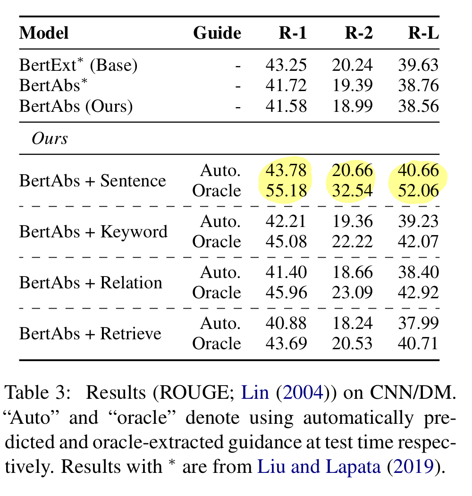 CNN/DailyMail 데이터셋에서 4가지 유형의 guidance를 각각 사용하여 학습했을 때 성능 비교
 
 

*highlighted sentence를 guidance로 사용했을 때 가장 성능이 좋음*  
*oracle extraction을 통해 guidance를 추출하는 경우 성능이 더욱 개선됨*  

**결과 💫**
- 더 나은 guidance를 예측하는 모델의 경우, 성능은 추가로 개선될 여지가 있음
- 모델은 guidance signal에 따라 학습됨

**Comparisions with State of the Art.**  

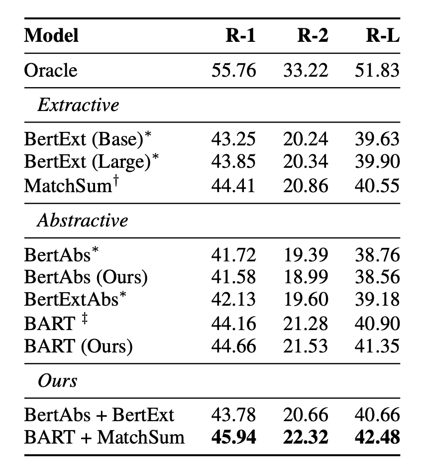 CNN/DailyMail 데이터셋에서 다른 SOTA 모델과 성능 비교
 
 

1. BertAbs+BertExt : BertAbs 이용한 GSum 프레임워크 구축  
테스트 과정에서 BertExt를 통해 guidance 추출  

2. BART+MatchSum : BART를 이용한 GSum 프레임워크 구축  
테스트 과정에서 MatchSum 통해 guidance 추출  

> 학습 과정에서 oracle extraction으로 guidance(=highlighted sentences) 추출

 

*BART+MatchSum이 가장 높은 성능을 보임*  

**결과 💫**
- 제안한 GSum 프레임워크로 다른 SOTA 모델의 성능을 능가할 수 있음

**Performance on Other Datasets.**  

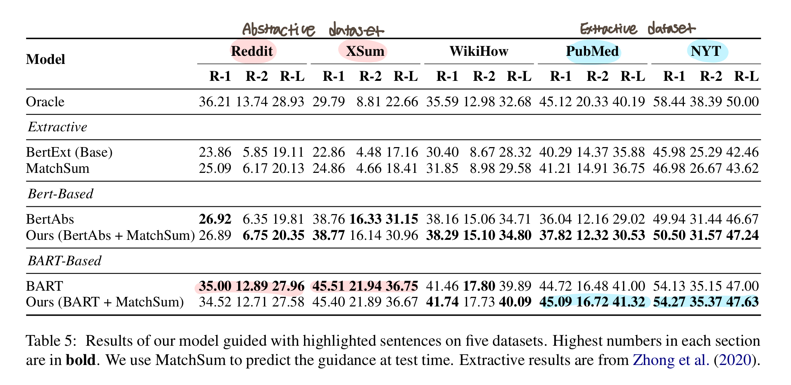 여러 데이터셋에서 다른 SOTA 모델과 성능 비교
 
 

**결과 💫**
- Abstractive dataset (Reddit, XSum)에는 abstractive summarization을 위한 모델의 성능이 충분히 높기 때문에 GSum 프레임워크로 성능 개선이 안됨
- Extractive dataset(PubMed, NYT)에는 GSum 프레임워크를 사용했을 때 성능 개선

#### **4.5 Analysis**

**Novel n-grams.**  

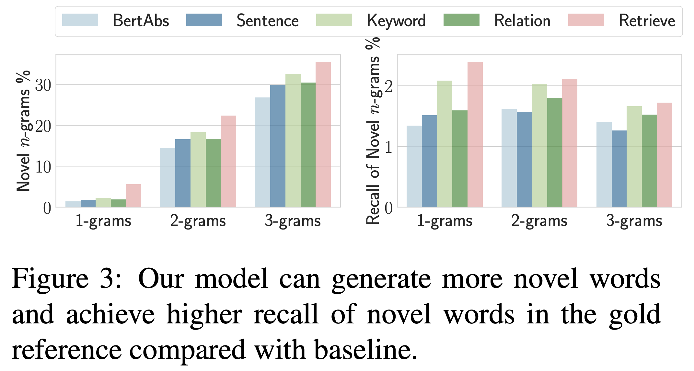 새로운 n-gram의 등장 비율
 
 

주어진 guidance를 반복하거나 너무 guidance에만 치중된 요약문을 생성했는지 확실히 알아보기 위해,  
본문에 등장하지 않는 새로운 n-gram의 등장 비율 비교  

**결과 💫**
- 베이스라인인 BertAbs과 비교했을 때, 제안한 프레임워크의 novel n-gram의 등장 비율이 높음
- 생성된 요약문은 주어진 guidance에만 치중되지 않았으며, 본문 내용을 paraphrasing 한 결과임을 알 수 있다.

**Complementarity of Different Guidance Signals.**

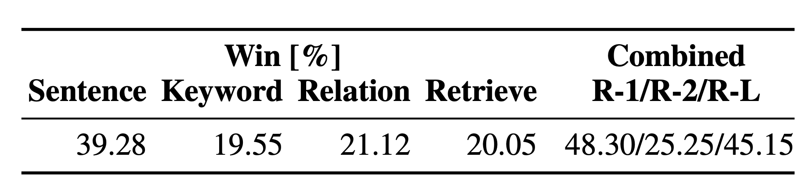 4가지 guidance signals의 best score 달성 비율 & best score의 guidance 결합에 따른 ROUGE 
 
 

**Win[%]** : 4가지 유형의 guidance에 따른 요약문 ROUGE score 비교 및 best score 달성 비율  
highlighted sentence가 가장 높은 비율을 차지하나, 전체 40%에도 못미침

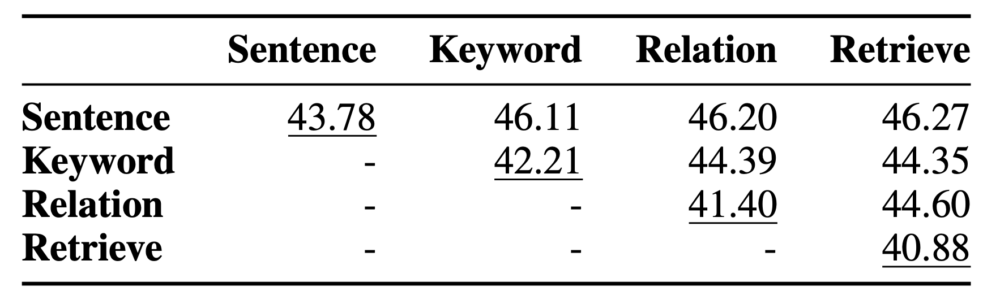 4가지 guidance signals 결합에 따른 ROUGE 
 
 

<u>밑줄</u>: 해당 guidance 하나만 사용한 경우(single guided model)의 ROUGE score

> **🧐 ROUGE-1 score**  
> Table 6 내 48.30 ROUGE-1 score는 oracle experiment로 선택된 guidance들의 결합이며,  
> Table 7 내 46.27 ROUGE-1 score는 4개의 guidance를 모두 결합한 성능  

**결과 💫**

- highlighted sentence를 guidance signal로 사용했을 때 가장 높은 성능을 보였지만,  
매번 highlighted sentence가 4가지 중에 best는 아님  

- guidance의 상호 보완을 통해 성능 개선 ROUGE-1/L 43.78/40.66 → 48.30/45.15  

**Controllability.**  

guidance에 따른 요약 결과 sample (in Table 8)

> **Guidance**  
> by running tissue paper over his son seth makes him sleep.  
>
> **Output**  
> by running tissue paper over his son seth makes him sleep.  

> **Guidance**  
> one grateful viewer of the video commented: 'this worked for my baby 5 times already so thanks!'  
>
> **Output**  
> one viewer commented: 'this worked for my baby 5 times already so thanks!'

**결과 💫**
- guidance에 따라 다른 output을 출력
- guidance에 기반한 abstraction 수행

**Faithfulness of Generated Summaries.**

테스트 결과로부터 100개의 샘플을 추려내 3명이 사람이 factual correctness 판단  
1,2,3으로 점수 부여했으며, 3은 사실관계에 완전히 부합할 때의 점수이다.  

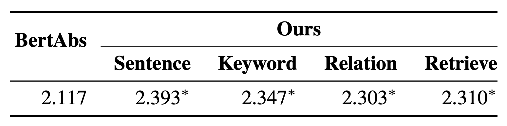 Factual Correctness 비교 
 
 

**결과 💫**
- GSum 프레임워크가 베이스라인 모델보다 사실에 가까운 요약문 생성

**Necessity of Using Oracles During Training.**

학습과정에서 oracle extraction으로 guidance를 추출했는데,  
학습과정에서도 automatic prediction으로 guidance를 추출한 경우의 성능 확인  

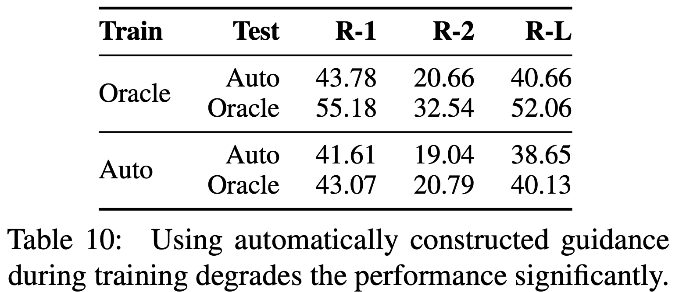 Automatic Prediction을 이용한 guidance 추출 (in train) 
 
 

**결과 💫**
- 성능 하락  
guidance와 source document의 관련성이 약하기 때문에 guidance에 기반한 학습이 이루어지지 못함

### **5. Conclusion**

4가지 유형의 guidance의 상호보완, GSum 프레임워크를 통한 요약문의 성능 향상(+ more novel word, more faithful)

**Future research**  
- 다른 guidance에 의한 model들의 조합하는 전략 개발  
- source document, guidance 등에 대한 copy/coverage mechanism 같은 기술 결합    
- 다른 유형의 guidance 실험

### **Appendix**

#### **A. Greedy Selection Algorithm**

문장 단위로 ROUGE-1/2 score 계산 및 비교를 통해 greedy하게 요약문 추출

#### **B. Analysis**

**B.1 Controllability** 

4.5절의 controllability에 더 나아가, guidance의 퀄리티와 그에 따른 output의 퀄리티 간의 상관관계 분석   
랜덤하게 추출한 guidance를 사용하며, guidance의 ROUGE score와 output의 ROUGE score 비교  

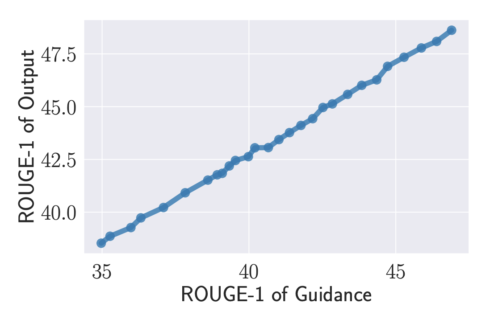 Guidance의 성능에 따른 output 성능
 
 

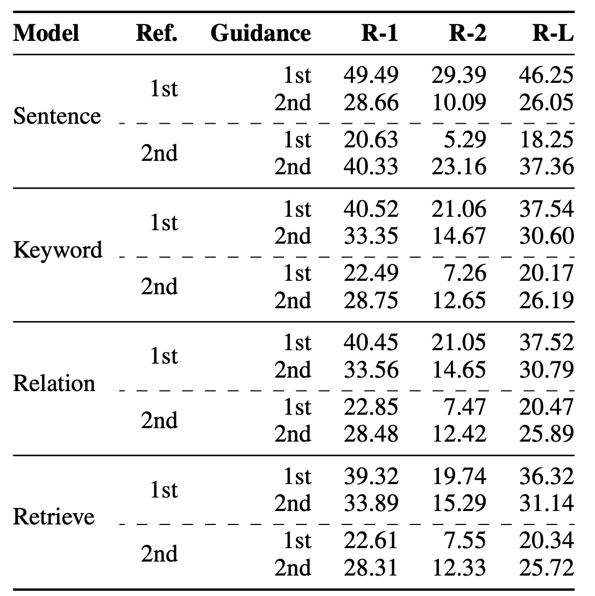 Guidance와 reference의 mismatch에 따른 성능 비교
 
 

reference summary를 반으로 나누어 각 반절의 reference에 oracle extraction 수행  

두번째 반절애 대한 guidance를 사용한 요약 결과는 첫번째 반절의 reference summary와 맞지 않음

**B.2 Semantic Similarity**   
의미 기반한 성능을 비교하기 위해 METEOR score 비교 

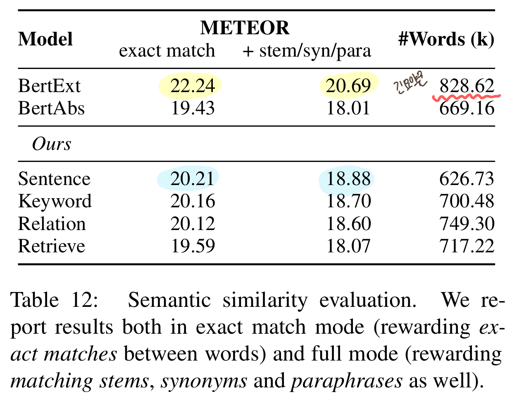 Semantic similarity METEOR 비교
 
 

BertAbs는 능가했으나, BertExt는 능가하지 못함  
> METEOR score는 긴 요약문에 더 잘나오기 때문

**B.3 Automatic Factual Correctness Evaluation**  

factCC model를 통해 자동으로 factual correctness 측정하려 하였으나,   
gold summary에 대한 정확도가 약 10%로, 적절하지 않은 지표인 것으로 추정  

**B.4 Necessity of Using Oracles During Training**  

4.5절의 Necessity of Using Oracles During Training에 더 나아가 다른 세 가지 유형의 guidance에 대해서도 oracle extraction의 필요성에 대해 연구함

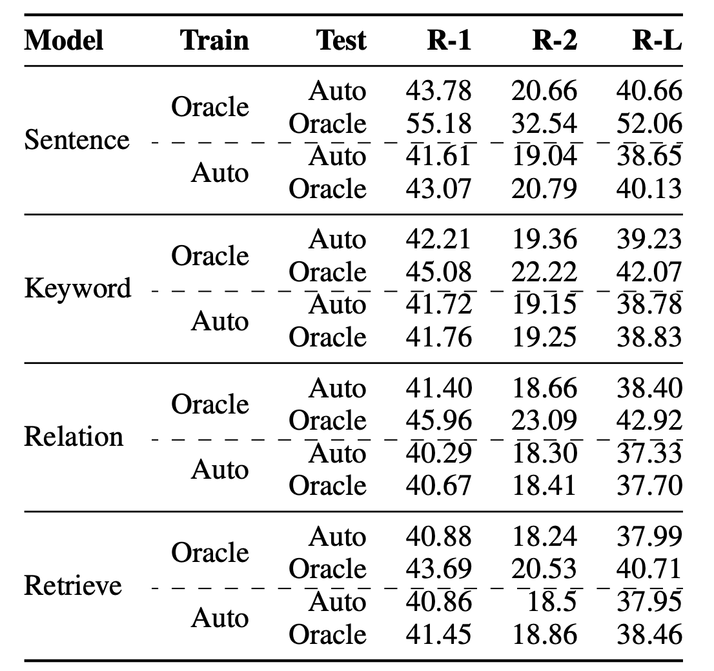 oracle ext/Auto pred에 따른 성능 비교 (in train)
 
 

마찬가지로, train 시 oracle extraction이 아닌 automatic prediction으로 guidance 추출 시 성능 하락함  

**B.5 Domain Adaptation**  

한 데이터셋으로 학습하고 다른 데이터셋에 검증해봄으로써 domain adaptation 확인  

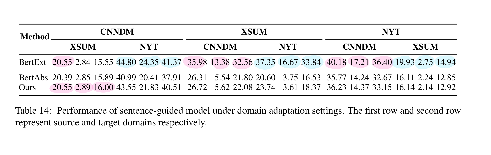 
 
 

BertExt가 가장 좋은 성능을 보인다.  

GSum 프레임워크는 BertExt로부터 얻은 guidance를 사용함에도 불구하고  BertExt를 능기하지 못한다  
Domain Adaptation에서, GSum은 guidance에 충실하지 못한 요약문을 생성하는 것으로 추청된다..